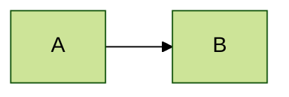
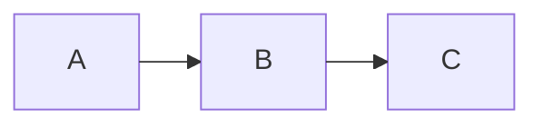

# Configuration

> **Purpose**: Mermaid config hierarchy, init directives, render options, and security
> **Confidence**: 0.95
> **MCP Validated**: 2026-02-17

## Overview

Mermaid configuration follows a three-level hierarchy: defaults, site-level (`initialize()`), and diagram-level (frontmatter). Diagram-level overrides site-level. Security settings are site-level only.

## Configuration Hierarchy

```text
1. Diagram-level  (frontmatter / directives)  ← highest priority
2. Site-level     (mermaid.initialize())
3. Defaults       (built-in values)
```

## Frontmatter Configuration (v10.5.0+)


## Init Directives



## JavaScript Initialization

```javascript
mermaid.initialize({
  startOnLoad: true,
  theme: 'default',
  securityLevel: 'strict',
  logLevel: 'error',
  flowchart: { useMaxWidth: true, htmlLabels: true, curve: 'basis' },
  sequence: { mirrorActors: true, showSequenceNumbers: false }
});
```

## Core Settings

| Setting | Values | Default | Description |
|---------|--------|---------|-------------|
| `startOnLoad` | `true/false` | `true` | Auto-render on page load |
| `theme` | `default/dark/forest/neutral/base` | `default` | Visual theme |
| `securityLevel` | `strict/loose/antiscript/sandbox` | `strict` | HTML/JS permissions |
| `logLevel` | `debug/info/warn/error/fatal` | `fatal` | Console verbosity |
| `maxTextSize` | number | `50000` | Max chars per diagram |
| `maxEdges` | number | `500` | Max edges (performance) |

## Security Levels

| Level | Behavior |
|-------|----------|
| `strict` | HTML stripped, click disabled |
| `antiscript` | HTML allowed, scripts blocked |
| `loose` | All HTML/JS (trusted content only) |
| `sandbox` | Sandboxed iframe |

**Note**: Security level is site-level only (not per-diagram).

## Flowchart Settings

| Setting | Default | Description |
|---------|---------|-------------|
| `curve` | `basis` | Edge curve (`basis/linear/cardinal`) |
| `nodeSpacing` | `50` | Horizontal node distance |
| `rankSpacing` | `50` | Vertical rank distance |
| `defaultRenderer` | `dagre` | Layout engine (`dagre/elk`) |
| `htmlLabels` | `true` | HTML in labels |

## Sequence Diagram Settings

| Setting | Default | Description |
|---------|---------|-------------|
| `mirrorActors` | `true` | Show actors at bottom |
| `showSequenceNumbers` | `false` | Number messages |
| `wrap` | `false` | Wrap long messages |
| `actorMargin` | `50` | Space between actors |

## Layout Engines

| Engine | Best For |
|--------|----------|
| **Dagre** (default) | Fast, most diagrams |
| **ELK** | Complex, large diagrams |



## Render API

```javascript
const { svg } = await mermaid.render('id', diagramText);
document.getElementById('output').innerHTML = svg;
```

## Common Mistakes

### Wrong
```text
---
config:
  securityLevel: loose   # ignored in frontmatter
---
```

### Correct
```javascript
mermaid.initialize({ securityLevel: 'loose' });
```

## Related

- [Theming & Styling](theming-styling.md) - Theme variables
- [Integration Patterns](../patterns/integration-patterns.md) - Platform config
