# Mermaid Diagram Types

> **Purpose**: Complete reference for all diagram types supported by Mermaid
> **Confidence**: 0.95
> **MCP Validated**: 2026-02-17

## Overview

Mermaid supports 20+ diagram types, each with a unique syntax identifier. Every diagram starts with its type declaration followed by content definitions.

## Diagram Type Reference

| Type | Identifier | Category |
|------|-----------|----------|
| Flowchart | `flowchart LR/TD` | Structural |
| Sequence | `sequenceDiagram` | Behavioral |
| Class | `classDiagram` | Structural |
| State | `stateDiagram-v2` | Behavioral |
| ER Diagram | `erDiagram` | Structural |
| Gantt | `gantt` | Project Mgmt |
| Pie Chart | `pie` | Data Viz |
| Mindmap | `mindmap` | Structural |
| Timeline | `timeline` | Project Mgmt |
| Git Graph | `gitGraph` | Structural |
| C4 Context | `C4Context` | Architecture |
| C4 Container | `C4Container` | Architecture |
| C4 Component | `C4Component` | Architecture |
| User Journey | `journey` | Behavioral |
| Quadrant | `quadrantChart` | Data Viz |
| Sankey | `sankey-beta` | Data Viz |
| XY Chart | `xychart-beta` | Data Viz |
| Block | `block-beta` | Structural |
| Kanban | `kanban` | Project Mgmt |
| Architecture | `architecture-beta` | Architecture |
| Packet | `packet-beta` | Network |
| Requirement | `requirementDiagram` | Structural |
| ZenUML | `zenuml` | Behavioral |

## Key Examples

### Flowchart
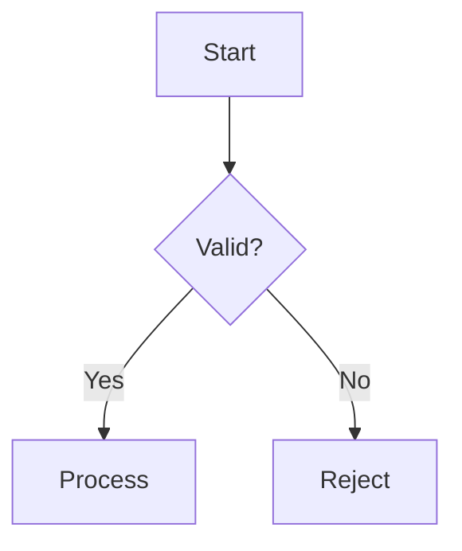

### Sequence Diagram
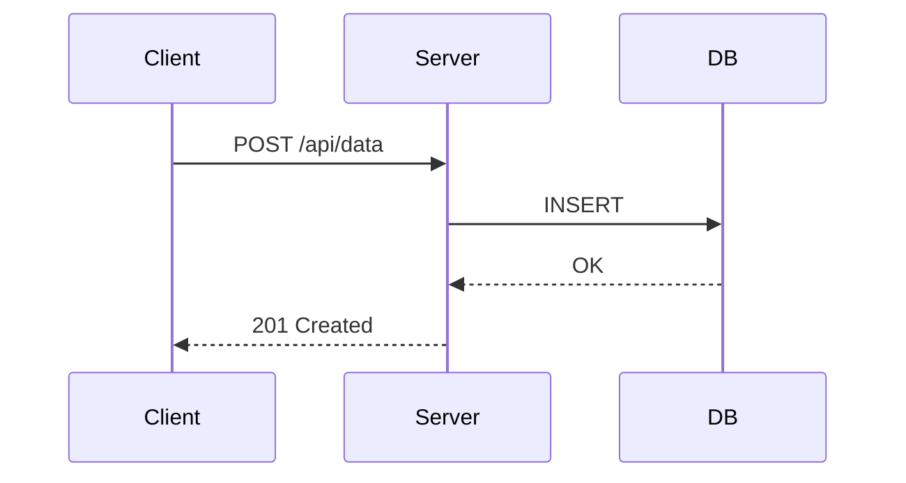

### ER Diagram
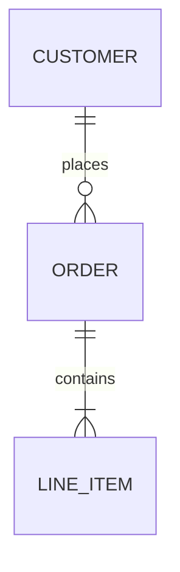

### State Diagram
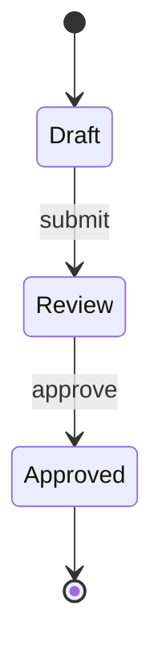

### Gantt Chart
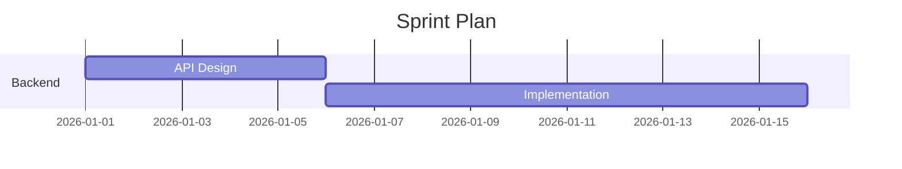

### Pie Chart
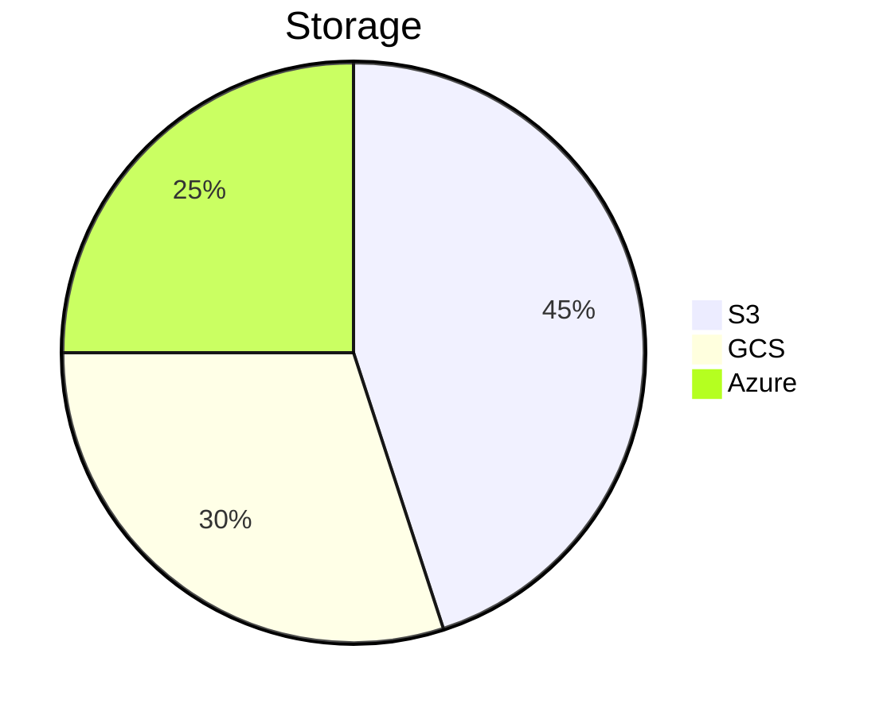

### Mindmap
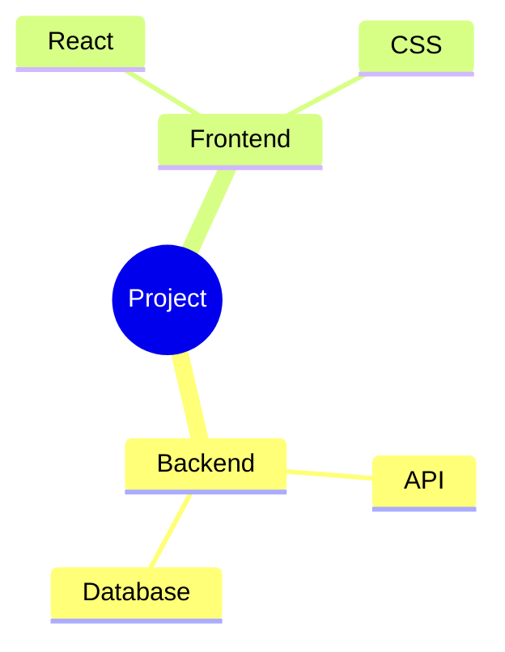

### Git Graph
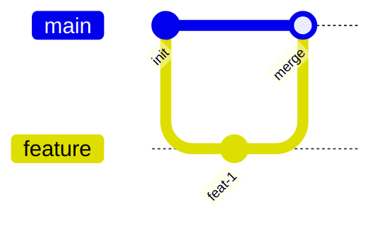

### Class Diagram
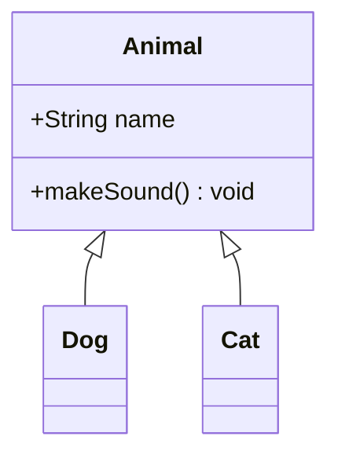

### Timeline
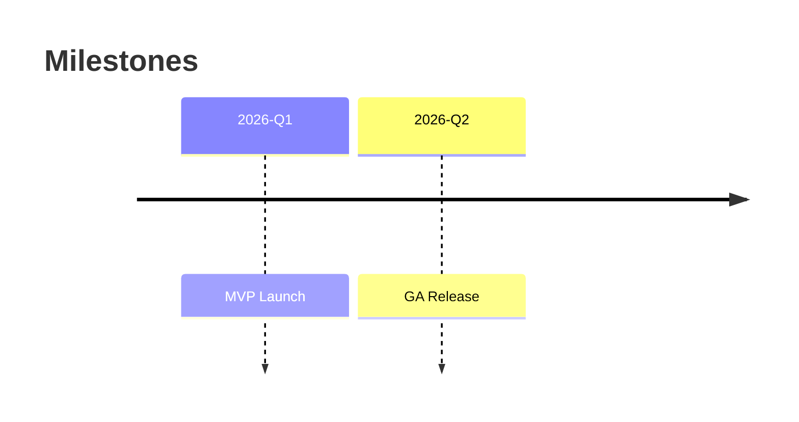

### Quadrant Chart
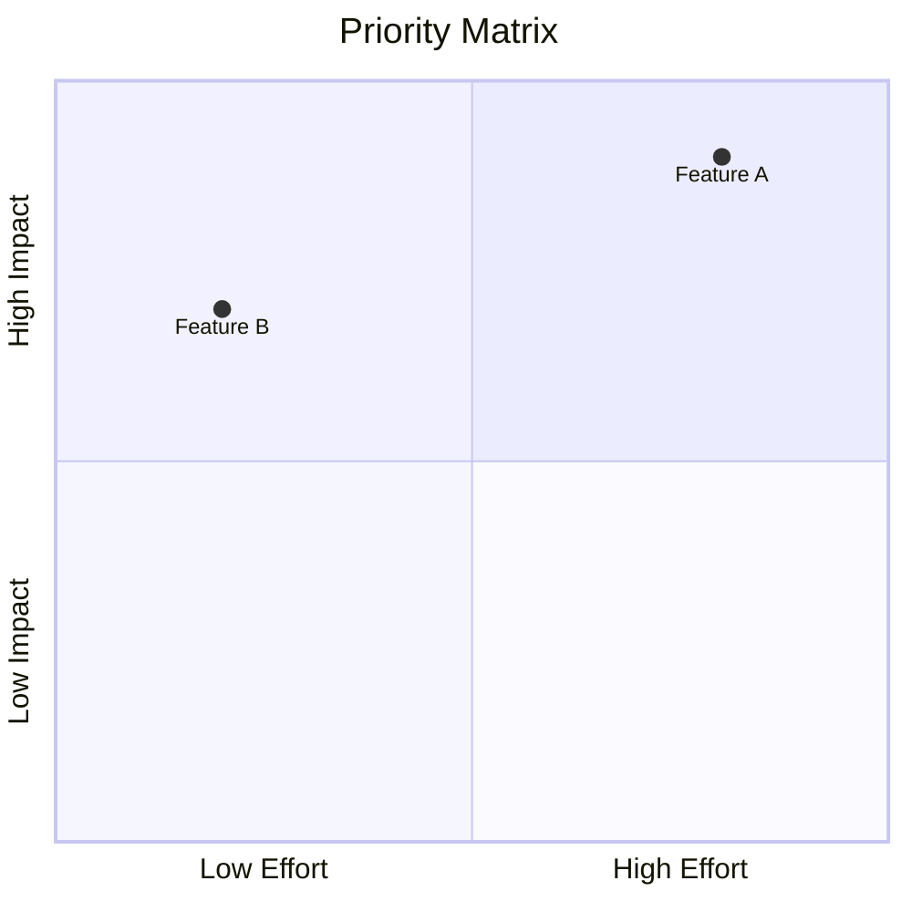

## Related

- [Syntax Fundamentals](syntax-fundamentals.md) - Node shapes, edges, directions
- [Architecture Diagrams](../patterns/architecture-diagrams.md) - Real-world patterns
