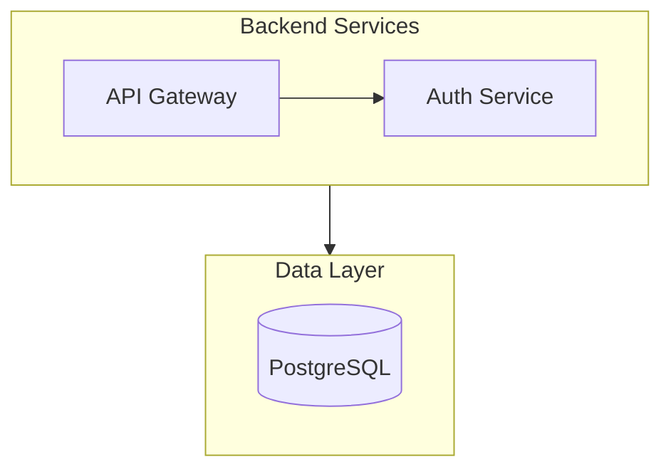

# Syntax Fundamentals

> **Purpose**: Core syntax -- nodes, edges, labels, subgraphs, directions, comments, styling
> **Confidence**: 0.95
> **MCP Validated**: 2026-02-17

## Overview

Every Mermaid diagram begins with a type declaration followed by node definitions and connections. Syntax is whitespace-tolerant but case-sensitive for keywords.

## Node Shapes

| Syntax | Shape | Example |
|--------|-------|---------|
| `A[text]` | Rectangle | `A[Process]` |
| `A(text)` | Rounded | `A(Start)` |
| `A([text])` | Stadium | `A([Deploy])` |
| `A{text}` | Diamond | `A{Decision}` |
| `A((text))` | Circle | `A((Hub))` |
| `A[(text)]` | Cylinder | `A[(Database)]` |
| `A[[text]]` | Subroutine | `A[[Function]]` |
| `A{{text}}` | Hexagon | `A{{Prepare}}` |
| `A>text]` | Flag | `A>Event]` |
| `A(((text)))` | Double circle | `A(((Target)))` |

### Extended Shapes (v11.3.0+)

```text
A@{ shape: doc, label: "Document" }
B@{ shape: flag, label: "Event" }
C@{ shape: lean-r, label: "Input" }
```

## Edge Types

| Syntax | Style |
|--------|-------|
| `-->` | Arrow |
| `---` | Open link |
| `-.->` | Dotted arrow |
| `==>` | Thick arrow |
| `~~~` | Invisible link |
| `--o` | Circle end |
| `--x` | Cross end |
| `<-->` | Bidirectional |

Add extra characters for longer edges: `--->`, `====>`

### Edge Labels

```text
A -->|label| B
A -- "text" --> B
A -.->|dotted label| F
```

## Directions

| Code | Direction | Best For |
|------|-----------|----------|
| `TB` / `TD` | Top to bottom | Hierarchies, org charts |
| `BT` | Bottom to top | Build-up flows |
| `LR` | Left to right | Pipelines, sequences |
| `RL` | Right to left | RTL reading flows |

## Subgraphs



Key features: nesting, per-subgraph `direction`, linking between subgraphs.

## Comments

```text
%% This is a line comment (ignored by parser)
flowchart LR
    A --> B  %% inline comment
```

## Styling

### classDef (Recommended)


### Apply to Multiple Nodes

```text
class A,B,C myClassName
```

### Inline Style

```text
style A fill:#e1bee7,stroke:#7b1fa2,stroke-width:2px
```

## Markdown Labels (v11+)

```text
A["`**Bold** and _italic_ text`"]
```

## Common Mistakes

### Wrong
```text
flowchart LR
    end --> start       %% 'end' is reserved
```

### Correct
```text
flowchart LR
    End_Node --> Start_Node
```

## Related

- [Diagram Types](diagram-types.md) - All available types
- [Theming & Styling](theming-styling.md) - Theme configuration
