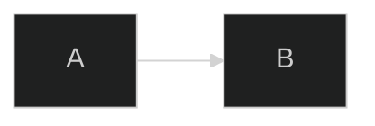
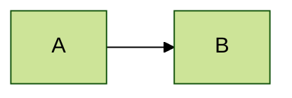
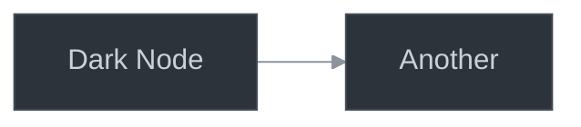
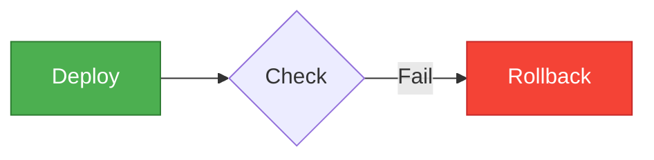
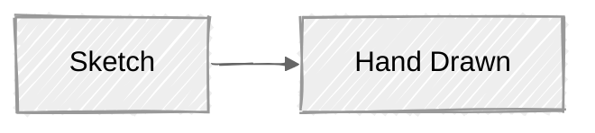

# Theming and Styling

> **Purpose**: Built-in themes, custom theming via base theme, and styling approaches
> **Confidence**: 0.95
> **MCP Validated**: 2026-02-17

## Overview

Mermaid provides 5 built-in themes and a customizable `base` theme. Custom themes modify `themeVariables` using hex color codes only (not color names).

## Built-in Themes

| Theme | Description | Best For |
|-------|-------------|----------|
| `default` | Standard blue/gray | General documentation |
| `dark` | Dark backgrounds | Dark mode interfaces |
| `forest` | Green tones | Environmental themes |
| `neutral` | Grayscale | Print / B&W documents |
| `base` | Customizable foundation | Brand colors |

## Applying Themes

### Frontmatter (Recommended)


### Init Directive


### JavaScript (Site-wide)
```javascript
mermaid.initialize({ theme: 'dark' });
```

## Custom Theme Variables

Only the `base` theme supports `themeVariables`. Derived colors auto-calculate.

| Variable | Controls |
|----------|----------|
| `primaryColor` | Main node background |
| `primaryTextColor` | Text in primary nodes |
| `primaryBorderColor` | Border of primary nodes |
| `secondaryColor` | Secondary backgrounds |
| `tertiaryColor` | Tertiary elements |
| `lineColor` | Edge/connection lines |
| `noteBkgColor` | Note backgrounds |

### Example: Brand Colors


### Example: Dark Mode


## Node-Level Styling

### classDef


### Inline Style
```text
style A fill:#e1bee7,stroke:#7b1fa2,stroke-width:2px
```

## Look Variants (v11+)

| Look | Description |
|------|-------------|
| `classic` | Traditional rendering |
| `handDrawn` | Sketch-like appearance |



## Constraints

- Theme engine accepts **hex codes only** (not `red`, `blue`)
- Shadow DOM prevents external CSS overrides
- Only `base` theme supports `themeVariables`
- Changing `primaryColor` auto-updates derived colors

## Related

- [Configuration](configuration.md) - Full config options
- [Syntax Fundamentals](syntax-fundamentals.md) - classDef and inline styles
