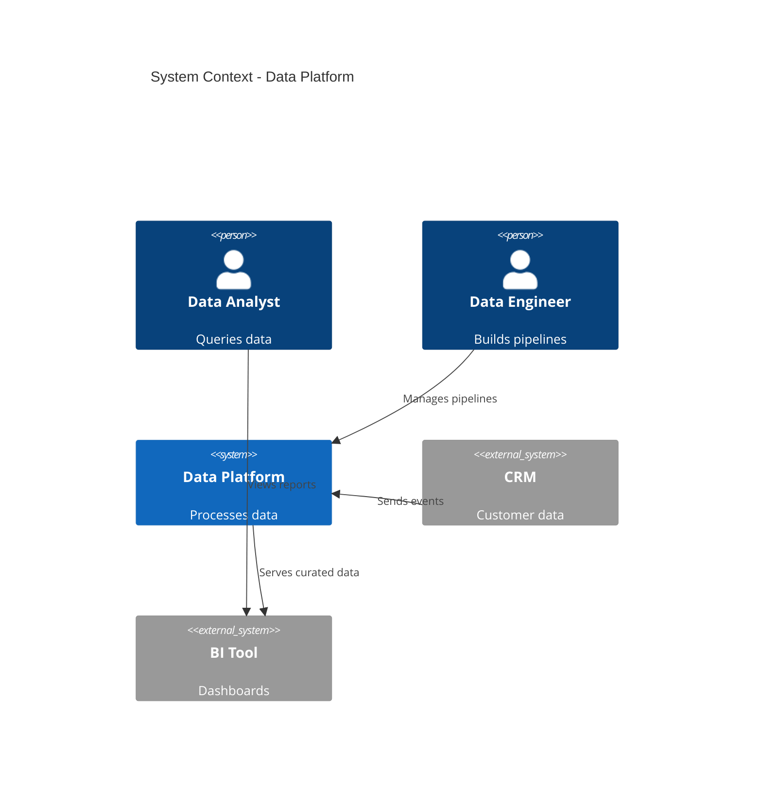
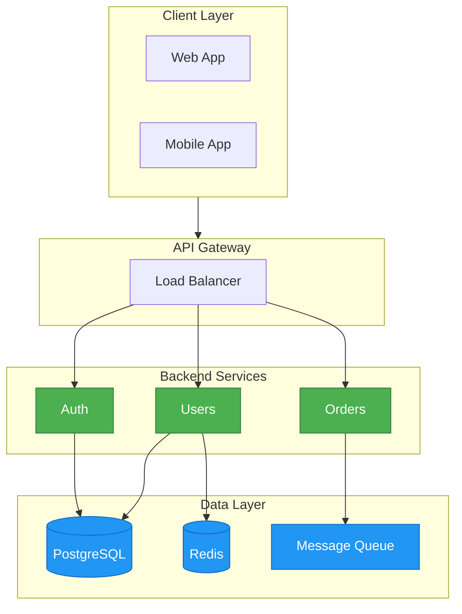
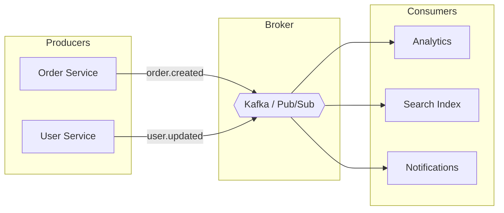
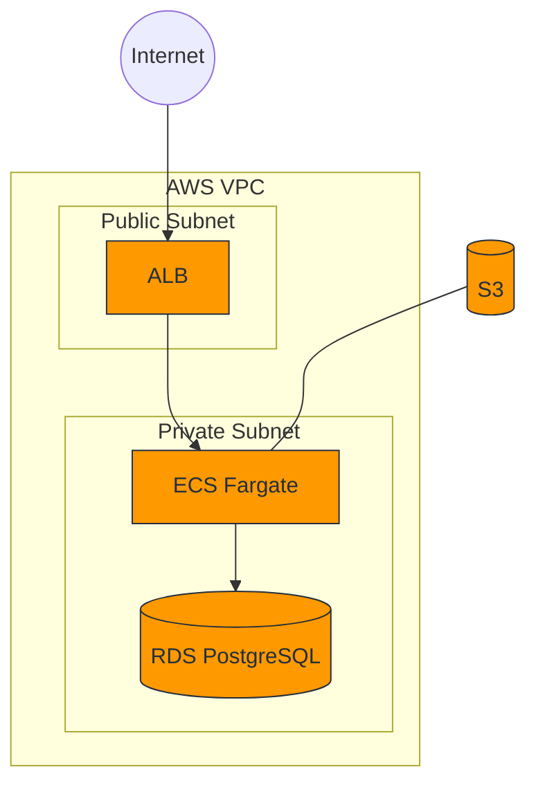
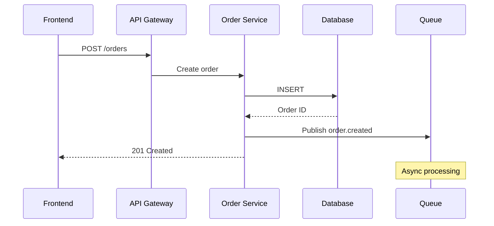
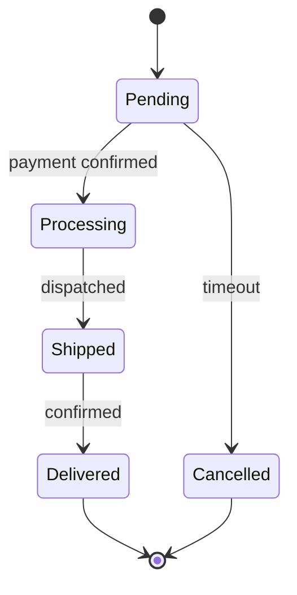

# Architecture Diagrams

> **Purpose**: Reusable patterns for visualizing software architecture with Mermaid
> **MCP Validated**: 2026-02-17

## When to Use

- Documenting system context and boundaries
- Visualizing microservice interactions
- Communicating infrastructure to stakeholders
- Architecture Decision Records (ADRs)

## C4 Context Diagram

## Microservice Architecture

## Event-Driven Architecture

## Infrastructure Diagram

## Service Interaction Sequence

## State Machine: Order Lifecycle

## Tips

| Tip | Rationale |
|-----|-----------|
| Use subgraphs for boundaries | Shows system/network boundaries |
| Apply `classDef` for color coding | Distinguish layers visually |
| Use LR for pipelines, TB for hierarchies | Matches reading patterns |
| Keep diagrams focused | One concern per diagram |

## See Also

- [Data Flow Diagrams](data-flow-diagrams.md) - ETL and pipeline patterns
- [CI/CD Diagrams](ci-cd-diagrams.md) - Deployment pipeline patterns
- [Diagram Types](../concepts/diagram-types.md) - All diagram type references
