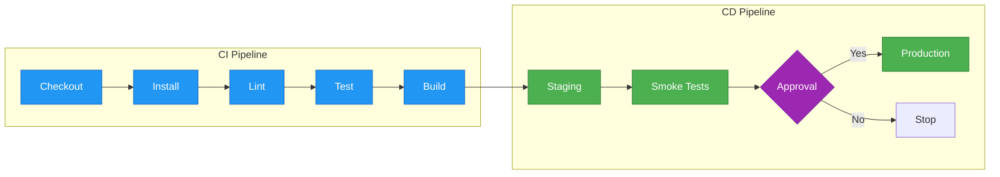
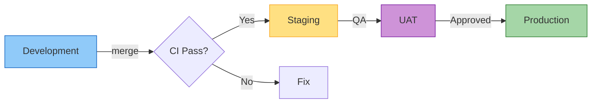
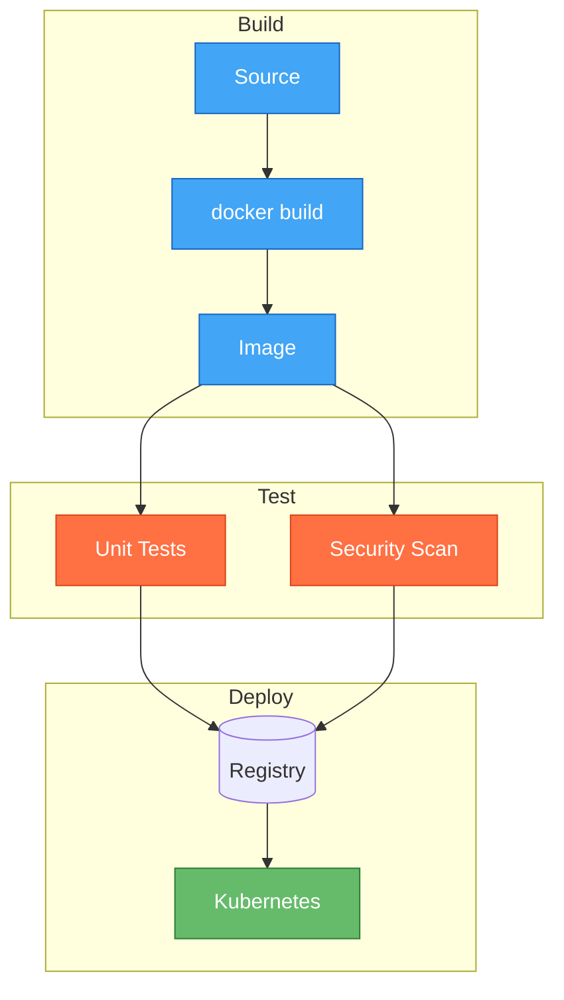
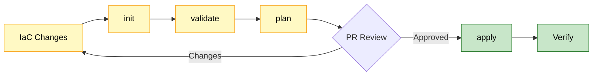
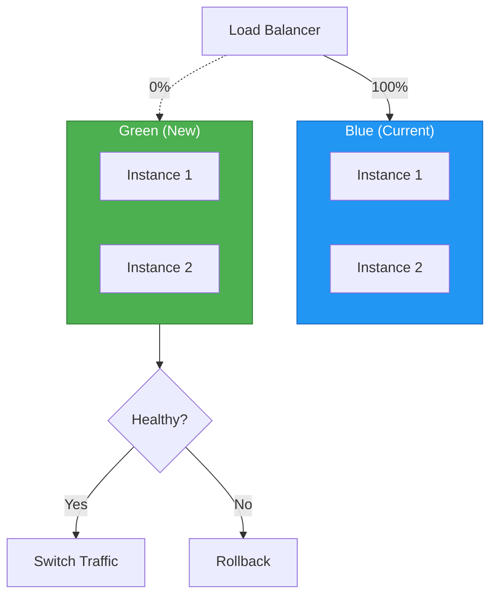
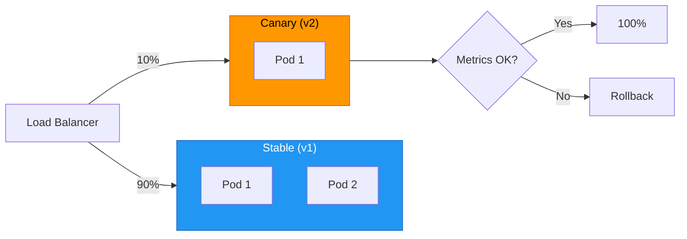
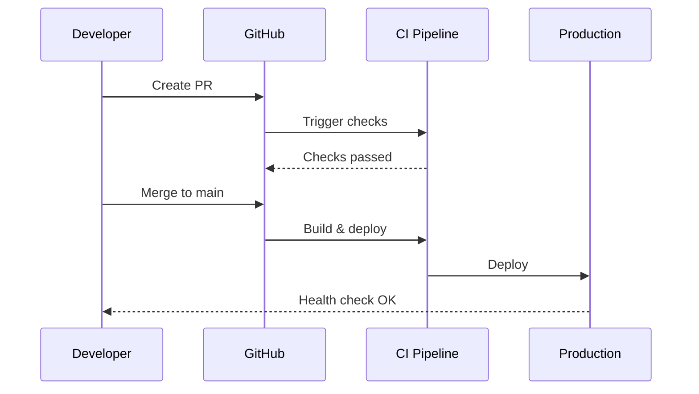
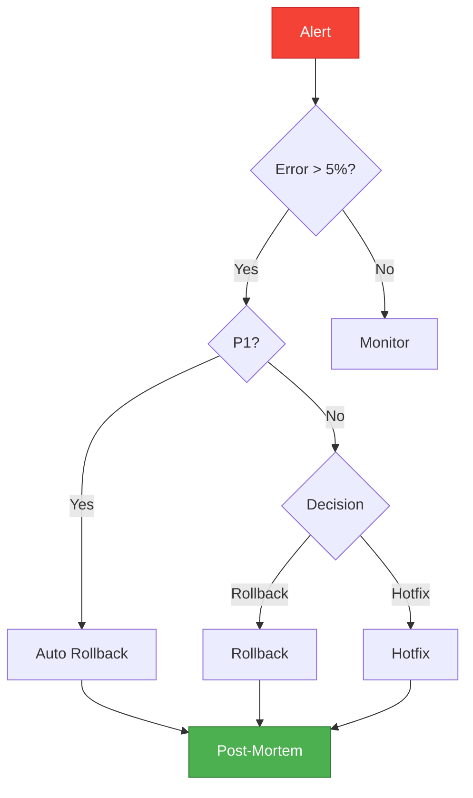

# CI/CD Diagrams

> **Purpose**: Patterns for visualizing CI/CD pipelines, deployment flows, and release processes
> **MCP Validated**: 2026-02-17

## When to Use

- Documenting CI/CD pipeline stages
- Visualizing deployment strategies (blue-green, canary)
- Communicating release processes to the team
- Mapping environment promotion flows

## GitHub Actions Pipeline

## Multi-Environment Promotion

## Docker Build and Push

## Terraform Deployment

## Blue-Green Deployment

## Canary Deployment

## Release Sequence

## Rollback Decision

## Tips

| Tip | Rationale |
|-----|-----------|
| Use LR for pipeline stages | Linear flow reads naturally |
| Color-code CI vs CD vs gates | Instant visual distinction |
| Include failure paths | Documents rollback procedures |
| Show approval gates | Clarifies human checkpoints |

## See Also

- [Architecture Diagrams](architecture-diagrams.md) - Infrastructure patterns
- [GitHub KB](../../../devops-sre/version-control/github/) - GitHub Actions
- [Kubernetes KB](../../../devops-sre/containerization/kubernetes/) - K8s deployments
