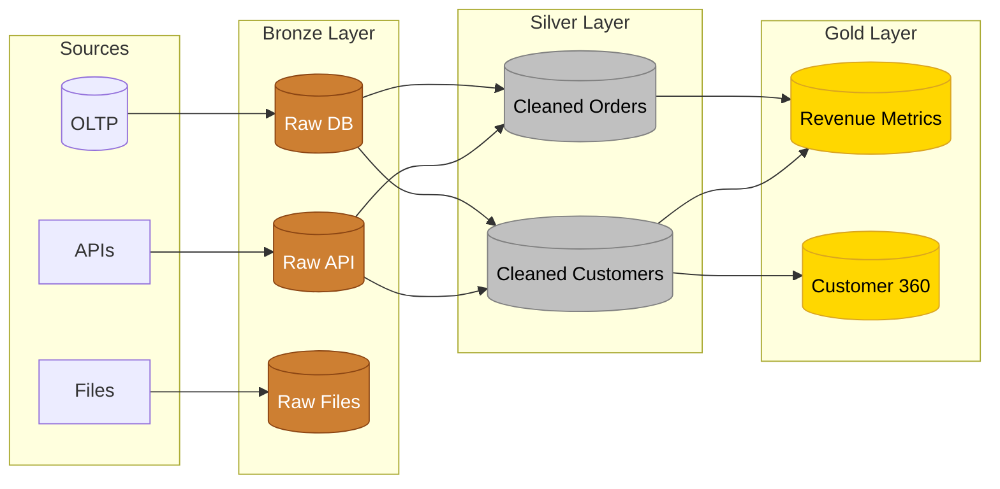
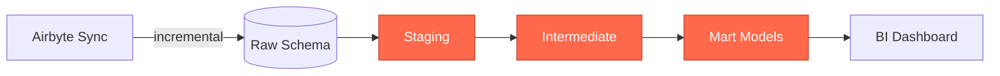
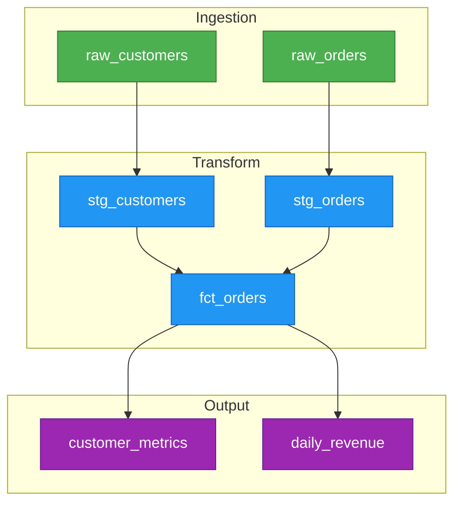
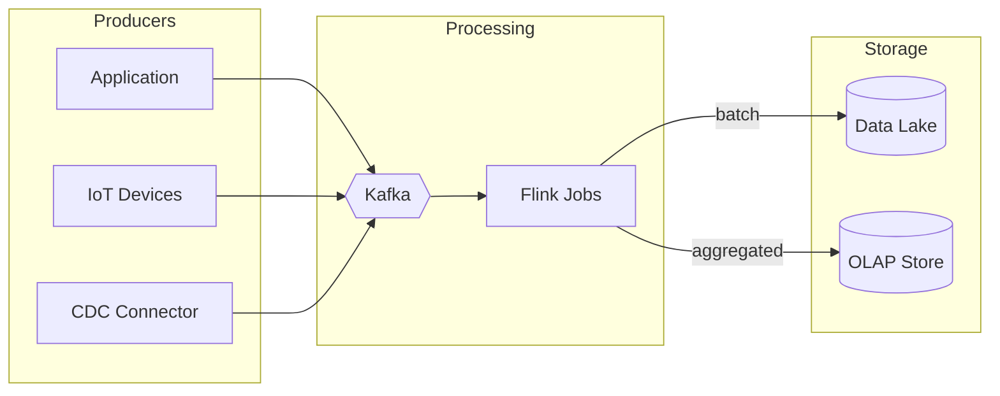
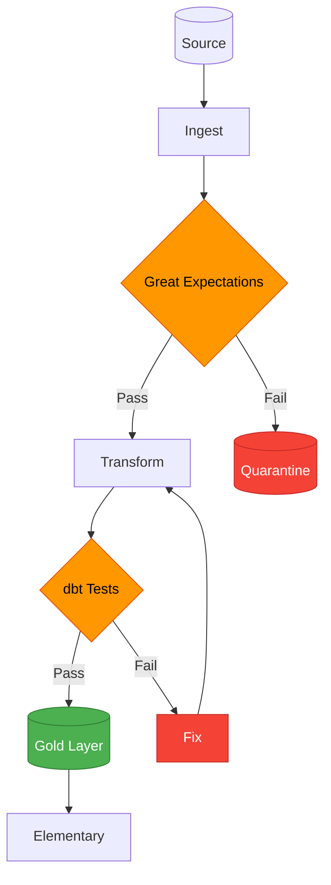
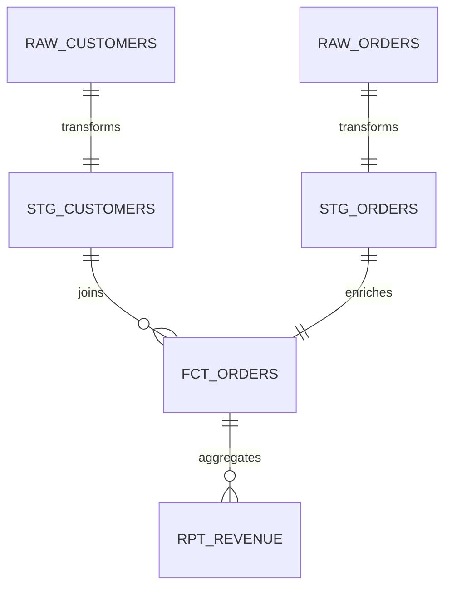

# Data Flow Diagrams

> **Purpose**: Patterns for visualizing ETL pipelines, data flows, and data platform architectures
> **MCP Validated**: 2026-02-17

## When to Use

- Documenting ETL/ELT pipeline architecture
- Visualizing medallion architecture layers
- Mapping data lineage across systems
- Communicating data platform design

## Medallion Architecture

## ELT Pipeline with dbt

## Dagster Asset Graph

## Streaming Pipeline

## Data Quality Pipeline

## Data Lineage (ER Diagram)

## Tips

| Tip | Rationale |
|-----|-----------|
| Use LR for pipelines | Data flows naturally left-to-right |
| Color-code by layer | Instant visual identification |
| Use cylinders for storage | Universal database symbol |
| Show quality checkpoints | Makes validation explicit |

## See Also

- [Architecture Diagrams](architecture-diagrams.md) - System-level patterns
- [Dagster KB](../../../data-engineering/orchestration/dagster/) - Orchestration
- [Great Expectations KB](../../../data-engineering/data-quality/) - Data quality
