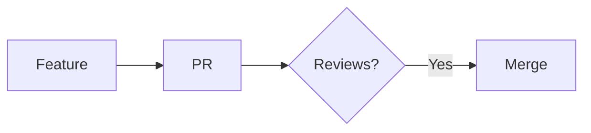
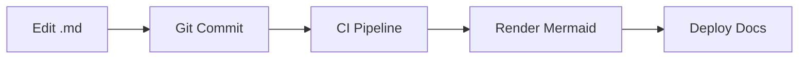

# Integration Patterns

> **Purpose**: Integrating Mermaid with documentation platforms and docs-as-code workflows
> **MCP Validated**: 2026-02-17

## When to Use

- Embedding diagrams in GitHub READMEs and wikis
- Adding diagrams to doc sites (Docusaurus, MkDocs)
- Rendering in knowledge tools (Notion, Obsidian, Confluence)
- Building docs-as-code pipelines

## GitHub (Native)

Renders Mermaid natively in `.md` files, issues, PRs, and wikis.

````markdown

````

**Limitations:** No `click` interactions, no custom themes via directives, diagram size limits.

### GitHub Actions: Render to Images

```yaml
name: Render Diagrams
on:
  push:
    paths: ['docs/**/*.md']
jobs:
  render:
    runs-on: ubuntu-latest
    steps:
      - uses: actions/checkout@v4
      - uses: mermaid-js/mermaid-cli-action@v1
        with:
          input: docs/diagrams/
          output: docs/images/
```

## GitLab (Native, 10.3+)

Same fenced code block syntax. Supported in Markdown files, MR descriptions, wikis, and snippets.

## Docusaurus

```bash
npm install @docusaurus/theme-mermaid
```

```javascript
// docusaurus.config.js
module.exports = {
  markdown: { mermaid: true },
  themes: ['@docusaurus/theme-mermaid'],
  themeConfig: {
    mermaid: {
      theme: { light: 'default', dark: 'dark' },
    },
  },
};
```

Auto-switches themes with Docusaurus dark mode.

## MkDocs (Material Theme)

```yaml
# mkdocs.yml
markdown_extensions:
  - pymdownx.superfences:
      custom_fences:
        - name: mermaid
          class: mermaid
          format: !!python/name:pymdownx.superfences.fence_code_format
```

## Notion

1. Type `/code` to create a code block
2. Select "Mermaid" from language dropdown
3. Diagram renders automatically

No custom themes or directives supported.

## Obsidian

Renders natively in preview mode. Custom CSS via `.obsidian/snippets/`.

## Confluence

**Options:**
1. "Mermaid Diagrams for Confluence" marketplace app (free tier)
2. HTML macro with CDN-loaded Mermaid.js
3. Pre-rendered SVG images via CLI

## Mermaid CLI (Offline Rendering)

```bash
npm install -g @mermaid-js/mermaid-cli

# Render to SVG
mmdc -i diagram.mmd -o diagram.svg

# Render to PNG with width
mmdc -i diagram.mmd -o diagram.png -w 1200

# Dark theme
mmdc -i diagram.mmd -o diagram.svg -t dark

# Batch render
mmdc -i docs/diagrams/ -o docs/images/
```

## Live Editor

[mermaid.live](https://mermaid.live/) -- real-time preview, theme switcher, export to SVG/PNG, shareable URLs.

## Docs-as-Code Pattern



**Best practices:**
- Store diagram source in `.md` files alongside code
- Use CI to validate syntax (`mmdc --validate`)
- Generate static images as fallback
- Version control diagrams with the code they document

## Platform Comparison

| Platform | Native | Themes | Directives | Interactions |
|----------|--------|--------|------------|-------------|
| GitHub | Yes | No | Limited | No |
| GitLab | Yes | No | Limited | No |
| Docusaurus | Plugin | Yes | Yes | Yes |
| MkDocs | Plugin | Yes | Yes | Yes |
| Notion | Yes | No | No | No |
| Obsidian | Yes | CSS | Yes | Limited |
| Confluence | App | Depends | Depends | Depends |

## See Also

- [Configuration](../concepts/configuration.md) - Per-platform config
- [Theming](../concepts/theming-styling.md) - Dark mode and custom themes
- [GitHub KB](../../../devops-sre/version-control/github/) - GitHub rendering
