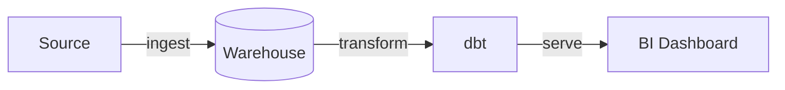
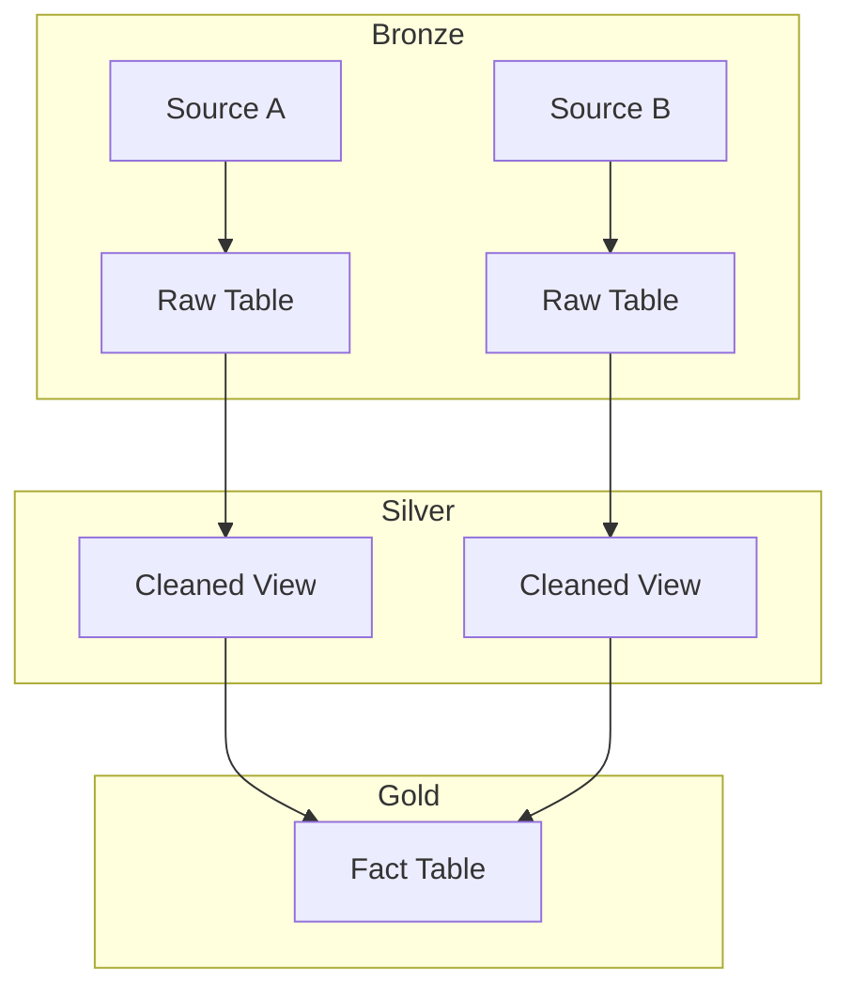
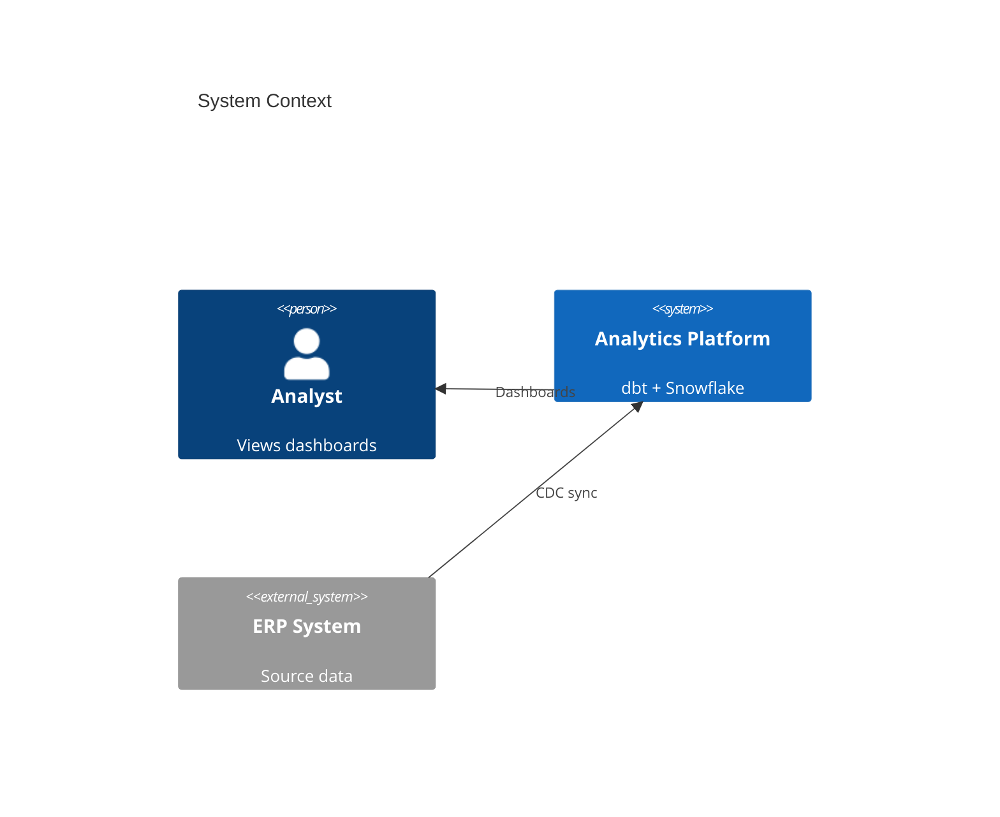
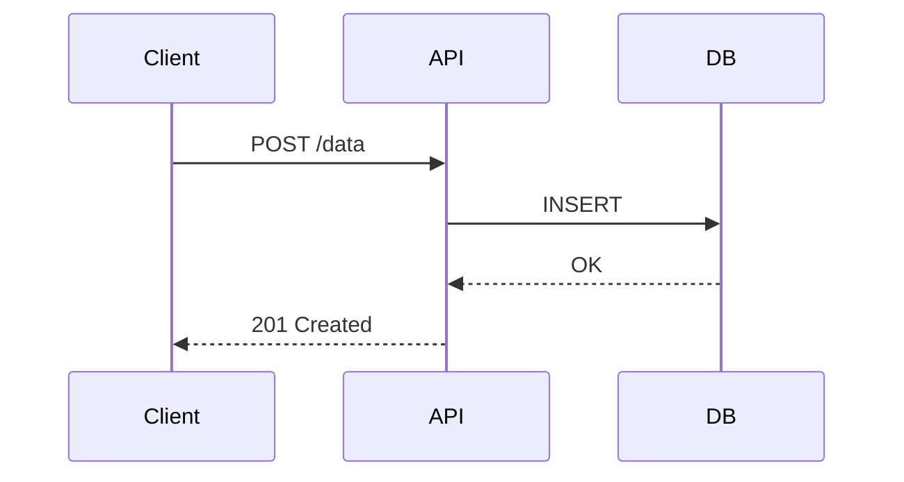

---
paths:
  - "**/README.md"
  - "**/README*.md"
  - "**/docs/**/*.md"
  - "**/ARCHITECTURE.md"
---

# Mermaid Diagrams Standard

> **Reference**: `.claude/kb/automation/diagramming/mermaid/`

## Rule

All architecture, data flow, and solution diagrams in README files and documentation MUST use Mermaid syntax — never ASCII art, image files, or external diagram tools.

## Why

- **Version-controlled**: Diagrams live in the same file, reviewed in the same PR
- **Native rendering**: GitHub, GitLab, Notion, and Obsidian render Mermaid natively
- **No tooling**: No draw.io, Lucidchart, or image exports to maintain
- **Searchable**: Text-based, grep-able, diff-able
- **Always current**: Updated alongside the code it describes

## Required Diagrams by Document Type

| Document | Required Diagrams | Recommended Mermaid Type |
|----------|-------------------|--------------------------|
| **Project README** | Architecture overview, data flow | `flowchart LR/TD` or `C4Context` |
| **ARCHITECTURE.md** | System design, component relationships | `flowchart`, `C4Context`, `block-beta` |
| **Pipeline docs** | Data flow from source to destination | `flowchart LR` |
| **API docs** | Request/response flows | `sequenceDiagram` |
| **Database docs** | Schema relationships | `erDiagram` |
| **CI/CD docs** | Deployment pipeline | `flowchart LR` |

## Mermaid Syntax (Quick Patterns)

### Architecture / Data Flow (most common)

````markdown

````

### Pipeline with Layers

````markdown

````

### System Architecture (C4)

````markdown

````

### API / Interaction Flow

````markdown

````

## Anti-Patterns

| Anti-Pattern | Do This Instead |
|-------------|-----------------|
| ASCII art boxes (`+---+`, `\|   \|`) | Mermaid `flowchart` |
| Embedded PNG/SVG images for architecture | Mermaid in markdown |
| draw.io / Lucidchart links | Mermaid inline |
| No diagram at all in README | Add at minimum an architecture flowchart |
| Overly complex single diagram (>30 nodes) | Split into multiple focused diagrams |

## When to Convert Existing ASCII Art

When editing a README that contains ASCII art diagrams:
1. Convert the ASCII diagram to equivalent Mermaid syntax
2. Remove the ASCII version
3. Verify the Mermaid renders correctly on GitHub

This conversion should happen opportunistically — when you're already editing the file for another reason, not as a standalone cleanup task.
