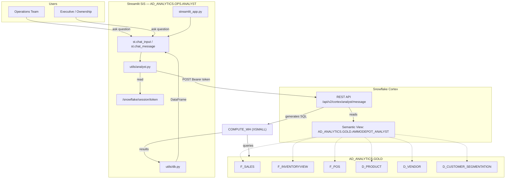

# DESIGN: Cortex Analyst Text-to-SQL Chatbot

> Technical design for a Streamlit SiS chatbot that translates natural language questions into SQL via Snowflake Cortex Analyst and a Semantic View over 6 Gold layer models

## Metadata

| Attribute | Value |
|-----------|-------|
| **Feature** | CORTEX_ANALYST_CHATBOT |
| **Date** | 2026-04-14 |
| **Author** | design-agent |
| **DEFINE** | [DEFINE_CORTEX_ANALYST_CHATBOT.md](./DEFINE_CORTEX_ANALYST_CHATBOT.md) |
| **Status** | Ready for Build |

---

## Architecture Overview



---

## Components

| Component | Purpose | Technology |
|-----------|---------|------------|
| `streamlit_app.py` | SiS entry point — page config, sidebar, chat loop | Streamlit 1.55+ (container runtime) |
| `app.py` | Local dev entry point — same UI, `.env` credentials | Streamlit (local) |
| `utils/analyst.py` | Cortex Analyst REST API wrapper — auth, send, parse | `requests` + `/snowflake/session/token` |
| `utils/db.py` | Snowpark session + SQL execution for generated queries | `snowflake-snowpark-python` |
| `utils/chart_theme.py` | Dark theme constants (subset from Sales Dashboard) | Plotly/CSS constants |
| `snowflake.yml` | SiS v2 definition — container runtime, shared pool | Snowflake CLI |
| `setup/01_bootstrap.sql` | Semantic View DDL + RBAC grants | Snowflake SQL |
| `setup/02_verified_queries.sql` | 10 golden question SQL for accuracy | Snowflake SQL |
| CI/CD workflow | GitHub Actions deploy + EAI re-attach | GitHub Actions |

---

## Key Decisions

### Decision 1: Semantic View over YAML on Stage

| Attribute | Value |
|-----------|-------|
| **Status** | Accepted |
| **Date** | 2026-04-14 |

**Context:** Cortex Analyst supports two semantic definition methods — Semantic Views (native DDL objects) and YAML files on Snowflake stages.

**Choice:** Use `CREATE SEMANTIC VIEW` in `AD_ANALYTICS.GOLD`.

**Rationale:** Native RBAC integration with existing 6-role setup. Auto-inferred relationship types reduce manual config. Snowsight wizard enables client self-service maintenance after handoff.

**Alternatives Rejected:**
1. YAML on stage — Legacy approach, stage-level permissions only, no Snowsight wizard, must manually specify relationship_type
2. Cortex Agents API — Overkill for Phase 1 simple lookups; saves this for future phases

**Consequences:**
- Trade-off: DDL not naturally Git-tracked (extract via `GET_DDL()` if needed)
- Benefit: Client team can edit semantic view in Snowsight without touching code

---

### Decision 2: Container Runtime Token Auth

| Attribute | Value |
|-----------|-------|
| **Status** | Accepted |
| **Date** | 2026-04-14 |

**Context:** Cortex Analyst REST API requires authentication. Container runtime has no `_snowflake` module and no connector-based token.

**Choice:** Read OAuth token from `/snowflake/session/token` (auto-injected by container runtime). Local dev falls back to `snowflake.connector` token.

**Rationale:** This is the documented approach for calling REST APIs from SiS container runtime. No secrets or EAI needed for the auth itself.

**Alternatives Rejected:**
1. `_snowflake` module — Not available in container runtime
2. Snowpark `session._conn._rest.token` — Works locally but unreliable in container runtime

**Consequences:**
- Trade-off: Auth mechanism differs between local and SiS — dual-mode `_get_token()` needed
- Benefit: Zero secrets management for the token; auto-rotated by Snowflake

---

### Decision 3: Shared Compute Pool

| Attribute | Value |
|-----------|-------|
| **Status** | Accepted |
| **Date** | 2026-04-14 |

**Context:** The chatbot needs a compute pool for SiS container runtime. A dedicated pool costs ~$5/mo.

**Choice:** Share `sales_dashboard_pool` (CPU_X64_XS, 1 node, auto-suspend 300s) with the Sales Dashboard.

**Rationale:** Dashboard is mostly idle between user interactions. Chatbot adds lightweight HTTP API calls + SQL execution on COMPUTE_WH (not the pool). Pool only runs the Streamlit container.

**Alternatives Rejected:**
1. Dedicated `analyst_pool` — $5/mo extra with no proven need for isolation

**Consequences:**
- Trade-off: If both apps are active simultaneously, container may be slower to respond
- Benefit: $0 incremental compute cost; simplifies management

---

### Decision 4: Execute Generated SQL Inline

| Attribute | Value |
|-----------|-------|
| **Status** | Accepted |
| **Date** | 2026-04-14 |

**Context:** Cortex Analyst returns generated SQL. Users expect results, not just the query.

**Choice:** Auto-execute the generated SQL via `get_active_session().sql(...)` and display results in `st.dataframe()`. Show SQL in a collapsible `st.code()` block above the results.

**Rationale:** Displaying only SQL forces users to copy-paste into a worksheet — defeats the purpose of the chatbot.

**Alternatives Rejected:**
1. Show SQL only, let users execute manually — Poor UX, users aren't SQL-literate
2. Execute in a separate warehouse — Unnecessary; COMPUTE_WH handles these queries

**Consequences:**
- Trade-off: Generated SQL executes with the session's role privileges (must ensure RBAC limits access to Gold only)
- Benefit: Complete self-service experience — question → answer in one interaction

---

## File Manifest

| # | File | Action | Purpose | Agent | Dependencies |
|---|------|--------|---------|-------|--------------|
| 1 | `streamlit_analyst/utils/__init__.py` | Create | Package init | (general) | None |
| 2 | `streamlit_analyst/utils/chart_theme.py` | Create | Dark theme constants (subset: BG_CHART, TEXT_PRIMARY, ACCENT) | @streamlit-expert | None |
| 3 | `streamlit_analyst/utils/db.py` | Create | Snowpark session + run_query() — dual-mode SiS/local | @streamlit-expert | None |
| 4 | `streamlit_analyst/utils/analyst.py` | Create | Cortex Analyst REST API wrapper: _get_token(), send_message(), extract_content() | @snowflake-expert | 3 |
| 5 | `streamlit_analyst/streamlit_app.py` | Create | SiS entry point — page config, chat UI loop, SQL execution, result display | @streamlit-expert | 2, 3, 4 |
| 6 | `streamlit_analyst/app.py` | Create | Local dev entry point — imports streamlit_app.py pattern | @streamlit-expert | 5 |
| 7 | `streamlit_analyst/snowflake.yml` | Create | SiS v2 definition — container runtime, sales_dashboard_pool, compute_wh | @streamlit-expert | None |
| 8 | `streamlit_analyst/requirements.txt` | Create | Package dependencies: streamlit, requests, pandas, snowflake-snowpark-python | (general) | None |
| 9 | `streamlit_analyst/setup/01_bootstrap.sql` | Create | CREATE SEMANTIC VIEW DDL + RBAC grants | @snowflake-expert | None |
| 10 | `streamlit_analyst/setup/02_verified_queries.sql` | Create | ALTER SEMANTIC VIEW to add 10 verified queries | @snowflake-expert | 9 |
| 11 | `.github/workflows/deploy-streamlit-analyst.yml` | Create | CI/CD: deploy + EAI re-attach (if needed) | @ci-cd-specialist | 5, 7 |

**Total Files:** 11

---

## Agent Assignment Rationale

| Agent | Files Assigned | Why This Agent |
|-------|----------------|----------------|
| @streamlit-expert | 2, 3, 5, 6, 7 | SiS container runtime patterns, dual-mode auth, Streamlit UI |
| @snowflake-expert | 4, 9, 10 | Cortex Analyst REST API, Semantic View DDL, RBAC grants |
| @ci-cd-specialist | 11 | GitHub Actions deploy workflow, EAI re-attachment pattern |
| (general) | 1, 8 | Trivial files: `__init__.py`, `requirements.txt` |

---

## Code Patterns

### Pattern 1: Container Runtime Token Auth (`utils/analyst.py`)

```python
import os
import requests

SNOWFLAKE_ACCOUNT = os.environ.get("SNOWFLAKE_ACCOUNT", "iwb48385.us-east-1")
SEMANTIC_VIEW = "AD_ANALYTICS.GOLD.AMMODEPOT_ANALYST"
_API_URL = f"https://{SNOWFLAKE_ACCOUNT}.snowflakecomputing.com/api/v2/cortex/analyst/message"

def _get_token() -> str:
    """Read OAuth token — container runtime injects at /snowflake/session/token."""
    try:
        with open("/snowflake/session/token", "r") as f:
            return f.read().strip()
    except FileNotFoundError:
        # Local dev: use snowflake-connector token
        from snowflake.connector import connect
        from utils.db import _get_local_connection
        conn = _get_local_connection()
        return conn.rest.token

def send_message(messages: list[dict]) -> dict:
    """Call Cortex Analyst with full conversation history."""
    resp = requests.post(
        _API_URL,
        headers={
            "Authorization": f"Bearer {_get_token()}",
            "Content-Type": "application/json",
            "X-Snowflake-Authorization-Token-Type": "OAUTH",
        },
        json={"messages": messages, "semantic_view": SEMANTIC_VIEW},
        timeout=90,
    )
    if not resp.ok:
        raise RuntimeError(f"Cortex Analyst error {resp.status_code}: {resp.text}")
    return resp.json()

def extract_content(response: dict) -> tuple[str | None, str | None, list[str]]:
    """Returns (text, sql, suggestions) from analyst response."""
    text, sql, suggestions = None, None, []
    for block in response.get("message", {}).get("content", []):
        if block["type"] == "text":
            text = block["text"]
        elif block["type"] == "sql":
            sql = block["statement"]
        elif block["type"] == "suggestions":
            suggestions = block["suggestions"]
    return text, sql, suggestions
```

### Pattern 2: Chat UI Loop (`streamlit_app.py`)

```python
import streamlit as st
from utils.analyst import send_message, extract_content
from utils.db import run_query
from utils.chart_theme import BG_CHART, TEXT_PRIMARY

st.set_page_config(page_title="Ammo Depot Analyst", layout="wide")

# Dark background CSS
st.markdown(f"""<style>
    .stApp {{ background-color: {BG_CHART}; color: {TEXT_PRIMARY}; }}
    .stChatMessage {{ background-color: #2a2a2a; }}
</style>""", unsafe_allow_html=True)

st.title("Sales Assistant")
st.caption("Ask questions about sales, inventory, products, vendors, and customers.")

if "messages" not in st.session_state:
    st.session_state.messages = []

# Render history
for msg in st.session_state.messages:
    with st.chat_message(msg["role"]):
        for block in msg["content"]:
            if block["type"] == "text":
                st.markdown(block["text"])
            elif block["type"] == "sql":
                with st.expander("Generated SQL", expanded=False):
                    st.code(block["statement"], language="sql")

# Chat input
if prompt := st.chat_input("Ask about sales, inventory, or products..."):
    user_msg = {"role": "user", "content": [{"type": "text", "text": prompt}]}
    st.session_state.messages.append(user_msg)

    with st.chat_message("user"):
        st.markdown(prompt)

    with st.chat_message("assistant"):
        with st.spinner("Analyzing..."):
            try:
                response = send_message(st.session_state.messages)
                text, sql, suggestions = extract_content(response)

                if text:
                    st.markdown(text)
                if sql:
                    with st.expander("Generated SQL", expanded=False):
                        st.code(sql, language="sql")
                    df = run_query(sql)
                    st.dataframe(df.head(500), use_container_width=True)
                if suggestions:
                    st.markdown("**Try asking:**")
                    for s in suggestions:
                        st.markdown(f"- {s}")

                st.session_state.messages.append(response["message"])
            except RuntimeError as e:
                st.error(f"Error: {e}")
            except Exception as e:
                st.error(f"Query error: {e}")

# Sidebar
with st.sidebar:
    if st.button("Clear conversation"):
        st.session_state.messages = []
        st.rerun()
    st.caption("Powered by Snowflake Cortex Analyst")
```

### Pattern 3: Dual-Mode DB Session (`utils/db.py`)

```python
"""Snowflake connection — same pattern as streamlit_app/utils/db.py."""
import pandas as pd
import streamlit as st

_session = None
_is_sis = False

try:
    from snowflake.snowpark.context import get_active_session
    _session = get_active_session()
    _is_sis = True
    _session.sql("USE SCHEMA AD_ANALYTICS.GOLD").collect()
except Exception:
    pass

def _get_local_connection():
    """Local dev: key-pair auth from ammodepot/.env."""
    import os
    from pathlib import Path
    from cryptography.hazmat.primitives import serialization
    from dotenv import load_dotenv
    from snowflake.connector import connect

    env_path = Path(__file__).resolve().parents[2] / "ammodepot" / ".env"
    load_dotenv(env_path)
    key_path = Path(__file__).resolve().parents[2] / "ammodepot" / os.environ["SNOWFLAKE_PRIVATE_KEY_PATH"]
    passphrase = os.environ.get("SNOWFLAKE_PRIVATE_KEY_PASSPHRASE", "").encode()
    with open(key_path, "rb") as f:
        pk = serialization.load_pem_private_key(f.read(), password=passphrase or None)
    pk_bytes = pk.private_bytes(
        encoding=serialization.Encoding.DER,
        format=serialization.PrivateFormat.PKCS8,
        encryption_algorithm=serialization.NoEncryption(),
    )
    return connect(
        account=os.environ["SNOWFLAKE_ACCOUNT"],
        user=os.environ["SNOWFLAKE_USER"],
        private_key=pk_bytes,
        warehouse=os.environ["SNOWFLAKE_WAREHOUSE"],
        database="AD_ANALYTICS", schema="GOLD",
        role=os.environ["SNOWFLAKE_ROLE"],
    )

@st.cache_resource
def get_connection():
    return _get_local_connection()

def run_query(sql: str) -> pd.DataFrame:
    """Execute SQL and return DataFrame. SiS uses session; local uses connector."""
    if _is_sis:
        df = _session.sql(sql).to_pandas()
    else:
        conn = get_connection()
        cur = conn.cursor()
        try:
            cur.execute(sql)
            df = pd.DataFrame(cur.fetchall(), columns=[d[0] for d in cur.description])
        finally:
            cur.close()
    # Coerce Decimal→float64 for pandas compatibility
    from decimal import Decimal
    for col in df.columns:
        if df[col].dtype == "object" and len(df) > 0:
            sample = df[col].dropna().iloc[0] if len(df[col].dropna()) > 0 else None
            if isinstance(sample, Decimal):
                df[col] = pd.to_numeric(df[col], errors="coerce")
    return df
```

### Pattern 4: SiS Definition (`snowflake.yml`)

```yaml
definition_version: 2

entities:
  analyst:
    type: streamlit
    identifier:
      name: analyst
      schema: ops
      database: ad_analytics
    title: "Ammunition Depot Sales Assistant"
    main_file: streamlit_app.py

    runtime_name: "SYSTEM$ST_CONTAINER_RUNTIME_PY3_11"
    compute_pool: sales_dashboard_pool
    query_warehouse: compute_wh

    stage: analyst_stage
    artifacts:
      - streamlit_app.py
      - requirements.txt
      - utils/
```

### Pattern 5: Bootstrap SQL (`setup/01_bootstrap.sql`)

```sql
-- Run as ACCOUNTADMIN (one-time setup)
USE ROLE ACCOUNTADMIN;

-- Grant semantic view creation to TRANSFORMER_ROLE
GRANT CREATE SEMANTIC VIEW ON SCHEMA AD_ANALYTICS.GOLD TO ROLE TRANSFORMER_ROLE;

-- Create the semantic view
USE ROLE TRANSFORMER_ROLE;
USE SCHEMA AD_ANALYTICS.GOLD;

CREATE OR REPLACE SEMANTIC VIEW AD_ANALYTICS.GOLD.AMMODEPOT_ANALYST
AS $$
name: ammodepot_analyst
description: >
  Sales, inventory, procurement, product, vendor, and customer segmentation
  data for Ammunition Depot. Covers 6 Gold layer tables.

tables:
  - name: sales
    description: "Order line items from Magento (website) and Fishbowl (GunBroker). One row per item sold."
    base_table:
      database: AD_ANALYTICS
      schema: GOLD
      table: F_SALES
    dimensions:
      - name: order_status
        expr: STATUS
        data_type: VARCHAR
        description: "Order status: COMPLETE, PROCESSING, UNVERIFIED, CANCELED, CLOSED"
        is_enum: true
        synonyms: ["status"]
      - name: storefront
        expr: STOREFRONT
        data_type: VARCHAR
        description: "Sales channel: Website (Magento) or GunBroker"
        is_enum: true
        synonyms: ["channel", "store"]
      - name: store_name
        expr: STORE_NAME
        data_type: VARCHAR
        description: "Magento store name"
      - name: customer_email
        expr: CUSTOMER_EMAIL
        data_type: VARCHAR
        description: "Customer email address"
        synonyms: ["email", "customer"]
      - name: customer_name
        expr: CUSTOMER_NAME
        data_type: VARCHAR
        description: "Customer full name"
      - name: region
        expr: REGION
        data_type: VARCHAR
        description: "Billing state/province"
        synonyms: ["state"]
      - name: city
        expr: CITY
        data_type: VARCHAR
      - name: postcode
        expr: POSTCODE
        data_type: VARCHAR
        description: "Billing ZIP code"
        synonyms: ["zip", "zip code"]
      - name: product_id
        expr: PRODUCT_ID
        data_type: NUMBER
        description: "Magento product entity ID (FK to products)"
      - name: order_id
        expr: ORDER_ID
        data_type: NUMBER
        description: "Magento order entity ID"
      - name: increment_id
        expr: INCREMENT_ID
        data_type: VARCHAR
        description: "Human-readable order number"
        synonyms: ["order number"]
      - name: vendor_id
        expr: VENDOR
        data_type: NUMBER
        description: "Fishbowl vendor ID (FK to vendors)"
    time_dimensions:
      - name: order_date
        expr: CREATED_AT
        data_type: TIMESTAMP_NTZ
        description: "Order creation date/time in Eastern (EDT/EST)"
        synonyms: ["date", "sale date", "created"]
    facts:
      - name: revenue
        expr: ROW_TOTAL
        data_type: NUMBER
        description: "Net line item revenue in USD (after discount)"
        synonyms: ["sales", "net sales"]
      - name: cost
        expr: COST
        data_type: NUMBER
        description: "Cost of goods sold per line item"
        synonyms: ["cogs"]
      - name: qty_ordered
        expr: QTY_ORDERED
        data_type: NUMBER
        description: "Units ordered"
        synonyms: ["units", "quantity"]
      - name: freight_revenue
        expr: FREIGHT_REVENUE
        data_type: NUMBER
        description: "Shipping revenue allocated to this line item"
      - name: freight_cost
        expr: FREIGHT_COST
        data_type: NUMBER
        description: "Shipping cost allocated to this line item"
      - name: tax_amount
        expr: TAX_AMOUNT
        data_type: NUMBER
        description: "Tax charged on this line item"
      - name: part_qty_sold
        expr: PART_QTY_SOLD
        data_type: NUMBER
        description: "Piece quantity sold (adjusted by UOM conversion)"
    metrics:
      - name: total_revenue
        expr: SUM(ROW_TOTAL)
        description: "Total net revenue"
        synonyms: ["gross sales", "total sales"]
      - name: total_orders
        expr: COUNT(DISTINCT ORDER_ID)
        description: "Count of unique orders"
      - name: gross_profit
        expr: SUM(ROW_TOTAL) - SUM(COST)
        description: "Gross profit (revenue minus COGS)"
        synonyms: ["GP", "profit"]
      - name: gross_margin
        expr: (SUM(ROW_TOTAL) - SUM(COST)) / NULLIF(SUM(ROW_TOTAL), 0)
        description: "Gross margin percentage"
        synonyms: ["margin"]
      - name: aov
        expr: SUM(ROW_TOTAL) / NULLIF(COUNT(DISTINCT ORDER_ID), 0)
        description: "Average order value"
        synonyms: ["average order value", "avg ticket"]
      - name: total_units
        expr: SUM(QTY_ORDERED)
        description: "Total units sold"
    filters:
      - name: standard_statuses
        description: "Active orders (excludes CANCELED, CLOSED)"
        expr: "STATUS IN ('COMPLETE', 'PROCESSING', 'UNVERIFIED')"

  - name: inventory
    description: "Current inventory snapshot. One row per part number."
    base_table:
      database: AD_ANALYTICS
      schema: GOLD
      table: F_INVENTORYVIEW
    dimensions:
      - name: part_number
        expr: PART_NUMBER
        data_type: VARCHAR
        unique: true
        description: "SKU / part number"
        synonyms: ["sku"]
    facts:
      - name: qty_available
        expr: QTY_AVAILABLE
        data_type: NUMBER
        description: "Units currently in stock"
        synonyms: ["on hand", "in stock"]
      - name: qty_not_available
        expr: QTY_NOT_AVAILABLE
        data_type: NUMBER
        description: "Units reserved or held"
      - name: qty_on_order
        expr: QTY_ON_ORDER
        data_type: NUMBER
        description: "Units on outstanding purchase orders"
        synonyms: ["on order"]
      - name: part_cost
        expr: PART_COST
        data_type: NUMBER
        description: "Unit cost (max of average costs)"
      - name: extended_cost
        expr: EXTENDED_COST
        data_type: NUMBER
        description: "Total inventory valuation (qty * cost)"
    metrics:
      - name: total_on_hand
        expr: SUM(QTY_AVAILABLE)
        description: "Total units in stock across all SKUs"
      - name: total_inventory_value
        expr: SUM(EXTENDED_COST)
        description: "Total dollar value of current inventory"
        synonyms: ["inventory cost", "stock value"]
      - name: total_on_order
        expr: SUM(QTY_ON_ORDER)
        description: "Total units on open purchase orders"

  - name: purchase_orders
    description: "Purchase order receipt lines. One row per received item."
    base_table:
      database: AD_ANALYTICS
      schema: GOLD
      table: F_POS
    dimensions:
      - name: part_number
        expr: PART_NUMBER
        data_type: VARCHAR
        description: "SKU / part number received"
      - name: vendor_id
        expr: VENDOR_ID
        data_type: NUMBER
        description: "Fishbowl vendor ID (FK to vendors)"
      - name: purchase_order_id
        expr: PURCHASE_ORDER_ID
        data_type: NUMBER
        description: "PO identifier"
        synonyms: ["PO", "PO number"]
      - name: receipt_status
        expr: RECEIPT_ITEM_STATUS_ID
        data_type: NUMBER
        description: "2=Received, 4=Reconciled"
        is_enum: true
    time_dimensions:
      - name: po_created_date
        expr: PO_CREATED_AT
        data_type: TIMESTAMP_NTZ
        description: "Date PO was created"
        synonyms: ["PO date", "order date"]
      - name: date_received
        expr: DATERECEIVED
        data_type: TIMESTAMP_NTZ
        description: "Date item was received (NULL if not yet received)"
    facts:
      - name: qty_received
        expr: QTY
        data_type: NUMBER
        description: "Quantity received on this line"
      - name: unit_cost
        expr: UNIT_COST
        data_type: NUMBER
        description: "Per-unit purchase cost"
      - name: total_cost
        expr: TOTAL_COST
        data_type: NUMBER
        description: "Total cost for this receipt line"
      - name: lead_time
        expr: PRECISE_LEADTIME
        data_type: NUMBER
        description: "Best available lead time in days (vendor-product > vendor > product)"
        synonyms: ["lead time", "delivery time"]
      - name: qty_to_fulfill
        expr: QUANTITY_TO_FULFILL
        data_type: NUMBER
        description: "Quantity still to be delivered on this PO item"
      - name: qty_fulfilled
        expr: QUANTITY_FULFILLED
        data_type: NUMBER
        description: "Quantity already delivered on this PO item"
    metrics:
      - name: avg_lead_time
        expr: AVG(PRECISE_LEADTIME)
        description: "Average lead time in days"
      - name: total_po_cost
        expr: SUM(TOTAL_COST)
        description: "Total procurement cost"
      - name: total_qty_received
        expr: SUM(QTY)
        description: "Total units received"
    filters:
      - name: open_pos
        description: "PO items not yet received"
        expr: "DATERECEIVED IS NULL AND QUANTITY_TO_FULFILL > 0"

  - name: products
    description: "Product catalog with ammunition attributes. One row per product."
    base_table:
      database: AD_ANALYTICS
      schema: GOLD
      table: D_PRODUCT
    dimensions:
      - name: product_id
        expr: "\"Product ID\""
        data_type: NUMBER
        unique: true
        description: "Magento product entity ID (primary key)"
      - name: sku
        expr: SKU
        data_type: VARCHAR
        unique: true
        description: "Stock keeping unit"
      - name: product_name
        expr: "\"Product Name\""
        data_type: VARCHAR
        description: "Full product name"
        synonyms: ["product", "item", "name"]
      - name: caliber
        expr: "\"Caliber\""
        data_type: VARCHAR
        description: "Ammunition caliber (e.g., 9mm, 5.56 NATO, .308 Win)"
      - name: manufacturer
        expr: "\"Manufacturer SKU\""
        data_type: VARCHAR
        description: "Manufacturer / brand name"
        synonyms: ["brand", "maker", "mfr"]
      - name: projectile
        expr: "\"Projectile\""
        data_type: VARCHAR
        description: "Projectile type: FMJ, JHP, SP, HP, Buck, Slug, etc."
      - name: vendor
        expr: "\"Vendor\""
        data_type: VARCHAR
        description: "Fishbowl vendor / fulfillment source"
        synonyms: ["fulfilled by", "supplier"]
      - name: use_type
        expr: USE_TYPE_CATEGORY
        data_type: VARCHAR
        description: "Product use classification: Hunting, Self-Defense, Tactical, Sporting, Collector, Unclassified"
        is_enum: true
        synonyms: ["use type", "product type", "use case"]
      - name: primary_category
        expr: "\"Primary Category\""
        data_type: VARCHAR
        description: "Top-level product category: Ammunition, Guns, Magazines, Gun Parts, Gear, Optics, etc."
        is_enum: true
        synonyms: ["category"]
      - name: discontinued
        expr: "\"Discontinued\""
        data_type: BOOLEAN
        description: "Whether the product is discontinued"
      - name: unit_type
        expr: "\"Unit Type\""
        data_type: VARCHAR
        description: "Unit of measure (Box, Case, Each)"
    facts:
      - name: avg_cost
        expr: AVGCOST
        data_type: NUMBER
        description: "Average cost from Fishbowl"
      - name: last_vendor_cost
        expr: LASTVENDORCOST
        data_type: NUMBER
        description: "Most recent vendor cost"

  - name: vendors
    description: "Vendor/supplier master data. One row per vendor."
    base_table:
      database: AD_ANALYTICS
      schema: GOLD
      table: D_VENDOR
    dimensions:
      - name: vendor_id
        expr: VENDOR_ID
        data_type: NUMBER
        unique: true
        description: "Fishbowl vendor ID (primary key)"
      - name: vendor_name
        expr: VENDOR_NAME
        data_type: VARCHAR
        description: "Supplier / vendor name"
        synonyms: ["vendor", "supplier"]
      - name: is_active
        expr: IS_ACTIVE
        data_type: BOOLEAN
        description: "Whether the vendor is currently active"
    facts:
      - name: default_lead_time
        expr: LEAD_TIME_DAYS
        data_type: NUMBER
        description: "Default lead time in days"
      - name: credit_limit
        expr: CREDIT_LIMIT
        data_type: NUMBER
        description: "Vendor credit limit"
      - name: min_order_amount
        expr: MINIMUM_ORDER_AMOUNT
        data_type: NUMBER
        description: "Minimum order amount"
    filters:
      - name: active_vendors
        description: "Only active vendors"
        expr: "IS_ACTIVE = TRUE"

  - name: customer_segments
    description: "RFM customer segmentation with 16 classifications. One row per unique customer."
    base_table:
      database: AD_ANALYTICS
      schema: GOLD
      table: D_CUSTOMER_SEGMENTATION
    dimensions:
      - name: customer_email
        expr: CUSTOMER_EMAIL
        data_type: VARCHAR
        description: "Customer email"
      - name: rank_id
        expr: RANK_ID
        data_type: NUMBER
        unique: true
        description: "Deduplicated customer ID (primary key)"
      - name: frequency
        expr: FREQUENCY
        data_type: VARCHAR
        description: "Purchase frequency band: F0 (none) to F5 (6+ purchases in 12 months)"
        is_enum: true
      - name: recency
        expr: RECENCY
        data_type: VARCHAR
        description: "Recency band: R0 (>365 days) to R5 (within 30 days)"
        is_enum: true
      - name: value_band
        expr: VALUE
        data_type: VARCHAR
        description: "Revenue band: V0 (none) to V5 (>$500 in 12 months)"
        is_enum: true
      - name: margin_band
        expr: MARGIN
        data_type: VARCHAR
        description: "Margin band: M0 (none) to M5 (>=30%)"
        is_enum: true
      - name: monetary_value
        expr: MONETARY_VALUE
        data_type: VARCHAR
        description: "Combined value+margin score: MV0 to MV5"
        is_enum: true
      - name: classification
        expr: CUSTOMER_CLASSIFICATION
        data_type: VARCHAR
        description: "Customer segment: Super Engaged, At-Risk Regular, Lost Buyer, New Buyer, etc. (16 segments)"
        is_enum: true
        synonyms: ["segment", "customer type", "classification"]
      - name: customer_group
        expr: CUSTOMER_GROUP
        data_type: VARCHAR
        description: "Account type: General, Law Enforcement, Wholesale, Retailer, NOT LOGGED IN"
        is_enum: true
        synonyms: ["group", "account type"]
    facts:
      - name: total_revenue
        expr: TOTAL_REVENUE
        data_type: NUMBER
        description: "Customer revenue in trailing 12 months"
      - name: purchase_count
        expr: NUMBER_OF_PURCHASES
        data_type: NUMBER
        description: "Number of purchases in trailing 12 months"
      - name: days_since_last
        expr: DAYS_SINCE_LAST_PURCHASE
        data_type: NUMBER
        description: "Days since most recent purchase"
      - name: lifetime_purchases
        expr: TOTAL_PURCHASES_ALL_TIME
        data_type: NUMBER
        description: "Total purchases across all time (any status)"
    metrics:
      - name: customer_count
        expr: COUNT(DISTINCT RANK_ID)
        description: "Number of unique customers"
      - name: avg_customer_revenue
        expr: AVG(TOTAL_REVENUE)
        description: "Average 12-month revenue per customer"

relationships:
  - name: sales_to_products
    left_table: sales
    right_table: products
    relationship_columns:
      - left_column: PRODUCT_ID
        right_column: "\"Product ID\""
  - name: sales_to_vendors
    left_table: sales
    right_table: vendors
    relationship_columns:
      - left_column: VENDOR
        right_column: VENDOR_ID
  - name: sales_to_segments
    left_table: sales
    right_table: customer_segments
    relationship_columns:
      - left_column: RANK_ID
        right_column: RANK_ID
  - name: pos_to_vendors
    left_table: purchase_orders
    right_table: vendors
    relationship_columns:
      - left_column: VENDOR_ID
        right_column: VENDOR_ID
  - name: pos_to_products
    left_table: purchase_orders
    right_table: products
    relationship_columns:
      - left_column: PART_NUMBER
        right_column: SKU
  - name: inventory_to_products
    left_table: inventory
    right_table: products
    relationship_columns:
      - left_column: PART_NUMBER
        right_column: SKU
$$;

-- RBAC grants
USE ROLE ACCOUNTADMIN;
GRANT USAGE ON SEMANTIC VIEW AD_ANALYTICS.GOLD.AMMODEPOT_ANALYST
  TO ROLE DASHBOARD_VIEWER_ROLE;
GRANT USAGE ON SEMANTIC VIEW AD_ANALYTICS.GOLD.AMMODEPOT_ANALYST
  TO ROLE POWERBI_READONLY_ROLE;
GRANT USAGE ON SEMANTIC VIEW AD_ANALYTICS.GOLD.AMMODEPOT_ANALYST
  TO ROLE STREAMLIT_ROLE;
```

### Pattern 6: CI/CD Workflow

```yaml
name: Deploy Streamlit Analyst

on:
  push:
    branches: [main]
    paths:
      - 'streamlit_analyst/**'
      - '.github/workflows/deploy-streamlit-analyst.yml'
  workflow_dispatch:

jobs:
  deploy:
    runs-on: ubuntu-latest
    permissions:
      contents: read
    env:
      SNOWFLAKE_ACCOUNT: iwb48385.us-east-1
      SNOWFLAKE_USER: SVC_DBT
      SNOWFLAKE_ROLE: STREAMLIT_ROLE
      SNOWFLAKE_WAREHOUSE: COMPUTE_WH
      SNOWFLAKE_DATABASE: AD_ANALYTICS
      SNOWFLAKE_SCHEMA: OPS

    steps:
      - uses: actions/checkout@v4

      - uses: aws-actions/configure-aws-credentials@v4
        with:
          aws-access-key-id: ${{ secrets.AWS_ACCESS_KEY_ID }}
          aws-secret-access-key: ${{ secrets.AWS_SECRET_ACCESS_KEY }}
          aws-region: us-east-1

      - name: Fetch Snowflake private key
        run: |
          # Same pattern as cost monitor — extract key from Secrets Manager
          set -euo pipefail
          aws secretsmanager get-secret-value \
            --secret-id ammodepot/dbt/snowflake \
            --query SecretString --output text > /tmp/sf_secret.json
          python3 <<'PY'
          import json, os, pathlib
          with open("/tmp/sf_secret.json") as f:
              d = json.load(f)
          pathlib.Path("/tmp/sf_rsa_key.p8").write_text(d["SNOWFLAKE_PRIVATE_KEY"])
          pathlib.Path("/tmp/sf_rsa_key.p8").chmod(0o600)
          passphrase = d.get("SNOWFLAKE_PRIVATE_KEY_PASSPHRASE", "") or ""
          if passphrase:
              print(f"::add-mask::{passphrase}")
          with open(os.environ["GITHUB_ENV"], "a") as env:
              env.write("SNOWFLAKE_PRIVATE_KEY_PATH=/tmp/sf_rsa_key.p8\n")
              if passphrase:
                  env.write(f"SNOWFLAKE_PRIVATE_KEY_PASSPHRASE={passphrase}\n")
          PY
          rm /tmp/sf_secret.json

      - name: Install Snowflake CLI
        run: pip install 'snowflake-cli-labs>=2.7' || pip install 'snowflake-cli>=2.7'

      - name: Write CLI config
        run: |
          mkdir -p ~/.snowflake
          cat > ~/.snowflake/config.toml <<EOF
          default_connection_name = "deploy"
          [connections.deploy]
          account = "${SNOWFLAKE_ACCOUNT}"
          user = "${SNOWFLAKE_USER}"
          role = "${SNOWFLAKE_ROLE}"
          warehouse = "${SNOWFLAKE_WAREHOUSE}"
          database = "${SNOWFLAKE_DATABASE}"
          schema = "${SNOWFLAKE_SCHEMA}"
          authenticator = "SNOWFLAKE_JWT"
          private_key_file = "${SNOWFLAKE_PRIVATE_KEY_PATH}"
          EOF
          chmod 600 ~/.snowflake/config.toml

      - name: Deploy Streamlit app
        working-directory: streamlit_analyst
        env:
          PRIVATE_KEY_PASSPHRASE: ${{ env.SNOWFLAKE_PRIVATE_KEY_PASSPHRASE }}
        run: snow streamlit deploy --replace --connection deploy

      - name: Smoke test
        env:
          PRIVATE_KEY_PASSPHRASE: ${{ env.SNOWFLAKE_PRIVATE_KEY_PASSPHRASE }}
        run: snow sql --connection deploy -q "describe streamlit ad_analytics.ops.analyst"
```

---

## Data Flow

```
1. User types question in st.chat_input()
   │
   ▼
2. Question appended to st.session_state.messages[]
   │
   ▼
3. utils/analyst.py: send_message(messages)
   ├── Read /snowflake/session/token (SiS) or connector token (local)
   ├── POST https://{account}.snowflakecomputing.com/api/v2/cortex/analyst/message
   └── Body: { messages: [...], semantic_view: "AD_ANALYTICS.GOLD.AMMODEPOT_ANALYST" }
   │
   ▼
4. Cortex Analyst resolves semantic view → generates SQL
   │
   ▼
5. Response: { text, sql, suggestions }
   │
   ▼
6. utils/db.py: run_query(sql) → COMPUTE_WH executes → pandas DataFrame
   │
   ▼
7. Streamlit renders: st.markdown(text) + st.code(sql) + st.dataframe(df)
   │
   ▼
8. Response appended to session_state.messages[] for multi-turn context
```

---

## Integration Points

| External System | Integration Type | Authentication |
|-----------------|-----------------|----------------|
| Cortex Analyst REST API | HTTPS POST | Bearer OAuth token (auto-injected) |
| Snowflake (SQL execution) | Snowpark session | Active session (SiS) / key-pair (local) |
| GitHub Actions | CI/CD | AWS Secrets Manager → Snowflake key-pair |

---

## Testing Strategy

| Test Type | Scope | Method | Coverage Goal |
|-----------|-------|--------|---------------|
| **Golden Questions** | 10 verified queries | Ask each question, compare result to dashboard value | 8/10 correct first attempt |
| **Out-of-scope** | 3 invalid questions | "What's the weather?", random text, SQL injection | All gracefully refused |
| **Performance** | 20 consecutive questions | Measure end-to-end latency | Median <5s, P95 <10s |
| **RBAC** | Role-based access | Query as DASHBOARD_VIEWER_ROLE vs TRANSFORMER_ROLE | No Silver/Bronze access from viewer role |
| **SiS deploy** | CI/CD pipeline | Push change to `streamlit_analyst/`, verify deploy succeeds | App accessible after deploy |
| **Dashboard parity** | KPI comparison | Golden questions 1, 2, 6, 7 vs Streamlit dashboard values | Within rounding tolerance |

---

## Error Handling

| Error Type | Handling Strategy | Retry? |
|------------|-------------------|--------|
| Cortex API 401 (auth failure) | `st.error("Authentication failed — please refresh the page")` | No — token refresh requires page reload |
| Cortex API 400 (bad request) | `st.error("Could not understand the question — try rephrasing")` | No |
| Cortex API 429 (rate limit) | `st.warning("Too many requests — please wait a moment")` | Yes (user retries) |
| Cortex API 500 (server error) | `st.error("Snowflake service error — try again in a minute")` | Yes (user retries) |
| SQL execution error | `st.error(f"Query error: {e}")` — show error but not full traceback | No |
| Network timeout (90s) | `st.error("Request timed out — try a simpler question")` | Yes (user retries) |
| Empty result set | `st.info("No results found for this query.")` | No |

---

## Configuration

| Config Key | Type | Default | Description |
|------------|------|---------|-------------|
| `SNOWFLAKE_ACCOUNT` | string | `iwb48385.us-east-1` | Snowflake account identifier |
| `SEMANTIC_VIEW` | string | `AD_ANALYTICS.GOLD.AMMODEPOT_ANALYST` | Semantic view to query |
| `API_TIMEOUT` | int | `90` | REST API timeout in seconds |
| `MAX_DISPLAY_ROWS` | int | `500` | Maximum rows to display in st.dataframe |

---

## Security Considerations

- **SELECT only** — Cortex Analyst generates SELECT statements only; no DML possible
- **RBAC enforcement** — Semantic view USAGE granted only to viewer roles; Gold tables already restricted
- **No PII exposure in SQL** — Generated SQL may include customer_email in WHERE clauses (acceptable — viewer roles already have SELECT on Gold)
- **Token security** — `/snowflake/session/token` is auto-rotated; never logged or exposed in UI
- **Input sanitization** — User input goes to Cortex Analyst API (not raw SQL); Analyst handles sanitization

---

## Observability

| Aspect | Implementation |
|--------|----------------|
| **Cortex usage** | `SNOWFLAKE.ACCOUNT_USAGE.CORTEX_ANALYST_USAGE_HISTORY` — add tile to Cost Monitor |
| **SQL execution** | `SNOWFLAKE.ACCOUNT_USAGE.QUERY_HISTORY` — tagged via `COMPUTE_WH` |
| **App errors** | `st.error()` displayed inline; container logs via Snowflake event table |
| **Cost monitoring** | Monthly Cortex credits visible in existing Cost Monitor Snowflake Compute page |

---

## Revision History

| Version | Date | Author | Changes |
|---------|------|--------|---------|
| 1.0 | 2026-04-14 | design-agent | Initial version |

---

## Next Step

**Ready for:** `/build .claude/sdd/features/DESIGN_CORTEX_ANALYST_CHATBOT.md`
