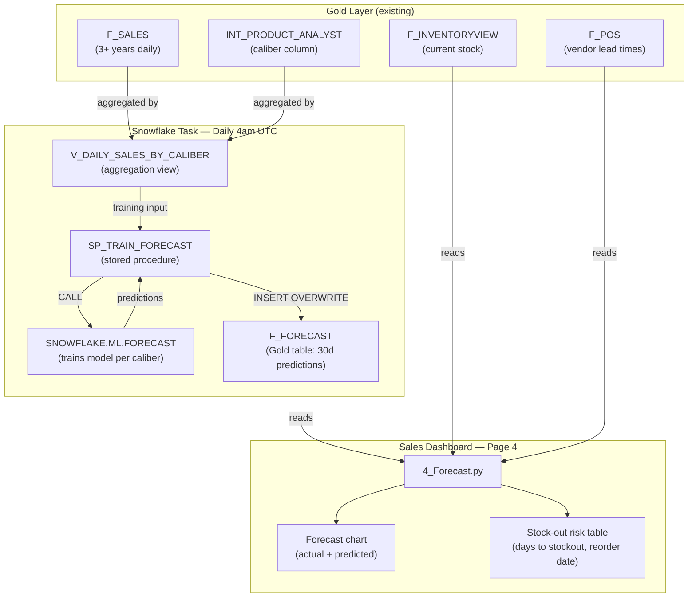

# DESIGN: Demand Forecasting with SNOWFLAKE.ML.FORECAST

> Technical design for daily demand forecasting by caliber with stock-out risk alerts, powered by Snowflake ML.FORECAST and displayed in the Sales Dashboard

## Metadata

| Attribute | Value |
|-----------|-------|
| **Feature** | DEMAND_FORECASTING |
| **Date** | 2026-04-15 |
| **Author** | design-agent |
| **DEFINE** | [DEFINE_DEMAND_FORECASTING.md](./DEFINE_DEMAND_FORECASTING.md) |
| **Status** | Ready for Build |

---

## Architecture Overview



---

## Components

| Component | Purpose | Technology |
|-----------|---------|------------|
| `V_DAILY_SALES_BY_CALIBER` | Aggregation view: daily units per caliber from f_sales + int_product_analyst | SQL view in GOLD schema |
| `SP_TRAIN_FORECAST` | Trains FORECAST model, writes predictions to F_FORECAST | Snowflake stored procedure (SQL) |
| `TASK_DAILY_FORECAST` | Schedules SP_TRAIN_FORECAST daily at 4am UTC | Snowflake Task |
| `F_FORECAST` | Gold table storing 30-day predictions per caliber | Table in GOLD schema |
| `4_Forecast.py` | Streamlit page: forecast chart + stock-out risk table | Python (Streamlit + Plotly) |
| `03_forecast_setup.sql` | Bootstrap SQL: creates all Snowflake objects | SQL |
| `test_forecast_backtest.py` | Validation script: trains on historical, compares to actuals | Python |

---

## Key Decisions

### Decision 1: Snowflake Task over ECS/dbt for Training

| Attribute | Value |
|-----------|-------|
| **Status** | Accepted |
| **Date** | 2026-04-15 |

**Context:** FORECAST training must run daily but cannot be in dbt (stored procedure, not SQL function) or ECS (would add 30-60s to every 10-min build).

**Choice:** Snowflake Task running at 4am UTC, using TRANSFORMER_ROLE on ETL_WH.

**Rationale:** Tasks are Snowflake-native, serverless scheduling, no infrastructure to manage. ETL_WH auto-suspends after 60s so cost is minimal (~$1-3/mo). Keeps dbt build and FORECAST training on independent schedules.

**Alternatives Rejected:**
1. dbt post-hook — FORECAST is CALL, not SELECT; would block builds
2. ECS scheduled task — adds infrastructure complexity for a single SQL call
3. EventBridge — already used for dbt; mixing ML training with ETL scheduling

**Consequences:**
- Trade-off: Predictions are up to 24h stale (acceptable for 30-day horizon)
- Benefit: Zero impact on dbt build duration

---

### Decision 2: Caliber-Level Aggregation with Category Fallback

| Attribute | Value |
|-----------|-------|
| **Status** | Accepted |
| **Date** | 2026-04-15 |

**Context:** FORECAST needs 730+ daily rows per series. Some calibers may have sparse sales history.

**Choice:** Primary: forecast per caliber (~120 series). Fallback: calibers with < 730 days of data excluded from per-caliber model and flagged as "Insufficient data" in the risk table.

**Rationale:** Starting without a category-level fallback keeps the stored procedure simple. Flagging sparse calibers is more honest than a low-confidence category-level prediction. Phase 2b can add category fallback.

**Alternatives Rejected:**
1. SKU-level — too many sparse series (~2,000+)
2. Category-level only — too coarse for reorder decisions (8 categories)
3. Automatic category fallback — adds complexity; validate need first

---

### Decision 3: INSERT OVERWRITE Pattern for F_FORECAST

| Attribute | Value |
|-----------|-------|
| **Status** | Accepted |
| **Date** | 2026-04-15 |

**Context:** F_FORECAST needs to contain only the latest predictions. Old predictions should be replaced, not accumulated.

**Choice:** `INSERT OVERWRITE INTO F_FORECAST` in the stored procedure — atomically replaces all rows.

**Rationale:** Simple, atomic, no cleanup needed. If the Task fails, the previous predictions remain (INSERT OVERWRITE only commits on success).

**Alternatives Rejected:**
1. DELETE + INSERT — not atomic; readers could see empty table between operations
2. MERGE — unnecessary complexity for a full replacement
3. CREATE OR REPLACE TABLE — loses grants on the table object

---

## File Manifest

| # | File | Action | Purpose | Agent | Dependencies |
|---|------|--------|---------|-------|--------------|
| 1 | `streamlit_app/setup/03_forecast_setup.sql` | Create | Bootstrap: view, procedure, table, task, grants | @snowflake-expert | None |
| 2 | `streamlit_app/pages/4_Forecast.py` | Create | Forecast chart + stock-out risk table | @streamlit-expert | 1 (objects must exist) |
| 3 | `streamlit_app/test_forecast_backtest.py` | Create | Backtest validation script | @snowflake-expert | 1 |

**Total Files:** 3

---

## Agent Assignment Rationale

| Agent | Files Assigned | Why This Agent |
|-------|----------------|----------------|
| @snowflake-expert | 1, 3 | FORECAST stored procedure, Task scheduling, SQL view design |
| @streamlit-expert | 2 | Plotly charts, dark theme, SiS container runtime patterns |

---

## Code Patterns

### Pattern 1: Training Input View (`V_DAILY_SALES_BY_CALIBER`)

```sql
CREATE OR REPLACE VIEW AD_ANALYTICS.GOLD.V_DAILY_SALES_BY_CALIBER AS
SELECT
    s.CREATED_AT::DATE       AS sale_date,
    p.CALIBER                AS caliber,
    SUM(s.QTY_ORDERED)       AS units_sold
FROM AD_ANALYTICS.GOLD.F_SALES s
JOIN AD_ANALYTICS.GOLD.INT_PRODUCT_ANALYST p
    ON s.PRODUCT_ID = p.PRODUCT_ID
WHERE s.STATUS IN ('COMPLETE', 'PROCESSING', 'UNVERIFIED')
    AND p.CALIBER IS NOT NULL
    AND p.CALIBER != ''
GROUP BY 1, 2;
```

### Pattern 2: Stored Procedure (`SP_TRAIN_FORECAST`)

```sql
CREATE OR REPLACE PROCEDURE AD_ANALYTICS.GOLD.SP_TRAIN_FORECAST()
RETURNS VARCHAR
LANGUAGE SQL
EXECUTE AS CALLER
AS
$$
BEGIN
    -- Step 1: Train per-caliber forecast model
    -- Only calibers with 730+ days of data (2 seasonal cycles)
    CREATE OR REPLACE SNOWFLAKE.ML.FORECAST AD_ANALYTICS.GOLD.CALIBER_FORECAST(
        INPUT_DATA => SYSTEM$REFERENCE('VIEW', 'AD_ANALYTICS.GOLD.V_DAILY_SALES_BY_CALIBER'),
        SERIES_COLNAME => 'CALIBER',
        TIMESTAMP_COLNAME => 'SALE_DATE',
        TARGET_COLNAME => 'UNITS_SOLD'
    );

    -- Step 2: Generate 30-day predictions
    -- INSERT OVERWRITE atomically replaces all rows
    INSERT OVERWRITE INTO AD_ANALYTICS.GOLD.F_FORECAST
    SELECT
        SERIES     AS CALIBER,
        TS         AS FORECAST_DATE,
        FORECAST   AS PREDICTED_UNITS,
        LOWER_BOUND,
        UPPER_BOUND,
        'caliber'  AS FORECAST_TYPE,
        CURRENT_TIMESTAMP() AS TRAINED_AT
    FROM TABLE(AD_ANALYTICS.GOLD.CALIBER_FORECAST!FORECAST(
        FORECASTING_PERIODS => 30
    ));

    -- Step 3: Train single-series revenue forecast
    CREATE OR REPLACE SNOWFLAKE.ML.FORECAST AD_ANALYTICS.GOLD.REVENUE_FORECAST(
        INPUT_DATA => SYSTEM$REFERENCE('VIEW', 'AD_ANALYTICS.GOLD.V_DAILY_REVENUE'),
        TIMESTAMP_COLNAME => 'SALE_DATE',
        TARGET_COLNAME => 'TOTAL_REVENUE'
    );

    -- Step 4: Append revenue predictions
    INSERT INTO AD_ANALYTICS.GOLD.F_FORECAST
    SELECT
        'REVENUE'  AS CALIBER,
        TS         AS FORECAST_DATE,
        FORECAST   AS PREDICTED_UNITS,
        LOWER_BOUND,
        UPPER_BOUND,
        'revenue'  AS FORECAST_TYPE,
        CURRENT_TIMESTAMP() AS TRAINED_AT
    FROM TABLE(AD_ANALYTICS.GOLD.REVENUE_FORECAST!FORECAST(
        FORECASTING_PERIODS => 30
    ));

    RETURN 'Forecast training complete: ' || CURRENT_TIMESTAMP()::VARCHAR;
END;
$$;
```

### Pattern 3: Predictions Table (`F_FORECAST`)

```sql
CREATE TABLE IF NOT EXISTS AD_ANALYTICS.GOLD.F_FORECAST (
    CALIBER         VARCHAR,
    FORECAST_DATE   DATE,
    PREDICTED_UNITS NUMBER(18,4),
    LOWER_BOUND     NUMBER(18,4),
    UPPER_BOUND     NUMBER(18,4),
    FORECAST_TYPE   VARCHAR,      -- 'caliber' or 'revenue'
    TRAINED_AT      TIMESTAMP_NTZ
);
```

### Pattern 4: Daily Task

```sql
CREATE OR REPLACE TASK AD_ANALYTICS.GOLD.TASK_DAILY_FORECAST
    WAREHOUSE = ETL_WH
    SCHEDULE = 'USING CRON 0 4 * * * UTC'
    COMMENT = 'Daily demand forecast: trains ML.FORECAST on sales by caliber, writes 30d predictions to F_FORECAST'
AS
    CALL AD_ANALYTICS.GOLD.SP_TRAIN_FORECAST();

-- Enable the task (requires EXECUTE TASK privilege)
ALTER TASK AD_ANALYTICS.GOLD.TASK_DAILY_FORECAST RESUME;
```

### Pattern 5: Revenue Aggregation View

```sql
CREATE OR REPLACE VIEW AD_ANALYTICS.GOLD.V_DAILY_REVENUE AS
SELECT
    CREATED_AT::DATE       AS sale_date,
    SUM(ROW_TOTAL)         AS total_revenue
FROM AD_ANALYTICS.GOLD.F_SALES
WHERE STATUS IN ('COMPLETE', 'PROCESSING', 'UNVERIFIED')
GROUP BY 1;
```

### Pattern 6: Streamlit Forecast Page (`4_Forecast.py`)

```python
"""Forecast — Demand prediction and stock-out risk alerts.

Source: AD_ANALYTICS.GOLD.F_FORECAST, F_INVENTORYVIEW, F_POS
"""

import streamlit as st
import pandas as pd
import plotly.graph_objects as go
from datetime import date, timedelta

from utils.db import run_query
from utils.chart_theme import apply_theme, dark_dataframe, BG_CHART, ACCENT

# ── Data Loading ─────────────────────────────────────────────────────────────

@st.cache_data(ttl="10m")
def load_forecast() -> pd.DataFrame:
    return run_query("""
        SELECT CALIBER, FORECAST_DATE, PREDICTED_UNITS, LOWER_BOUND, UPPER_BOUND,
               FORECAST_TYPE, TRAINED_AT
        FROM F_FORECAST
        WHERE FORECAST_TYPE = 'caliber'
        ORDER BY CALIBER, FORECAST_DATE
    """)

@st.cache_data(ttl="10m")
def load_revenue_forecast() -> pd.DataFrame:
    return run_query("""
        SELECT FORECAST_DATE, PREDICTED_UNITS AS PREDICTED_REVENUE,
               LOWER_BOUND, UPPER_BOUND, TRAINED_AT
        FROM F_FORECAST
        WHERE FORECAST_TYPE = 'revenue'
        ORDER BY FORECAST_DATE
    """)

@st.cache_data(ttl="10m")
def load_actuals_30d() -> pd.DataFrame:
    return run_query("""
        SELECT s.CREATED_AT::DATE AS SALE_DATE, p.CALIBER,
               SUM(s.QTY_ORDERED) AS UNITS_SOLD
        FROM F_SALES s
        JOIN INT_PRODUCT_ANALYST p ON s.PRODUCT_ID = p.PRODUCT_ID
        WHERE s.CREATED_AT::DATE >= DATEADD('DAY', -30, CURRENT_DATE())
          AND s.STATUS IN ('COMPLETE', 'PROCESSING', 'UNVERIFIED')
          AND p.CALIBER IS NOT NULL
        GROUP BY 1, 2
    """)

@st.cache_data(ttl="10m")
def load_stockout_risk() -> pd.DataFrame:
    """Combines forecast, inventory, and lead times into stock-out risk table."""
    return run_query("""
        WITH predicted_demand AS (
            SELECT CALIBER,
                   SUM(PREDICTED_UNITS) AS DEMAND_30D,
                   AVG(PREDICTED_UNITS) AS DAILY_AVG_PREDICTED
            FROM F_FORECAST
            WHERE FORECAST_TYPE = 'caliber'
            GROUP BY CALIBER
        ),
        current_stock AS (
            SELECT p.CALIBER,
                   SUM(i.QTY_AVAILABLE)   AS QTY_ON_HAND,
                   SUM(i.QTY_ON_ORDER)    AS QTY_ON_ORDER,
                   SUM(i.EXTENDED_COST)   AS INVENTORY_VALUE
            FROM F_INVENTORYVIEW i
            JOIN INT_PRODUCT_ANALYST p ON i.PART_NUMBER = p.SKU
            WHERE p.CALIBER IS NOT NULL
            GROUP BY p.CALIBER
        ),
        lead_times AS (
            SELECT p.CALIBER,
                   ROUND(AVG(po.PRECISE_LEADTIME), 0) AS AVG_LEAD_TIME_DAYS
            FROM F_POS po
            JOIN INT_PRODUCT_ANALYST p ON po.PART_NUMBER = p.SKU
            WHERE po.PRECISE_LEADTIME IS NOT NULL
              AND p.CALIBER IS NOT NULL
            GROUP BY p.CALIBER
        )
        SELECT
            cs.CALIBER,
            cs.QTY_ON_HAND,
            cs.QTY_ON_ORDER,
            cs.INVENTORY_VALUE,
            pd.DEMAND_30D,
            pd.DAILY_AVG_PREDICTED,
            CASE WHEN pd.DAILY_AVG_PREDICTED > 0
                 THEN ROUND(cs.QTY_ON_HAND / pd.DAILY_AVG_PREDICTED, 1)
                 ELSE NULL END AS DAYS_OF_SUPPLY,
            COALESCE(lt.AVG_LEAD_TIME_DAYS, 14) AS LEAD_TIME_DAYS,
            CASE WHEN pd.DAILY_AVG_PREDICTED > 0
                 THEN DATEADD('DAY',
                    GREATEST(ROUND(cs.QTY_ON_HAND / pd.DAILY_AVG_PREDICTED) - COALESCE(lt.AVG_LEAD_TIME_DAYS, 14), 0),
                    CURRENT_DATE())
                 ELSE NULL END AS REORDER_BY,
            CASE
                WHEN pd.DAILY_AVG_PREDICTED > 0
                     AND cs.QTY_ON_HAND / pd.DAILY_AVG_PREDICTED <= COALESCE(lt.AVG_LEAD_TIME_DAYS, 14)
                THEN 'Critical'
                WHEN pd.DAILY_AVG_PREDICTED > 0
                     AND cs.QTY_ON_HAND / pd.DAILY_AVG_PREDICTED <= COALESCE(lt.AVG_LEAD_TIME_DAYS, 14) * 2
                THEN 'Warning'
                WHEN pd.DAILY_AVG_PREDICTED > 0
                     AND cs.QTY_ON_HAND / pd.DAILY_AVG_PREDICTED > 90
                THEN 'Overstock'
                ELSE 'OK'
            END AS RISK_LEVEL
        FROM current_stock cs
        LEFT JOIN predicted_demand pd ON cs.CALIBER = pd.CALIBER
        LEFT JOIN lead_times lt ON cs.CALIBER = lt.CALIBER
        WHERE cs.QTY_ON_HAND > 0
        ORDER BY DAYS_OF_SUPPLY ASC NULLS LAST
    """)

# ── Page Layout ──────────────────────────────────────────────────────────────

# Stock-out Risk KPIs
risk = load_stockout_risk()
critical = risk[risk["RISK_LEVEL"] == "Critical"]
warning = risk[risk["RISK_LEVEL"] == "Warning"]

col1, col2, col3, col4 = st.columns(4)
col1.metric("Critical", len(critical))
col2.metric("Warning", len(warning))
col3.metric("OK", len(risk[risk["RISK_LEVEL"] == "OK"]))
col4.metric("Overstock", len(risk[risk["RISK_LEVEL"] == "Overstock"]))

# Stock-out Risk Table
st.subheader("Stock-Out Risk by Caliber")
dark_dataframe(risk)

# Forecast Chart for selected caliber
calibers = sorted(risk["CALIBER"].dropna().unique().tolist())
selected = st.selectbox("Select caliber for forecast chart", calibers)

if selected:
    fc = load_forecast()
    fc_cal = fc[fc["CALIBER"] == selected]
    actuals = load_actuals_30d()
    act_cal = actuals[actuals["CALIBER"] == selected].groupby("SALE_DATE")["UNITS_SOLD"].sum().reset_index()

    fig = go.Figure()
    # Actuals (last 30d)
    fig.add_trace(go.Scatter(
        x=act_cal["SALE_DATE"].tolist(),
        y=act_cal["UNITS_SOLD"].tolist(),
        mode="lines+markers", name="Actual", line=dict(color=ACCENT),
    ))
    # Predicted (next 30d)
    fig.add_trace(go.Scatter(
        x=fc_cal["FORECAST_DATE"].tolist(),
        y=fc_cal["PREDICTED_UNITS"].tolist(),
        mode="lines", name="Forecast", line=dict(color="#FFD700", dash="dash"),
    ))
    apply_theme(fig)
    fig.update_layout(title=f"{selected} — Units Sold (Actual + Forecast)")
    st.plotly_chart(fig, use_container_width=True, key=f"fc_{selected}")
```

---

## Data Flow

```
1. Daily at 4am UTC: Snowflake Task triggers
   │
   ▼
2. SP_TRAIN_FORECAST reads V_DAILY_SALES_BY_CALIBER
   (daily units per caliber from f_sales + int_product_analyst, 3+ years)
   │
   ▼
3. SNOWFLAKE.ML.FORECAST trains caliber model (~120 series)
   + trains single-series revenue model
   │
   ▼
4. INSERT OVERWRITE INTO F_FORECAST
   (~3,600 caliber rows + 30 revenue rows)
   │
   ▼
5. User visits Streamlit Page 4
   │
   ▼
6. Page reads F_FORECAST + F_INVENTORYVIEW + F_POS
   │
   ▼
7. Stock-out risk calculation:
   Days of Supply = QTY_ON_HAND / DAILY_AVG_PREDICTED
   Reorder By = TODAY + DoS - Lead Time
   Risk = Critical if DoS <= Lead Time
   │
   ▼
8. Renders: KPI cards, risk table, forecast chart per caliber
```

---

## Integration Points

| External System | Integration Type | Authentication |
|-----------------|-----------------|----------------|
| Snowflake ML.FORECAST | SQL stored procedure (CALL) | TRANSFORMER_ROLE |
| F_SALES + INT_PRODUCT_ANALYST | SQL view aggregation | TRANSFORMER_ROLE |
| F_INVENTORYVIEW + F_POS | SQL join in Streamlit query | Session role (SiS) |
| Streamlit Sales Dashboard | New page in existing app | Same compute pool, same CI/CD |

---

## Testing Strategy

| Test Type | Scope | Method | Coverage Goal |
|-----------|-------|--------|---------------|
| **Backtest** | Model accuracy | Train on data through Dec 2025, predict Jan-Mar 2026, compare MAPE | < 20% at caliber level |
| **Data coverage** | Caliber eligibility | Count calibers with 730+ days in V_DAILY_SALES_BY_CALIBER | 90%+ of total units covered |
| **Task execution** | End-to-end pipeline | Run SP_TRAIN_FORECAST manually, verify F_FORECAST populated | All calibers present, 30 rows each |
| **Stock-out risk** | Calculation accuracy | Manual check: 5.56 NATO (low stock) should show Critical | Risk levels match expectations |
| **Page load** | Performance | Load Page 4 with F_FORECAST populated | < 3 seconds |
| **Revenue forecast** | Single-series accuracy | Compare to daily revenue actuals | MAPE < 15% |

---

## Error Handling

| Error Type | Handling Strategy | Retry? |
|------------|-------------------|--------|
| Task failure (warehouse suspended) | Task auto-retries per Snowflake default; F_FORECAST retains last good data | Yes (auto) |
| FORECAST training failure (sparse caliber) | Procedure logs warning; sparse calibers excluded from F_FORECAST | No |
| F_FORECAST empty (first run or all failures) | Page 4 shows "Forecast not yet available — training runs daily at 4am UTC" | N/A |
| Streamlit query timeout | st.cache_data with 10-min TTL; cached results survive transient failures | Yes (next visit) |

---

## Configuration

| Config Key | Type | Default | Description |
|------------|------|---------|-------------|
| Task schedule | Cron | `0 4 * * * UTC` | Daily at 4am UTC |
| Forecast horizon | Int | `30` | Days to predict forward |
| Min training days | Int | `730` | Minimum days of data per caliber series |
| Critical threshold | Multiplier | `1x lead time` | DoS <= lead time = Critical |
| Warning threshold | Multiplier | `2x lead time` | DoS <= 2x lead time = Warning |
| Overstock threshold | Days | `90` | DoS > 90 = Overstock |
| Cache TTL | Minutes | `10` | Streamlit query cache duration |

---

## Security Considerations

- `SP_TRAIN_FORECAST` runs as CALLER (TRANSFORMER_ROLE) — has SELECT on Gold tables, CREATE on ML models
- F_FORECAST inherits existing Gold schema RBAC grants (DASHBOARD_VIEWER_ROLE can read)
- Task owned by TRANSFORMER_ROLE — requires EXECUTE TASK privilege (granted in bootstrap)
- No PII in F_FORECAST (caliber + date + predicted units only)

---

## Observability

| Aspect | Implementation |
|--------|----------------|
| **Task monitoring** | `SNOWFLAKE.ACCOUNT_USAGE.TASK_HISTORY` — check for failures |
| **Training timestamp** | `TRAINED_AT` column in F_FORECAST — shows when predictions were last refreshed |
| **Cost tracking** | ETL_WH usage tagged `query_tag = 'ml:forecast'` via Task comment |
| **Accuracy monitoring** | Backtest script (run manually); permanent monitoring deferred to Phase 2b |

---

## Revision History

| Version | Date | Author | Changes |
|---------|------|--------|---------|
| 1.0 | 2026-04-15 | design-agent | Initial version |

---

## Next Step

**Ready for:** `/build .claude/sdd/features/DESIGN_DEMAND_FORECASTING.md`
