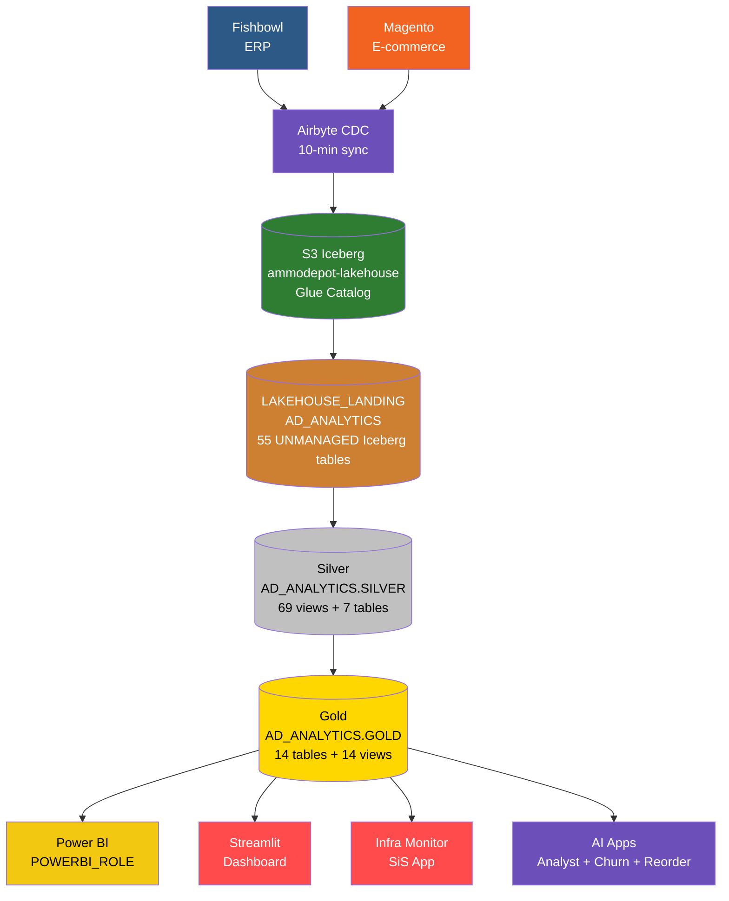
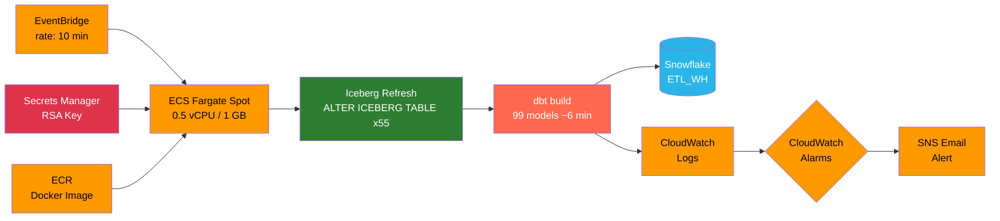
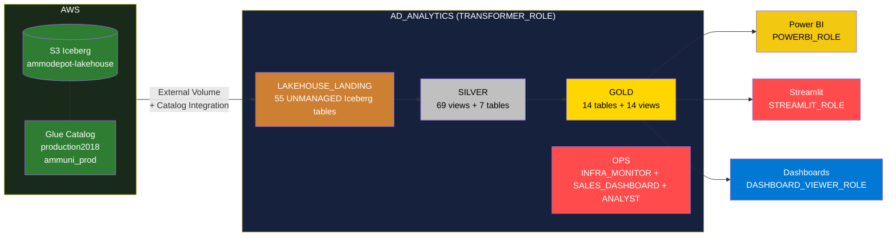

# AmmoDepot dbt Analytics Pipeline

Analytics pipeline for [Ammunition Depot](https://www.ammunitiondepot.com), transforming raw data from **Fishbowl** (ERP) and **Magento** (e-commerce) into structured, tested datasets using Medallion Architecture.

Data is ingested via Airbyte CDC into **S3 Iceberg** (Glue catalog), read by Snowflake via External Volume, transformed by dbt on ECS Fargate Spot every 10 minutes, and served to Power BI and a Streamlit dashboard.

---

## Architecture

### Data Pipeline



### Orchestration



### Snowflake Database Layout



---

## Tech Stack

| Component | Technology |
|-----------|------------|
| Transformation | dbt-core 1.11.6 + dbt-snowflake 1.11.2 |
| Warehouse | Snowflake `AD_ANALYTICS` |
| Ingestion | Airbyte CDC on EC2 c6a.2xlarge → S3 Iceberg (Glue catalog) |
| Bronze refresh | `on-run-start` hook: `ALTER ICEBERG TABLE ... REFRESH` x55 |
| Orchestration | ECS Fargate Spot + EventBridge scheduler (~$3.70/mo) |
| Packages | dbt_utils |
| Cross-db macros | `adapter.dispatch` — `convert_tz`, `string_agg`, `format_timestamp`, `json_extract_text` |
| Linting | SQLFluff (Snowflake dialect) |
| Python | uv (package manager) |
| BI Dashboard | Streamlit (local + Streamlit in Snowflake) + Power BI |
| Infra Monitoring | Snowsight dashboard (8 tiles) + Streamlit SiS app (`AD_ANALYTICS.OPS.INFRA_MONITOR`, 5 pages) |
| AI Analyst | Cortex Analyst chatbot (`AD_ANALYTICS.OPS.ANALYST`) — text-to-SQL over Gold layer |
| Demand Forecasting | Cortex ML FORECAST — 115 calibers + revenue, weekly Task, Page 4 |
| Anomaly Detection | Cortex ML ANOMALY_DETECTION — revenue/orders/margin, Page 1 alerts |
| Churn Narratives | CORTEX.COMPLETE (`gemini-2-5-flash`) — RFM segment health, Page 5 |
| Reorder Intelligence | `F_REORDER_RECOMMENDATIONS` + CORTEX.COMPLETE — per-caliber reorder qty + vendor, Page 4 tab |
| Secrets | AWS Secrets Manager (`ammodepot/dbt/snowflake`) |

---

## Project Structure

```
dbt_ammodepot/
├── ammodepot/                         # Snowflake dbt project (production)
│   ├── dbt_project.yml                # version 2.0 — vars, materialization, schema routing
│   ├── packages.yml
│   ├── .env.example                   # Snowflake connection vars template
│   ├── macros/
│   │   ├── generate_schema_name.sql
│   │   ├── json_extract_text.sql
│   │   ├── refresh_lakehouse_landing.sql  # on-run-start: ALTER ICEBERG TABLE REFRESH x55
│   │   └── cross_db/                  # convert_tz, string_agg, format_timestamp
│   ├── tests/generic/                 # 8 custom generic tests (assert_*)
│   └── models/
│       ├── bronze/                    # Source YAML definitions (60 source tables)
│       │   ├── fishbowl/              # 34 tables — AD_ANALYTICS.LAKEHOUSE_LANDING
│       │   ├── magento/               # 25 tables — AD_ANALYTICS.LAKEHOUSE_LANDING
│       │   └── ups/                   # 1 table — PC_FIVETRAN_DB.UPS_INVOICE_HISTORY
│       ├── silver/                    # 76 models (69 views + 7 tables)
│       │   ├── fishbowl/              # 34 ERP models
│       │   ├── magento/               # 23 e-commerce models
│       │   └── inventory/             # 19 quantity calculation models
│       └── gold/                      # 14 table models + 14 intermediate views
│           ├── intermediate/          # 14 reusable view models (3 override to table)
│           ├── d_customer.sql, d_customer_segmentation.sql, d_product.sql
│           ├── d_product_bundle.sql, d_store.sql, d_vendor.sql
│           ├── f_inventoryview.sql, f_pos.sql, f_sales.sql, f_shippment.sql
│           ├── f_cohort.sql, f_cohort_detailed.sql, f_sales_realtime.sql
│           └── f_reorder_recommendations.sql  # AI Phase 5: per-caliber reorder intelligence
├── streamlit_app/                     # BI dashboard (local + SiS) — 5 pages
│   ├── app.py                         # Local entry point
│   ├── streamlit_app.py               # Streamlit in Snowflake entry point
│   ├── pages/
│   │   ├── 1_Today_Yesterday.py       # Real-time sales + cross-filtering + anomaly alerts
│   │   ├── 2_Sales_Overview.py        # Historical sales with category drilldown
│   │   ├── 3_Inventory.py             # Inventory, vendor analysis, open POs
│   │   ├── 4_Forecast.py             # Demand forecast + 4 tabs incl. Reorder Recommendations
│   │   └── 5_Customer_Intelligence.py # RFM segment health + CORTEX.COMPLETE summary
│   └── utils/
│       ├── chart_theme.py             # Unified dark theme (Plotly + HTML tables)
│       ├── db.py                      # Query runner with local/SiS dual-mode
│       └── zip3_coords.py             # ZIP3 centroid lookup for geographic maps
├── streamlit_cost_monitor/            # Infra Monitor app (SiS container runtime) — dir kept to avoid CI churn
│   ├── streamlit_app.py               # Entry point (SiS + local)
│   ├── snowflake.yml                  # SiS definition v2 — container runtime
│   ├── pages/
│   │   ├── 1_Snowflake_Compute.py     # MTD KPIs, daily trend, anomaly detection
│   │   ├── 2_Snowflake_Storage.py     # DB snapshot + 30d growth
│   │   ├── 3_AWS_Infrastructure.py    # MTD KPIs, daily/monthly service spend (boto3)
│   │   ├── 4_Combined.py             # 6M monthly SF+AWS trend, MTD totals
│   │   └── 5_dbt_Pipeline.py          # Build duration chart, health table, dbt docs link
│   └── utils/
│       ├── config.py, db.py, snowflake_queries.py, aws_costs.py, cloudwatch_metrics.py
│       └── setup/                     # SQL bootstrap scripts
├── ecs/                               # ECS Fargate deployment artifacts
│   ├── Dockerfile
│   ├── entrypoint.sh
│   ├── task-definition.json
│   ├── eventbridge-rule.json
│   ├── iam-policies/
│   └── README.md                      # Full ECS setup guide
├── airbyte-ec2/                       # EC2 maintenance scripts
│   ├── airbyte-cleanup.sh             # Monthly cleanup (Minio logs + DB pruning)
│   ├── disk-alert.sh                  # 6-hourly disk usage alert
│   └── deploy.sh                      # One-command EC2 installer
├── docs/
│   ├── snowflake_access_setup.md
│   ├── SNOWFLAKE_COST_DASHBOARD.md
│   ├── POC_S3_DUCKDB_LAKEHOUSE.md
│   └── AIRBYTE_2_0_UPGRADE_PLAN.md
└── archive/
    └── projects/ammodepot/            # Redshift dbt project (decommissioned)
```

---

## Model Layers

### Bronze — Source Definitions

YAML source definitions only. No SQL models. Airbyte writes to S3 Iceberg; Snowflake reads via External Volume + Glue Catalog Integration into `LAKEHOUSE_LANDING`. dbt references them as `source()` calls.

- `AD_ANALYTICS.LAKEHOUSE_LANDING`: 55 UNMANAGED Iceberg tables (34 Fishbowl + 21 Magento)
- `PC_FIVETRAN_DB.UPS_INVOICE_HISTORY`: 1 table (manually uploaded weekly)
- Source freshness: warn after 24h, error after 48h (field: `_airbyte_extracted_at`)
- All 55 Iceberg tables refreshed via `on-run-start` hook before every dbt build

### Silver — Cleaned Views

One model per source table. Each model applies:

1. Filters deleted CDC rows: `WHERE _ab_cdc_deleted_at IS NULL`
2. Renames columns to `snake_case`
3. Casts types as needed

All 55 Fishbowl + Magento Silver models include `QUALIFY ROW_NUMBER()` dedup guards to handle CDC replication artifacts.

High-fan-out tables override to `table` materialization: `fishbowl_soitem`, `fishbowl_product`, `fishbowl_uomconversion`, `fishbowl_part`, `magento_sales_order_item`, `magento_sales_order`, `inventory_qtyinventorytotals`.

### Gold — Business Tables

Consumption-ready facts and dimensions. All columns use `UPPER_CASE` aliases for Power BI compatibility. `f_sales` uses incremental materialization with a 3-day lookback merge window.

| Model | Type | Description |
|-------|------|-------------|
| `d_customer` | Dimension | Customer master (Magento + Fishbowl) |
| `d_customer_segmentation` | Dimension | RFM-based customer segments |
| `d_product` | Dimension | Product catalog with resolved EAV attributes |
| `d_product_bundle` | Dimension | Kit/bundle compositions |
| `d_store` | Dimension | Magento store reference |
| `d_vendor` | Dimension | Vendor/supplier master |
| `f_sales` | Fact | Sales orders with Fishbowl cost data (incremental merge) |
| `f_pos` | Fact | Purchase orders |
| `f_inventoryview` | Fact | Real-time inventory quantities |
| `f_shippment` | Fact | Shipment tracking with UPS freight costs |
| `f_cohort` | Fact | Customer cohort analysis |
| `f_cohort_detailed` | Fact | Detailed cohort metrics |
| `f_sales_realtime` | View | Real-time sales feed (filtered view of f_sales) |
| `f_reorder_recommendations` | Fact | Per-caliber reorder qty + vendor (AI Phase 5) |

### Intermediate Views

14 reusable pre-computations in the `gold` schema. Three high-cost nodes override to `table`: `int_fishbowl_order_cost`, `int_magento_product_eav_lookups`, `int_sales_cost_fallback`.

---

## Quick Start (Snowflake Project)

### Prerequisites

- [uv](https://docs.astral.sh/uv/) installed
- Snowflake account access with `TRANSFORMER_ROLE` or a developer role
- RSA key pair for `SVC_DBT` (see `docs/snowflake_access_setup.md`)

### Install

```bash
cd ammodepot
uv sync
uv run dbt deps --profiles-dir .
```

### Configure credentials

Copy `.env.example` to `.env` and populate:

```bash
SNOWFLAKE_ACCOUNT=<account-identifier>
SNOWFLAKE_USER=SVC_DBT
SNOWFLAKE_PRIVATE_KEY_PATH=/path/to/dbt_rsa_key.p8
SNOWFLAKE_PRIVATE_KEY_PASSPHRASE=<passphrase>
SNOWFLAKE_ROLE=TRANSFORMER_ROLE
SNOWFLAKE_DATABASE=AD_ANALYTICS
SNOWFLAKE_WAREHOUSE=ETL_WH
SNOWFLAKE_SCHEMA=dbt_dev
```

### Development commands

Run from `ammodepot/`. Always source `.env` first — dbt does not auto-load it.

```bash
set -a && source .env && set +a

uv run dbt parse --profiles-dir .
uv run dbt debug --profiles-dir .
uv run dbt build --profiles-dir . --target prod
uv run dbt build --profiles-dir . --target prod --select +f_sales
uv run dbt test --profiles-dir . --target prod --select gold
uv run dbt source freshness --profiles-dir .
```

### Schema routing

| Target | Behavior |
|--------|----------|
| `dev` (default) | All models in `SNOWFLAKE_SCHEMA` (e.g. `dbt_dev`) |
| `prod` | Models route to `SILVER` or `GOLD` schemas in `AD_ANALYTICS` |

---

## Deployment (ECS Fargate)

The Snowflake project runs on ECS Fargate Spot, triggered by EventBridge every 10 minutes. Full setup instructions are in `ecs/README.md`.

| Resource | Detail |
|----------|--------|
| Cluster | `ammodepot-dbt` (us-east-1, Fargate Spot) |
| Task | `ammodepot-dbt-build` (0.5 vCPU, 1 GB) |
| Schedule | `rate(10 minutes)` via EventBridge |
| Runtime | ~6 min per run (104 models + Iceberg refresh x55) |
| Secrets | `ammodepot/dbt/snowflake` in Secrets Manager |
| Logs | CloudWatch `/ecs/ammodepot-dbt` (14-day retention) |
| Image | ECR `746669199691.dkr.ecr.us-east-1.amazonaws.com/ammodepot/dbt` |
| Cost | ~$3.70/month |

Push to `main` — GitHub Actions builds and pushes to ECR automatically. The next EventBridge trigger (within 10 minutes) picks up the new image.

---

## Streamlit Apps

### Sales Dashboard (`AD_ANALYTICS.OPS.SALES_DASHBOARD`)

5-page replacement for Power BI dashboards. Runs locally and deploys to SiS.

| Page | Description |
|------|-------------|
| 1 — Today / Yesterday | Real-time sales with cross-filtering + anomaly alert banner |
| 2 — Sales Overview | Historical sales with category drilldown and trend charts |
| 3 — Inventory | Inventory quantities, vendor analysis, open purchase orders |
| 4 — Forecast | Demand forecast + 4 tabs: Stock-Out Risk, Caliber Forecast, Revenue Forecast, **Reorder Recommendations** |
| 5 — Customer Intelligence | RFM segment health + CORTEX.COMPLETE executive summary |

Run locally:

```bash
cd streamlit_app
uv run streamlit run app.py
```

### Infra Monitor (`AD_ANALYTICS.OPS.INFRA_MONITOR`)

Deployed at `AD_ANALYTICS.OPS.INFRA_MONITOR` on SiS container runtime. Tracks Snowflake compute/storage, AWS infrastructure costs, and dbt pipeline health across 5 pages.

| Resource | Detail |
|----------|--------|
| Runtime | SiS container runtime (Streamlit 1.55+) |
| Compute pool | `cost_monitor_pool` (CPU_X64_XS, ~$5/mo) |
| Deployment | GitHub Actions (`deploy-streamlit-cost-monitor.yml`) on push to `streamlit_cost_monitor/` |
| Viewers | `DASHBOARD_VIEWER_ROLE`, `POWERBI_READONLY_ROLE` |

### Cortex Analyst Chatbot (`AD_ANALYTICS.OPS.ANALYST`)

Natural language query interface powered by Snowflake Cortex Analyst + Semantic View. Covers 6 Gold tables with 20 verified golden queries.

| Resource | Detail |
|----------|--------|
| Semantic View | `AD_ANALYTICS.GOLD.AMMODEPOT_ANALYST` |
| Compute pool | `sales_dashboard_pool` (shared, ~$0 incremental) |
| Deployment | GitHub Actions (`deploy-streamlit-analyst.yml`) on push to `streamlit_analyst/` |

---

## Roles

| Role | Purpose |
|------|---------|
| `AIRBYTE_ROLE` | Airbyte ingestion writes (legacy Snowflake connections, now inactive) |
| `TRANSFORMER_ROLE` | dbt reads LAKEHOUSE_LANDING, writes Silver + Gold |
| `POWERBI_ROLE` | Power BI read-only access to Gold |
| `POWERBI_READONLY_ROLE` | Read-only Gold + Streamlit viewer access |
| `STREAMLIT_ROLE` | Streamlit in Snowflake app owner |
| `DASHBOARD_VIEWER_ROLE` | SSO dashboard viewers |

---

## Documentation

| Document | Description |
|----------|-------------|
| `docs/snowflake_access_setup.md` | Roles, warehouses, RSA keys, Power BI access, SiS setup, SSO |
| `docs/SNOWFLAKE_COST_DASHBOARD.md` | Cost monitoring queries, Snowsight dashboard (8 tiles), alerts |
| `docs/POC_S3_DUCKDB_LAKEHOUSE.md` | S3 + Iceberg migration plan and POC results |
| `docs/AIRBYTE_2_0_UPGRADE_PLAN.md` | Airbyte upgrade procedure, rollback plan, risk assessment |
| `ecs/README.md` | ECS Fargate deployment guide (one-time setup + ongoing ops) |

---

## Build Status

| Project | Last Build | Result |
|---------|------------|--------|
| Snowflake (ECS Fargate) | 2026-04-16 | PASS=379 WARN=13 ERROR=0 — 104 models, ~4 min |
| Redshift | Archived | Decommissioned — see `archive/projects/ammodepot/` |
