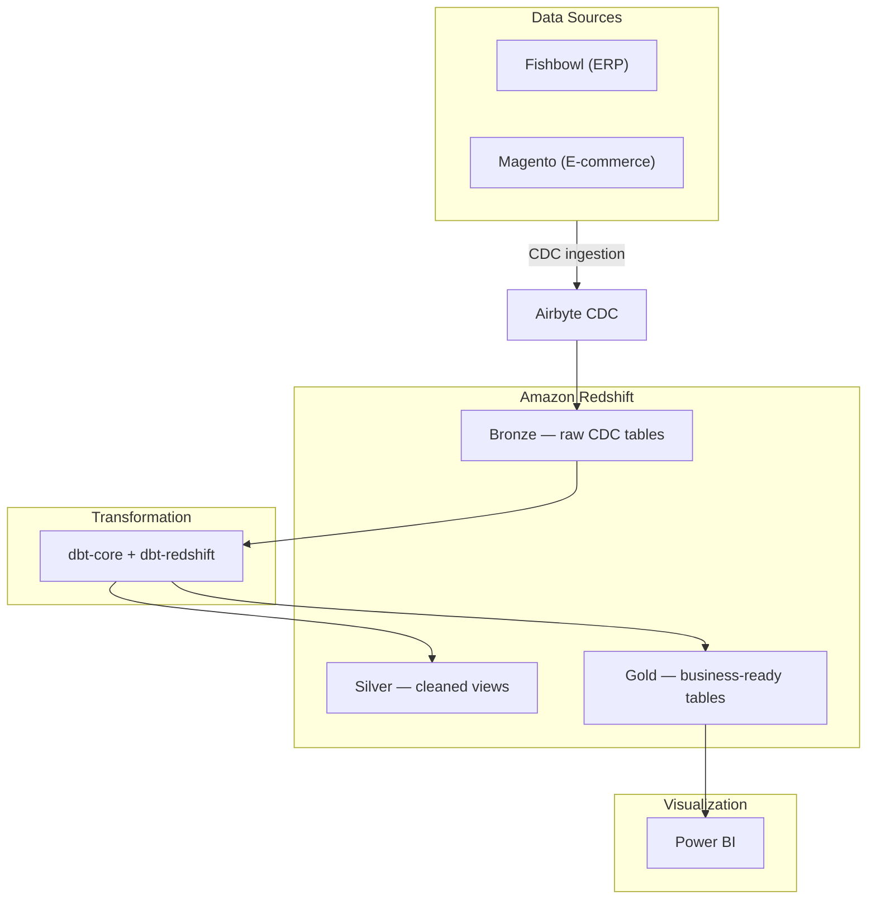

# AmmoDepot dbt Project

Analytics pipeline for [Ammunition Depot](https://www.ammunitiondepot.com), transforming raw data from **Fishbowl** (inventory/ERP) and **Magento** (e-commerce) into structured, tested datasets on Amazon Redshift.

Data flows through a **Medallion Architecture** (Bronze > Silver > Gold), ingested via Airbyte CDC and transformed with dbt.

## Architecture



### Medallion Layers

| Layer | Schema | Materialization | Description |
|-------|--------|-----------------|-------------|
| Bronze | `fishbowl`, `magento` | Raw tables (Airbyte) | CDC data from sources. Defined as source YAMLs only — no SQL models. |
| Silver | `silver` | Views | Cleaned, CDC-filtered (`_ab_cdc_deleted_at IS NULL`), column-renamed |
| Gold | `gold` | Tables | Business logic, facts & dimensions for Power BI consumption |
| Intermediate | `gold` | Views | Reusable pre-computations extracted from complex Gold models |

### Tech Stack

| Component | Technology |
|-----------|------------|
| Transformation | dbt-core 1.11 + dbt-redshift |
| Warehouse | Amazon Redshift |
| Ingestion | Airbyte (CDC) |
| Packages | dbt_utils, dbt_expectations |
| Linting | SQLFluff (Redshift dialect) |
| Python | uv (package manager) |
| CI/CD | GitHub Actions (S3 sync on push to main) |
| BI | Power BI |

## Project Structure

```
projects/ammodepot/
├── dbt_project.yml              # Central config: vars, materialization, schema routing
├── packages.yml                 # dbt_utils, dbt_expectations
├── .sqlfluff                    # SQLFluff config (Redshift dialect)
├── macros/
│   └── generate_schema_name.sql # Schema routing: prod=layer schema, dev=target schema
├── tests/generic/               # 16 custom generic tests (assert_*)
├── models/
│   ├── bronze/                  # Source definitions only (59 tables)
│   │   ├── fishbowl/            #   34 source tables
│   │   └── magento/             #   25 source tables
│   ├── silver/                  # 78 view models
│   │   ├── fishbowl/            #   34 models (ERP data)
│   │   ├── magento/             #   23 models (e-commerce data)
│   │   └── inventory/           #   21 models (quantity calculations)
│   └── gold/                    # 10 table models + 7 intermediate views
│       ├── intermediate/        #   7 reusable view models
│       ├── d_customer.sql       #   Dimensions (d_*)
│       ├── f_sales.sql          #   Facts (f_*)
│       └── ...
├── seeds/
├── snapshots/
└── analyses/
```

**Totals:** 95 SQL models, 59 source tables, 42 YAML configs, 16 generic tests

## Gold Layer Models

### Dimensions
- **d_customer** — Customer master from Magento + Fishbowl
- **d_customer_segmentation** — RFM-based customer segments
- **d_product** — Product catalog with Magento EAV attributes resolved
- **d_product_bundle** — Kit/bundle product compositions
- **d_store** — Magento store reference
- **d_vendor** — Vendor/supplier master from Fishbowl

### Facts
- **f_sales** — Sales orders joining Magento orders with Fishbowl costs
- **f_pos** — Purchase orders from Fishbowl
- **f_inventoryview** — Real-time inventory quantities
- **f_shippment** — Shipment tracking from Fishbowl

### Intermediate (reusable views)
- **int_fishbowl_order_cost** — Order-level cost calculations
- **int_fishbowl_product_enrichment** — Product enrichment from Fishbowl
- **int_magento_order_freight** — Freight/shipping cost breakdown
- **int_magento_product_attributes** — Resolved EAV product attributes
- **int_magento_product_conversion** — Unit conversion logic
- **int_magento_product_eav_lookups** — EAV attribute ID resolution
- **int_magento_product_taxonomy** — Category/taxonomy hierarchy

---

## Local Development Setup

### Prerequisites

- [uv](https://docs.astral.sh/uv/) (Python package manager)
- Access to your Redshift cluster
- A dev schema created for your user (ask your Redshift admin if needed)

### Step 1: Redshift Setup

Create your dev schema in Redshift (e.g. via the Query Editor in the AWS console, or `psql`):

```sql
CREATE SCHEMA IF NOT EXISTS dbt_dev;
```

> **Note**: For per-developer isolation, use separate schemas (e.g. `dbt_dev_victor`, `dbt_dev_daniel`) and update `REDSHIFT_SCHEMA` in `.env`.

### Step 2: Install dbt

```bash
# From the repo root
uv sync

# Install dbt packages
cd projects/ammodepot
uv run dbt deps --profiles-dir .
```

### Step 3: Configure credentials

Create a `.env` file in `projects/ammodepot/`:

```bash
REDSHIFT_HOST=your-cluster.us-east-1.redshift.amazonaws.com
REDSHIFT_PORT=5439
REDSHIFT_USER=your_username
REDSHIFT_PASSWORD=your_password
REDSHIFT_DATABASE=ammodepot
REDSHIFT_SCHEMA=dbt_dev
```

> **Finding your cluster endpoint**: In the AWS console, go to Amazon Redshift > Clusters > your cluster. The endpoint is under "General information" (remove the `:5439/dev` suffix).

### Step 4: Load environment variables

```bash
# Load .env into your shell (run from projects/ammodepot/)
export $(cat .env | xargs)
```

Or add a convenience alias to your shell profile:

```bash
# Add to ~/.zshrc or ~/.bashrc
alias dbt-env='export $(cat projects/ammodepot/.env | xargs)'
```

### Step 5: Validate and run

All commands run from `projects/ammodepot/`:

```bash
# Validate syntax (no Redshift connection needed)
uv run dbt parse --profiles-dir .

# Test connection to Redshift
uv run dbt debug --profiles-dir .

# Run all models + tests
uv run dbt build --profiles-dir .

# Run a specific model with upstream dependencies
uv run dbt build --profiles-dir . --select +f_sales

# Test gold layer only
uv run dbt test --profiles-dir . --select gold

# Check source freshness
uv run dbt source freshness --profiles-dir .
```

### Schema Routing

| Target | Behavior | Example |
|--------|----------|---------|
| `dev` | All models go to your dev schema | `dbt_dev.f_sales` |
| `prod` | Models route to their configured schema | `gold.f_sales`, `silver.fishbowl_so` |

Controlled by the [`generate_schema_name`](projects/ammodepot/macros/generate_schema_name.sql) macro.

---

## SQL Linting

SQLFluff is configured for the Redshift dialect with lowercase keyword enforcement:

```bash
cd projects/ammodepot

# Lint all models
uv run sqlfluff lint models/

# Auto-fix linting issues (review changes before committing)
uv run sqlfluff fix models/

# Lint a specific file
uv run sqlfluff lint models/gold/f_sales.sql
```

---

## Key Design Decisions

1. **Bronze = source definitions only** — Airbyte loads directly into `fishbowl.*` and `magento.*` schemas. No SQL models at the Bronze layer.

2. **Silver views, Gold tables** — Silver is lightweight (views) for real-time freshness. Gold materializes as tables for BI query performance.

3. **Intermediate views in Gold schema** — Complex CTEs extracted from `f_sales` and `d_product` into 7 reusable intermediate views.

4. **UPPER_CASE Gold columns** — Gold layer output uses UPPER_CASE column aliases for backward compatibility with Power BI consumers.

5. **EAV attribute parameterization** — Magento attribute IDs are configured as dbt variables (`ammodepot_magento_attr_id_*`) to avoid hardcoding numeric IDs.

6. **All config centralized** — Model materialization and schema routing defined in [`dbt_project.yml`](projects/ammodepot/dbt_project.yml), not in per-model config blocks.

7. **Custom generic tests** — 16 reusable test macros in [`tests/generic/`](projects/ammodepot/tests/generic/) for data quality validation.

---

## CI/CD

On push to `main`, a GitHub Actions workflow syncs the `projects/` directory to an S3 artifacts bucket for deployment.
