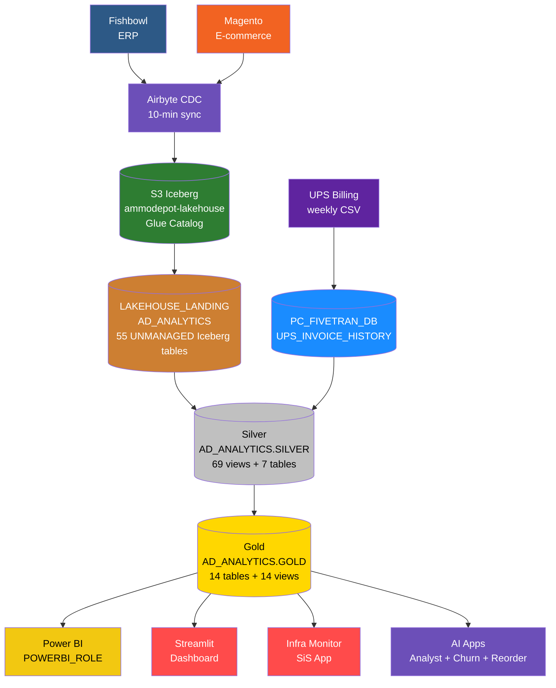
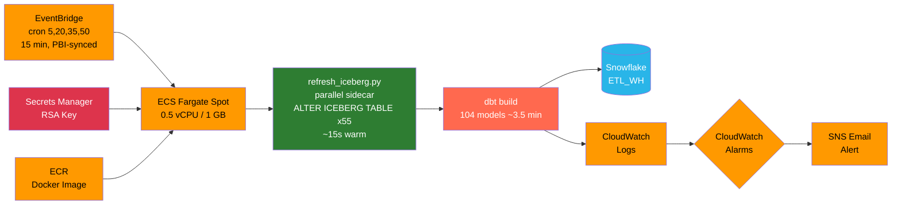
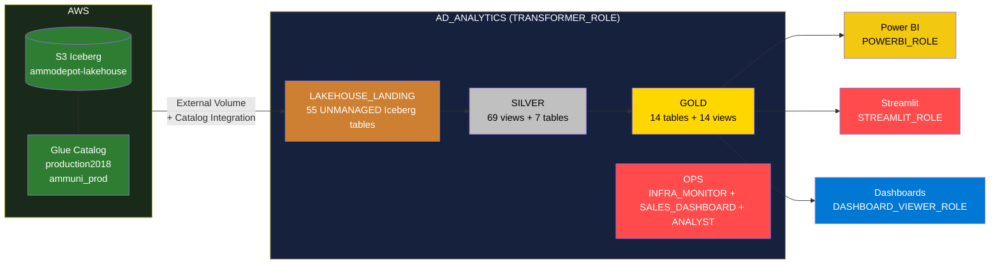
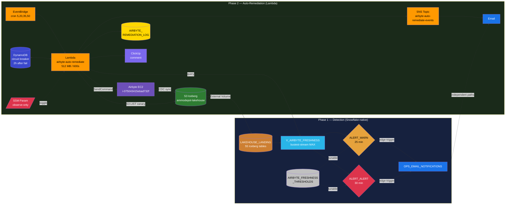

# AmmoDepot dbt Analytics Pipeline

Analytics pipeline for [Ammunition Depot](https://www.ammunitiondepot.com), transforming raw data from **Fishbowl** (ERP) and **Magento** (e-commerce) into structured, tested datasets using Medallion Architecture.

Data is ingested via Airbyte CDC into **S3 Iceberg** (Glue catalog), read by Snowflake via External Volume, transformed by dbt on ECS Fargate Spot every 15 minutes (synchronized 5 minutes before each Power BI refresh window), and served to Power BI, a Streamlit dashboard, a Cortex Analyst chatbot, and an Infra Monitor app.

---

## Architecture

### Data Pipeline



### Orchestration



### Snowflake Database Layout



---

## Tech Stack

| Component | Technology |
|-----------|------------|
| Transformation | dbt-core 1.11.6 + dbt-snowflake 1.11.2 |
| Warehouse | Snowflake `AD_ANALYTICS` (reads Iceberg via External Volume + Glue Catalog) |
| Ingestion | Airbyte CDC on EC2 c6a.2xlarge → S3 Iceberg (Glue catalog). Legacy → Snowflake connections inactive 2026-04-07 |
| Iceberg refresh | `ecs/refresh_iceberg.py` — parallel Python sidecar, runs before dbt build; `ALTER ICEBERG TABLE ... REFRESH` across all 55 tables in 8 worker threads (~15s warm) |
| Orchestration | ECS Fargate Spot + EventBridge `cron(5,20,35,50 * * * ? *)` UTC — fires 5 min before each Power BI :00/:15/:30/:45 refresh window (~$3.70/mo) |
| Packages | dbt_utils |
| Cross-db macros | `adapter.dispatch` — `convert_tz`, `string_agg`, `format_timestamp`, `json_extract_text` |
| Linting | SQLFluff (Snowflake dialect) |
| Python | uv (package manager) |
| BI Dashboard | Streamlit Sales Dashboard (`AD_ANALYTICS.OPS.SALES_DASHBOARD`, SiS container runtime, 5 pages) + Power BI |
| Infra Monitoring | Snowsight dashboard (8 tiles) + Streamlit Infra Monitor (`AD_ANALYTICS.OPS.INFRA_MONITOR`, SiS container runtime, 6 pages including Airbyte Health) |
| Airbyte Observability | Snowflake-native edge-triggered alerts (Phase 1) — `V_AIRBYTE_FRESHNESS` view + 2 ALERT objects on `ETL_WH` (warn 25 min, alert 30 min) → `OPS_EMAIL_NOTIFICATIONS` |
| Airbyte Auto-Remediation | AWS Lambda `airbyte-auto-remediate` (Phase 2) — autonomous cancel + restart of stuck Airbyte syncs via SSM, with DynamoDB circuit breaker, S3-LIST verification, and audit log in `AD_ANALYTICS.OPS.AIRBYTE_REMEDIATION_LOG` |
| AI Analyst | Cortex Analyst chatbot (`AD_ANALYTICS.OPS.ANALYST`) — text-to-SQL over semantic view `AMMODEPOT_ANALYST` (6 Gold tables, 20 golden queries) |
| Demand Forecasting | Cortex ML FORECAST — 115 calibers + revenue, weekly Task `TASK_DAILY_FORECAST` (Sunday 4am UTC), outputs to `F_FORECAST` |
| Anomaly Detection | Cortex ML ANOMALY_DETECTION — revenue/orders/margin, Page 1 alerts, outputs to `F_ANOMALIES` |
| Churn Narratives | CORTEX.COMPLETE (`llama3.1-70b`) — RFM segment health + executive summary, Page 5 |
| Reorder Intelligence | `F_REORDER_RECOMMENDATIONS` + CORTEX.COMPLETE — per-caliber reorder qty + vendor, Page 4 tab |
| Customer Snapshot | dbt snapshot `SNAP_CUSTOMER_SEGMENTATION` (check strategy on RFM fields) — enables MoM segment deltas |
| Secrets | AWS Secrets Manager (`ammodepot/dbt/snowflake` for dbt; `AD_ANALYTICS.OPS.AWS_COST_EXPLORER_CREDS` for Infra Monitor) |

---

## Project Structure

```
dbt_ammodepot/
├── ammodepot/                         # Snowflake dbt project (production)
│   ├── dbt_project.yml                # version 2.0 — vars, materialization, schema routing
│   ├── packages.yml
│   ├── .env.example                   # Snowflake connection vars template
│   ├── macros/
│   │   ├── generate_schema_name.sql
│   │   ├── json_extract_text.sql
│   │   ├── ml_forecast.sql            # Cortex ML training: caliber/revenue forecasts + anomaly models
│   │   └── cross_db/                  # convert_tz, string_agg, format_timestamp
│   ├── tests/generic/                 # 8 custom generic tests (assert_*)
│   ├── snapshots/
│   │   └── snap_customer_segmentation.sql  # check strategy on RFM classification fields
│   ├── seeds/
│   │   └── customer_groups.csv        # Customer group lookup (Law Enforcement, Wholesale, etc.)
│   └── models/
│       ├── bronze/                    # Source YAML definitions (60 source tables)
│       │   ├── fishbowl/              # 34 tables — AD_ANALYTICS.LAKEHOUSE_LANDING
│       │   ├── magento/               # 25 tables — AD_ANALYTICS.LAKEHOUSE_LANDING
│       │   └── ups/                   # 1 table — PC_FIVETRAN_DB.UPS_INVOICE_HISTORY
│       ├── silver/                    # 76 models (69 views + 7 tables)
│       │   ├── fishbowl/              # 34 ERP models
│       │   ├── magento/               # 23 e-commerce models
│       │   └── inventory/             # 19 quantity calculation models
│       └── gold/                      # 14 table models + 14 intermediate views
│           ├── intermediate/          # 14 reusable view models (3 override to table)
│           ├── d_customer.sql, d_customer_segmentation.sql, d_product.sql
│           ├── d_product_bundle.sql, d_store.sql, d_vendor.sql
│           ├── f_inventoryview.sql, f_pos.sql, f_sales.sql, f_shippment.sql
│           ├── f_cohort.sql, f_cohort_detailed.sql, f_sales_realtime.sql
│           └── f_reorder_recommendations.sql  # AI Phase 5: per-caliber reorder intelligence
├── streamlit_app/                     # BI dashboard (local + SiS) — 5 pages
│   ├── app.py                         # Local entry point
│   ├── streamlit_app.py               # Streamlit in Snowflake entry point
│   ├── pages/
│   │   ├── 1_Today_Yesterday.py       # Real-time sales + cross-filtering + anomaly alerts
│   │   ├── 2_Sales_Overview.py        # Historical sales with category drilldown
│   │   ├── 3_Inventory.py             # Inventory, vendor analysis, open POs
│   │   ├── 4_Forecast.py             # Demand forecast + 4 tabs incl. Reorder Recommendations
│   │   └── 5_Customer_Intelligence.py # RFM segment health + CORTEX.COMPLETE summary
│   └── utils/
│       ├── chart_theme.py             # Unified dark theme (Plotly + HTML tables)
│       ├── db.py                      # Query runner with local/SiS dual-mode
│       └── zip3_coords.py             # ZIP3 centroid lookup for geographic maps
├── streamlit_analyst/                 # Cortex Analyst chatbot (SiS container runtime)
│   ├── app.py / streamlit_app.py      # Local + SiS entry points
│   ├── snowflake.yml                  # SiS definition v2 — container runtime
│   ├── test_golden_questions.py       # Smoke test (25 questions)
│   ├── setup/01_bootstrap.sql         # Semantic view + RBAC + stage
│   └── utils/                         # analyst.py, db.py, chart_theme.py
├── streamlit_cost_monitor/            # Infra Monitor app (SiS container runtime) — dir kept to avoid CI churn
│   ├── streamlit_app.py               # Entry point (SiS + local)
│   ├── snowflake.yml                  # SiS definition v2 — container runtime
│   ├── pages/
│   │   ├── 1_Snowflake_Compute.py     # MTD KPIs, daily trend, anomaly detection
│   │   ├── 2_Snowflake_Storage.py     # DB snapshot + 30d growth
│   │   ├── 3_AWS_Infrastructure.py    # MTD KPIs, daily/monthly service spend (boto3)
│   │   ├── 4_Combined.py              # 6M monthly SF+AWS trend, MTD totals
│   │   ├── 5_dbt_Pipeline.py          # Build duration chart, health table, dbt docs link
│   │   └── 6_Airbyte_Health.py        # RAG cards per connection, per-stream detail, threshold display
│   ├── utils/
│   │   └── config.py, db.py, snowflake_queries.py, aws_costs.py, cloudwatch_metrics.py
│   └── setup/                         # 8 SQL bootstrap scripts (EAI, secrets, alerts, freshness, remediation log)
├── ecs/                               # ECS Fargate deployment artifacts
│   ├── Dockerfile
│   ├── entrypoint.sh                  # Iceberg refresh sidecar → source freshness → dbt build → snapshot
│   ├── refresh_iceberg.py             # Parallel ALTER ICEBERG TABLE REFRESH (8 workers)
│   ├── task-definition.json
│   ├── eventbridge-rule.json          # cron(5,20,35,50 * * * ? *) UTC — PBI-synced
│   ├── iam-policies/
│   └── README.md                      # Full ECS setup guide
├── lambda/
│   └── airbyte_auto_remediate/        # Phase 2: autonomous Airbyte cancel + restart Lambda
│       ├── Dockerfile, app/, deploy.sh
│       └── (uses SSM, DynamoDB circuit breaker, SNS notifications)
├── airbyte-ec2/                       # EC2 maintenance scripts
│   ├── airbyte-cleanup.sh             # Monthly cleanup (Minio logs + DB pruning)
│   ├── disk-alert.sh                  # 6-hourly disk usage alert
│   └── deploy.sh                      # One-command EC2 installer
├── snowflake_setup/
│   └── 01_governance_tags.sql         # FinOps: query tags + cost attribution tags
├── docs/
│   ├── snowflake_access_setup.md
│   ├── SNOWFLAKE_COST_DASHBOARD.md
│   ├── POC_S3_DUCKDB_LAKEHOUSE.md
│   ├── AIRBYTE_2_0_UPGRADE_PLAN.md
│   ├── AIRBYTE_INCIDENT_RUNBOOK.md           # Manual cancel + restart playbook
│   └── AIRBYTE_AUTO_REMEDIATION_RUNBOOK.md   # Phase 2 Lambda — toggle, breaker, escalation
├── sdd-archive/                       # Shipped feature archives (BRAINSTORM/DEFINE/DESIGN/SHIPPED docs)
└── archive/
    └── projects/ammodepot/            # Redshift dbt project (decommissioned)
```

---

## Model Layers

### Bronze — Source Definitions

YAML source definitions only. No SQL models. Airbyte writes to S3 Iceberg; Snowflake reads via External Volume + Glue Catalog Integration into `LAKEHOUSE_LANDING`. dbt references them as `source()` calls.

- `AD_ANALYTICS.LAKEHOUSE_LANDING`: 55 UNMANAGED Iceberg tables (34 Fishbowl + 21 Magento)
- `PC_FIVETRAN_DB.UPS_INVOICE_HISTORY`: 1 table (manually uploaded weekly)
- Source freshness: warn after 24h, error after 48h (field: `_airbyte_extracted_at`)
- All 55 Iceberg tables refreshed by `ecs/refresh_iceberg.py` (parallel sidecar with 8 worker threads, ~15s warm) before every dbt build — this used to be a dbt `on-run-start` hook but dbt's serial master connection took 45–90s warm / 3–5min cold

### Silver — Cleaned Views

One model per source table. Each model applies:

1. Filters deleted CDC rows: `WHERE _ab_cdc_deleted_at IS NULL`
2. Renames columns to `snake_case`
3. Casts types as needed

All 55 Fishbowl + Magento Silver models include `QUALIFY ROW_NUMBER()` dedup guards to handle CDC replication artifacts.

High-fan-out tables override to `table` materialization: `fishbowl_soitem`, `fishbowl_product`, `fishbowl_uomconversion`, `fishbowl_part`, `magento_sales_order_item`, `magento_sales_order`, `inventory_qtyinventorytotals`.

### Gold — Business Tables

Consumption-ready facts and dimensions. All columns use `UPPER_CASE` aliases for Power BI compatibility. `f_sales` uses incremental materialization with a 3-day lookback merge window.

| Model | Type | Description |
|-------|------|-------------|
| `d_customer` | Dimension | Customer master (Magento + Fishbowl) |
| `d_customer_segmentation` | Dimension | RFM-based customer segments |
| `d_product` | Dimension | Product catalog with resolved EAV attributes |
| `d_product_bundle` | Dimension | Kit/bundle compositions |
| `d_store` | Dimension | Magento store reference |
| `d_vendor` | Dimension | Vendor/supplier master |
| `f_sales` | Fact | Sales orders with Fishbowl cost data (incremental merge) |
| `f_pos` | Fact | Purchase orders |
| `f_inventoryview` | Fact | Real-time inventory quantities |
| `f_shippment` | Fact | Shipment tracking with UPS freight costs |
| `f_cohort` | Fact | Customer cohort analysis |
| `f_cohort_detailed` | Fact | Detailed cohort metrics |
| `f_sales_realtime` | View | Real-time sales feed (filtered view of f_sales) |
| `f_reorder_recommendations` | Fact | Per-caliber reorder qty + vendor (AI Phase 5) |

### Intermediate Views

14 reusable pre-computations in the `gold` schema. Three high-cost nodes override to `table`: `int_fishbowl_order_cost`, `int_magento_product_eav_lookups`, `int_sales_cost_fallback`.

---

## Quick Start (Snowflake Project)

### Prerequisites

- [uv](https://docs.astral.sh/uv/) installed
- Snowflake account access with `TRANSFORMER_ROLE` or a developer role
- RSA key pair for `SVC_DBT` (see `docs/snowflake_access_setup.md`)

### Install

```bash
cd ammodepot
uv sync
uv run dbt deps --profiles-dir .
```

### Configure credentials

Copy `.env.example` to `.env` and populate:

```bash
SNOWFLAKE_ACCOUNT=<account-identifier>
SNOWFLAKE_USER=SVC_DBT
SNOWFLAKE_PRIVATE_KEY_PATH=/path/to/dbt_rsa_key.p8
SNOWFLAKE_PRIVATE_KEY_PASSPHRASE=<passphrase>
SNOWFLAKE_ROLE=TRANSFORMER_ROLE
SNOWFLAKE_DATABASE=AD_ANALYTICS
SNOWFLAKE_WAREHOUSE=ETL_WH
SNOWFLAKE_SCHEMA=dbt_dev
```

### Development commands

Run from `ammodepot/`. Always source `.env` first — dbt does not auto-load it.

```bash
set -a && source .env && set +a

uv run dbt parse --profiles-dir .
uv run dbt debug --profiles-dir .
uv run dbt build --profiles-dir . --target prod
uv run dbt build --profiles-dir . --target prod --select +f_sales
uv run dbt test --profiles-dir . --target prod --select gold
uv run dbt source freshness --profiles-dir .
```

### Schema routing

| Target | Behavior |
|--------|----------|
| `dev` (default) | All models in `SNOWFLAKE_SCHEMA` (e.g. `dbt_dev`) |
| `prod` | Models route to `SILVER` or `GOLD` schemas in `AD_ANALYTICS` |

---

## Deployment (ECS Fargate)

The Snowflake project runs on ECS Fargate Spot, triggered by EventBridge every 15 minutes synchronized 5 minutes before each Power BI refresh window. Full setup instructions are in `ecs/README.md`.

| Resource | Detail |
|----------|--------|
| Cluster | `ammodepot-dbt` (us-east-1, Fargate Spot) |
| Task | `ammodepot-dbt-build` (0.5 vCPU, 1 GB) |
| Schedule | `cron(5,20,35,50 * * * ? *)` UTC — fires 5 min before each PBI :00/:15/:30/:45 refresh |
| Runtime | ~3.5 min steady state (104 models + Iceberg refresh ~15s + snapshot) |
| Secrets | `ammodepot/dbt/snowflake` in Secrets Manager (RSA private key + passphrase) |
| Logs | CloudWatch `/ecs/ammodepot-dbt` (14-day retention) |
| Image | ECR `746669199691.dkr.ecr.us-east-1.amazonaws.com/ammodepot/dbt` |
| Monitoring | CloudWatch dashboard `ammodepot-dbt`, alarms `dbt-build-failure` + `dbt-task-missing` → SNS email |
| Cost | ~$3.70/month (replaces dbt Cloud at $663/mo) |

Push to `main` — GitHub Actions (`deploy-ecs.yml`, path-filtered to `ammodepot/` and `ecs/`) builds and pushes to ECR automatically. The next EventBridge trigger picks up the new image.

### CI/CD Workflows

| Workflow | Triggers On | Purpose |
|----------|-------------|---------|
| `deploy-ecs.yml` | Push to `main` (`ammodepot/`, `ecs/`) | Build + push dbt image to ECR |
| `deploy-streamlit-dashboard.yml` | Push to `streamlit_app/` | `snow streamlit deploy --replace` + re-attach EAI |
| `deploy-streamlit-cost-monitor.yml` | Push to `streamlit_cost_monitor/` | `snow streamlit deploy --replace` + re-attach EAI/secret |
| `deploy-streamlit-analyst.yml` | Push to `streamlit_analyst/` | `snow streamlit deploy --replace` |
| `deploy-dbt-docs.yml` | Push to `ammodepot/` | `dbt docs generate --static` → upload to S3 |
| `deploy-lambda-airbyte-auto-remediate.yml` | Push to `lambda/airbyte_auto_remediate/**` | Build + push Lambda image, update function code |

---

## Streamlit Apps

### Sales Dashboard (`AD_ANALYTICS.OPS.SALES_DASHBOARD`)

5-page replacement for Power BI dashboards. Runs locally and deploys to SiS container runtime.

| Page | Description |
|------|-------------|
| 1 — Today / Yesterday | Real-time sales with PBI-style cross-filtering + anomaly alert banner |
| 2 — Sales Overview | Historical sales with category drilldown and trend charts |
| 3 — Inventory | Inventory quantities, vendor analysis, open purchase orders |
| 4 — Forecast | Demand forecast + 5 tabs: Stock-Out Risk, Caliber Forecast, Revenue Forecast, **Reorder Recommendations** (+ Vendor Comparison), Forecast Accuracy |
| 5 — Customer Intelligence | RFM segment health + CORTEX.COMPLETE (`llama3.1-70b`) executive summary + MoM segment deltas |

| Resource | Detail |
|----------|--------|
| Runtime | SiS container runtime (Streamlit 1.55+) |
| Compute pool | `sales_dashboard_pool` (CPU_X64_XS, auto-suspend 300s, ~$5/mo) |
| EAI | `sales_dashboard_integration` — CARTO tiles + PyPI |
| Deployment | GitHub Actions (`deploy-streamlit-dashboard.yml`) on push to `streamlit_app/` |

Run locally:

```bash
cd streamlit_app
uv run streamlit run app.py
```

### Infra Monitor (`AD_ANALYTICS.OPS.INFRA_MONITOR`)

Tracks Snowflake compute/storage, AWS infrastructure costs, dbt pipeline health, and Airbyte ingestion freshness across 6 pages.

| Page | Description |
|------|-------------|
| 1 — Snowflake Compute | MTD KPIs, daily trend by warehouse + user, anomaly detector |
| 2 — Snowflake Storage | DB snapshot + 30-day growth stacked area |
| 3 — AWS Infrastructure | MTD KPIs, daily/monthly service spend (boto3 → Cost Explorer) |
| 4 — Combined | 6-month monthly SF + AWS trend, MTD totals |
| 5 — dbt Pipeline | Build duration chart, build health table, dbt docs link (presigned S3 URL) |
| 6 — Airbyte Health | RAG cards per connection, per-stream staleness, threshold display |

| Resource | Detail |
|----------|--------|
| Runtime | SiS container runtime (Streamlit 1.55+) |
| Compute pool | `cost_monitor_pool` (CPU_X64_XS, auto-suspend 300s, ~$5/mo) |
| EAI | `aws_cost_explorer_integration` — CE + PyPI + CloudWatch + Logs + S3 |
| Secret | `AD_ANALYTICS.OPS.AWS_COST_EXPLORER_CREDS` (IAM user `svc_snowflake_costs`) |
| Deployment | GitHub Actions (`deploy-streamlit-cost-monitor.yml`) on push to `streamlit_cost_monitor/` |
| Viewers | `DASHBOARD_VIEWER_ROLE`, `POWERBI_READONLY_ROLE` |

### Cortex Analyst Chatbot (`AD_ANALYTICS.OPS.ANALYST`)

Natural language query interface powered by Snowflake Cortex Analyst + Semantic View. Covers 6 Gold tables with 20 verified golden queries.

| Resource | Detail |
|----------|--------|
| Runtime | SiS container runtime (Streamlit 1.55+) |
| Semantic View | `AD_ANALYTICS.GOLD.AMMODEPOT_ANALYST` (covers F_SALES, F_INVENTORYVIEW, F_POS, INT_PRODUCT_ANALYST, D_VENDOR, D_CUSTOMER_SEGMENTATION) |
| Compute pool | `sales_dashboard_pool` (shared, ~$0 incremental) |
| Auth | OAuth via `/snowflake/session/token` in SiS; key-pair locally |
| Smoke test | `streamlit_analyst/test_golden_questions.py` — 25 questions, API + SQL execution validation |
| Deployment | GitHub Actions (`deploy-streamlit-analyst.yml`) on push to `streamlit_analyst/` |

---

## Airbyte Observability & Auto-Remediation

Two layers protect the Airbyte → S3 Iceberg ingestion path. They are independent: disabling Phase 2 does not affect Phase 1 emails.



### Phase 1 — Snowflake-native Detection (shipped 2026-05-01)

- **Detection**: `V_AIRBYTE_FRESHNESS` view computes per-connection staleness from the busiest stream's `MAX(_airbyte_extracted_at)` across all 55 LAKEHOUSE_LANDING tables (busiest-stream signal — idle CDC streams legitimately have stale extracts and must not drive connection-level alerting)
- **Alerting**: 2 edge-triggered Snowflake `ALERT` objects (`ALERT_AIRBYTE_FRESHNESS_WARN` at 25 min, `ALERT_AIRBYTE_FRESHNESS_ALERT` at 30 min) running on `ETL_WH` at `cron(5,20,35,50)` — same cadence as dbt, piggybacks on warm warehouse (~$0/mo incremental)
- **Email channel**: `OPS_EMAIL_NOTIFICATIONS` account-level integration → `victor@trinitybi.com` (recipient must be click-verified, not just `SET`)
- **Config**: `AIRBYTE_FRESHNESS_THRESHOLDS` table — operator tunes `warn_minutes` / `alert_minutes` via `UPDATE` (no redeploy)
- **Runbook**: `docs/AIRBYTE_INCIDENT_RUNBOOK.md` — manual cancel + restart via SSM (5-min playbook)

### Phase 2 — Lambda Auto-Remediation (shipped 2026-05-03)

- **Lambda**: `airbyte-auto-remediate` (container image, 512 MB, 600 s timeout). EventBridge `cron(5,20,35,50 * * * ? *)` UTC — same cadence as dbt + Phase 1
- **Action**: Cancels stuck Airbyte job and restarts via `ssm:SendCommand` against EC2 `i-075043415ebad732f` (no VPC, no NAT gateway)
- **State**: DynamoDB table `airbyte-auto-remediate-state` (PAY_PER_REQUEST + TTL on `breaker_until`) — circuit breaker = 2 h after a failed attempt
- **Toggle**: SSM Parameter `/airbyte-auto-remediate/observe-only` — flip between `true` (log only) and `false` (live action) without redeploy
- **Verification**: Snowflake re-query (`V_AIRBYTE_FRESHNESS`) primary; S3 LIST on canary tables fallback
- **Audit log**: `AD_ANALYTICS.OPS.AIRBYTE_REMEDIATION_LOG` — one row per AUTO_FIX / ESCALATE / BREAKER_OPEN / OBSERVE_ONLY_WOULD_ACT event
- **Notifications**: SNS topic `airbyte-auto-remediate-events` → email; ClickUp comment per outcome
- **Latency**: detection-to-action ≤16 min worst case, mean ~7.5 min
- **Cost**: ≤$2/mo (CloudWatch billing alarm at $5/mo as hard cap)
- **Runbook**: `docs/AIRBYTE_AUTO_REMEDIATION_RUNBOOK.md`

---

## Roles

| Role | Purpose |
|------|---------|
| `AIRBYTE_ROLE` | Airbyte ingestion writes (legacy Snowflake connections, now inactive) |
| `TRANSFORMER_ROLE` | dbt reads LAKEHOUSE_LANDING, writes Silver + Gold |
| `POWERBI_ROLE` | Power BI read-only access to Gold |
| `POWERBI_READONLY_ROLE` | Read-only Gold + Streamlit viewer access |
| `STREAMLIT_ROLE` | Streamlit in Snowflake app owner |
| `DASHBOARD_VIEWER_ROLE` | SSO dashboard viewers |

---

## Documentation

| Document | Description |
|----------|-------------|
| `docs/snowflake_access_setup.md` | Roles, warehouses, RSA keys, Power BI access, SiS setup, SSO |
| `docs/SNOWFLAKE_COST_DASHBOARD.md` | Cost monitoring queries, Snowsight dashboard (8 tiles), alerts |
| `docs/POC_S3_DUCKDB_LAKEHOUSE.md` | S3 + Iceberg migration plan and POC results |
| `docs/AIRBYTE_2_0_UPGRADE_PLAN.md` | Airbyte upgrade procedure, rollback plan, risk assessment |
| `docs/AIRBYTE_INCIDENT_RUNBOOK.md` | Manual cancel + restart playbook for stuck Airbyte syncs (SSM-only, 5-min target) |
| `docs/AIRBYTE_AUTO_REMEDIATION_RUNBOOK.md` | Phase 2 Lambda — email tiers, observe-only toggle, breaker reset, emergency disable |
| `ecs/README.md` | ECS Fargate deployment guide (one-time setup + ongoing ops) |

---

## Cost Summary

Realized savings vs. pre-migration baseline (~$2,881/mo / ~$34,572/year):

| Source | Monthly |
|--------|---------|
| dbt Cloud → ECS Fargate Spot | ~$659/mo |
| MWAA decommission (2026-03-23) | ~$450/mo |
| EC2 downsize | (included) |
| Iceberg cutover (2026-04-07) — `SVC_AIRBYTE` credits ~678 → ~0 | ~$2,034/mo |
| dbt cadence sync to PBI 10 → 15 min (2026-04-28) | ~$617/mo |
| **Total** | **~$2,881/mo / ~$34,572/yr** |

Ongoing infrastructure cost (excluding Snowflake compute): ~$3.70/mo ECS + ~$10/mo Streamlit pools + ~$2/mo Lambda ≈ $16/mo.

---

## Build Status

| Project | Last Build | Result |
|---------|------------|--------|
| Snowflake (ECS Fargate) | 2026-04-22 | PASS=390 WARN=12 ERROR=0 — 104 models + 1 snapshot, ~3.5 min |
| Redshift | Archived | Decommissioned — see `archive/projects/ammodepot/` |
