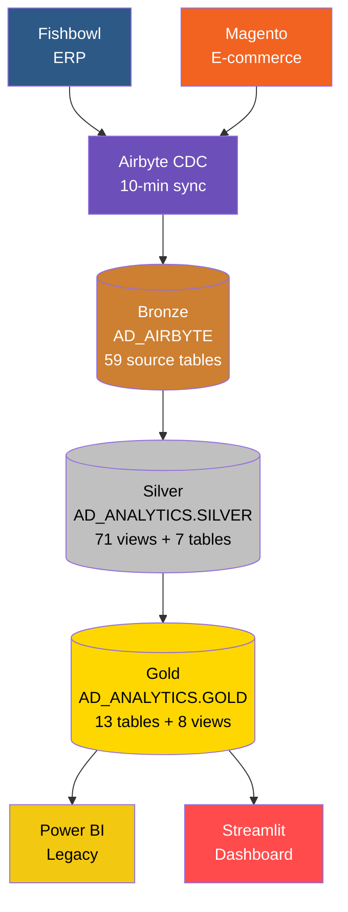
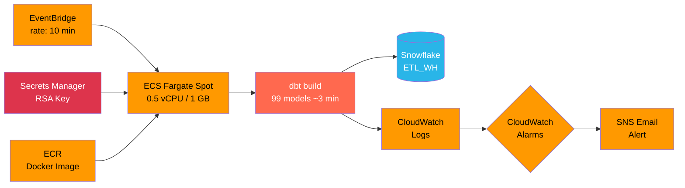
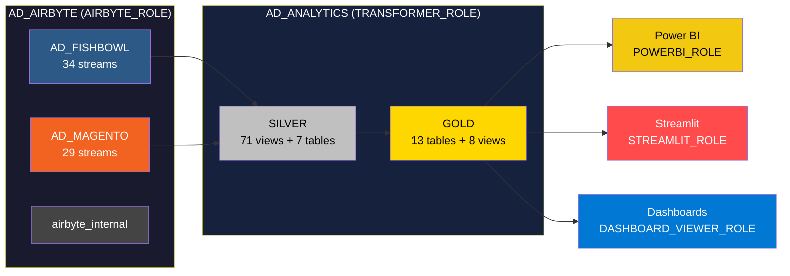

# AmmoDepot dbt Analytics Pipeline

Analytics pipeline for [Ammunition Depot](https://www.ammunitiondepot.com), transforming raw data from **Fishbowl** (ERP) and **Magento** (e-commerce) into structured, tested datasets using Medallion Architecture.

Data is ingested via Airbyte CDC every 10 minutes, transformed by dbt on ECS Fargate Spot, and served to Power BI and a Streamlit dashboard via Snowflake.

---

## Architecture

### Data Pipeline



### Orchestration



---

## Tech Stack

| Component | Technology |
|-----------|------------|
| Transformation | dbt-core 1.11.7 + dbt-snowflake 1.11.3 (primary) / dbt-redshift 1.10.1 (legacy) |
| Warehouse | Snowflake `AD_ANALYTICS` (primary) / Amazon Redshift (legacy production) |
| Ingestion | Airbyte CDC — 6 connections, 64 active streams, 10-min sync |
| Orchestration | ECS Fargate Spot + EventBridge scheduler (~$2.55/mo) |
| Packages | dbt_utils, dbt_expectations (metaplane fork) |
| Cross-db macros | `adapter.dispatch` — `convert_tz`, `string_agg`, `format_timestamp`, `json_extract_text` |
| Linting | SQLFluff (Snowflake + Redshift dialects) |
| Python | uv (package manager) |
| BI Dashboard | Streamlit (local + Streamlit in Snowflake) / Power BI (legacy) |
| Secrets | AWS Secrets Manager (`ammodepot/dbt/snowflake`) |

---

## Two dbt Projects

| Project | Path | Warehouse | Models | Status |
|---------|------|-----------|--------|--------|
| Snowflake | `ammodepot/` | Snowflake | 99 | Primary — ECS Fargate, every 10 min |
| Redshift | `projects/ammodepot/` | Amazon Redshift | 95 | Legacy — dbt Cloud scheduled runs |

The Snowflake project adds three new Gold models (`f_cohort`, `f_cohort_detailed`, `f_sales_realtime`) and a fourth cross-db dispatch macro (`json_extract_text`).

---

## Project Structure

```
dbt_ammodepot/
├── ammodepot/                     # Snowflake project (primary)
│   ├── dbt_project.yml            # version 2.0 — vars, materialization, schema routing
│   ├── packages.yml
│   ├── .env.example               # Snowflake connection vars template
│   ├── macros/
│   │   ├── generate_schema_name.sql
│   │   ├── json_extract_text.sql
│   │   └── cross_db/              # convert_tz, string_agg, format_timestamp
│   ├── tests/generic/             # 16 custom generic tests (assert_*)
│   └── models/
│       ├── bronze/                # Source YAML definitions (59 source tables)
│       │   ├── fishbowl/          # 34 tables — AD_AIRBYTE.AD_FISHBOWL
│       │   └── magento/           # 25 tables — AD_AIRBYTE.AD_MAGENTO
│       ├── silver/                # 78 models (71 views + 7 tables)
│       │   ├── fishbowl/          # 34 ERP models
│       │   ├── magento/           # 23 e-commerce models
│       │   └── inventory/         # 21 quantity calculation models
│       └── gold/                  # 13 table models + 8 intermediate views
│           ├── intermediate/      # 8 reusable view models
│           ├── d_customer.sql, d_customer_segmentation.sql, d_product.sql
│           ├── d_product_bundle.sql, d_store.sql, d_vendor.sql
│           ├── f_inventoryview.sql, f_pos.sql, f_sales.sql, f_shippment.sql
│           ├── f_cohort.sql, f_cohort_detailed.sql
│           └── f_sales_realtime.sql
├── projects/ammodepot/            # Redshift project (legacy)
│   └── models/                    # 95 models — same Bronze/Silver layers, 10 Gold + 7 Int
├── streamlit_app/                 # BI dashboard (local + SiS)
│   ├── app.py                     # Local entry point
│   ├── streamlit_app.py           # Streamlit in Snowflake entry point
│   ├── pages/
│   │   ├── 1_Today_Yesterday.py   # Real-time sales + cross-filtering
│   │   ├── 2_Sales_Overview.py    # Historical sales with category drilldown
│   │   └── 3_Inventory.py         # Inventory, vendor analysis, open POs
│   └── utils/
│       ├── chart_theme.py         # Unified dark theme (Plotly + HTML tables)
│       ├── db.py                  # Query runner with local/SiS dual-mode
│       └── zip3_coords.py         # ZIP3 centroid lookup for geographic maps
├── ecs/                           # ECS Fargate deployment artifacts
│   ├── Dockerfile
│   ├── entrypoint.sh
│   ├── task-definition.json
│   ├── eventbridge-rule.json
│   ├── iam-policies/
│   └── README.md                  # Full ECS setup guide
├── scripts/                       # Airbyte EC2 maintenance scripts
│   ├── airbyte-cleanup.sh
│   ├── disk-alert.sh
│   └── deploy.sh
└── docs/
    ├── snowflake_access_setup.md
    ├── PIPELINE_ASSESSMENT.md
    ├── AIRBYTE_MAINTENANCE.md
    ├── COST_OPTIMIZATION_PROPOSAL.md
    └── CONSOLIDATION_EXECUTIVE_SUMMARY.md
```

---

## Model Layers

### Bronze — Source Definitions

YAML source definitions only. No SQL models. Airbyte loads directly into the Bronze schemas; dbt references them as `source()` calls.

- Snowflake: `AD_AIRBYTE.AD_FISHBOWL` (34 tables), `AD_AIRBYTE.AD_MAGENTO` (25 tables)
- Source freshness: warn after 24h, error after 48h (field: `_airbyte_extracted_at`)

### Silver — Cleaned Views

One model per source table. Each model applies three transformations:

1. Filters deleted CDC rows: `WHERE _ab_cdc_deleted_at IS NULL`
2. Renames columns to `snake_case`
3. Casts types as needed

High-fan-out tables override to `table` materialization: `fishbowl_soitem`, `fishbowl_product`, `fishbowl_uomconversion`, `fishbowl_part`, `magento_sales_order_item`, `magento_sales_order`, `inventory_qtyinventorytotals`.

All 55 Fishbowl + Magento Silver models include `QUALIFY ROW_NUMBER()` dedup guards to handle CDC replication artifacts.

### Gold — Business Tables

Consumption-ready facts and dimensions. All columns use `UPPER_CASE` aliases for Power BI compatibility. `f_sales` uses incremental materialization with a 3-day lookback merge window.

| Model | Type | Description |
|-------|------|-------------|
| `d_customer` | Dimension | Customer master (Magento + Fishbowl) |
| `d_customer_segmentation` | Dimension | RFM-based customer segments |
| `d_product` | Dimension | Product catalog with resolved EAV attributes |
| `d_product_bundle` | Dimension | Kit/bundle compositions |
| `d_store` | Dimension | Magento store reference |
| `d_vendor` | Dimension | Vendor/supplier master |
| `f_sales` | Fact | Sales orders with Fishbowl cost data (incremental) |
| `f_pos` | Fact | Purchase orders |
| `f_inventoryview` | Fact | Real-time inventory quantities |
| `f_shippment` | Fact | Shipment tracking |
| `f_cohort` | Fact | Customer cohort analysis (Snowflake only) |
| `f_cohort_detailed` | Fact | Detailed cohort metrics (Snowflake only) |
| `f_sales_realtime` | View | Real-time sales feed (Snowflake only) |

### Intermediate Views

Reusable pre-computations materialized as views in the `gold` schema. Three high-cost nodes override to `table`: `int_fishbowl_order_cost`, `int_magento_product_eav_lookups`, `int_sales_cost_fallback`.

---

## Quick Start (Snowflake Project)

### Prerequisites

- [uv](https://docs.astral.sh/uv/) installed
- Snowflake account access with `TRANSFORMER_ROLE` or a developer role
- RSA key pair for `SVC_DBT` (see `docs/snowflake_access_setup.md`)

### Install

```bash
cd ammodepot
uv sync
uv run dbt deps --profiles-dir .
```

### Configure credentials

Copy `.env.example` to `.env` and populate:

```bash
SNOWFLAKE_ACCOUNT=<account-identifier>
SNOWFLAKE_USER=SVC_DBT
SNOWFLAKE_PRIVATE_KEY_PATH=/path/to/dbt_rsa_key.p8
SNOWFLAKE_PRIVATE_KEY_PASSPHRASE=<passphrase>
SNOWFLAKE_ROLE=TRANSFORMER_ROLE
SNOWFLAKE_DATABASE=AD_ANALYTICS
SNOWFLAKE_WAREHOUSE=ETL_WH
SNOWFLAKE_SCHEMA=dbt_dev
```

### Development commands

Run from `ammodepot/`. Always source `.env` first — dbt does not auto-load it.

```bash
set -a && source .env && set +a

uv run dbt parse --profiles-dir .
uv run dbt debug --profiles-dir .
uv run dbt build --profiles-dir . --target prod
uv run dbt build --profiles-dir . --target prod --select +f_sales
uv run dbt test --profiles-dir . --target prod --select gold
uv run dbt source freshness --profiles-dir .
```

### Schema routing

| Target | Behavior |
|--------|----------|
| `dev` (default) | All models in `SNOWFLAKE_SCHEMA` (e.g. `dbt_dev`) |
| `prod` | Models route to `SILVER` or `GOLD` schemas in `AD_ANALYTICS` |

---

## Quick Start (Redshift Project)

Run from `projects/ammodepot/`. Credentials via `.env` (see `.env.example`).

```bash
uv run dbt deps --profiles-dir .
uv run dbt parse --profiles-dir .
uv run dbt debug --profiles-dir .
uv run dbt build --profiles-dir .
uv run dbt build --profiles-dir . --select +f_sales
uv run dbt test --profiles-dir . --select gold
uv run dbt source freshness --profiles-dir .
uv run sqlfluff lint models/
uv run sqlfluff fix models/
```

---

## Deployment (ECS Fargate)

The Snowflake project runs on ECS Fargate Spot, triggered by EventBridge every 10 minutes. Full setup instructions are in `ecs/README.md`.

| Resource | Detail |
|----------|--------|
| Cluster | `ammodepot-dbt` (us-east-1, Fargate Spot) |
| Task | `ammodepot-dbt-build` (0.5 vCPU, 1 GB) |
| Schedule | `rate(10 minutes)` via EventBridge |
| Runtime | ~3 min per run, 99 models + 340 tests |
| Secrets | `ammodepot/dbt/snowflake` in Secrets Manager |
| Logs | CloudWatch `/ecs/ammodepot-dbt` (14-day retention) |
| Image | ECR `ammodepot/dbt` |
| Cost | ~$2.55/month |

To deploy a model update, push to `main` then run:

```bash
./scripts/deploy-ecs.sh
```

The next scheduled run (within 10 minutes) picks up the new image automatically.

---

## Streamlit Dashboard

Replacement for Power BI dashboards. Runs locally against Snowflake and deploys to Streamlit in Snowflake (SiS).

| Page | Description |
|------|-------------|
| Today / Yesterday | Real-time sales with cross-filtering by category, manufacturer, vendor, SKU |
| Sales Overview | Historical sales with category drilldown and trend charts |
| Inventory | Inventory quantities, vendor analysis, open purchase orders |

Run locally:

```bash
cd streamlit_app
uv run streamlit run app.py
```

The `utils/db.py` module detects SiS via the `_is_sis` flag and switches rendering paths accordingly (maps, clickable charts, and `st.dataframe` all have SiS-safe fallbacks).

---

## Snowflake Database Layout



| Role | Purpose |
|------|---------|
| `AIRBYTE_ROLE` | Airbyte ingestion writes |
| `TRANSFORMER_ROLE` | dbt reads Bronze, writes Silver + Gold |
| `POWERBI_ROLE` | Power BI read-only access to Gold |
| `POWERBI_READONLY_ROLE` | Read-only Gold + Streamlit viewer access |
| `STREAMLIT_ROLE` | Streamlit in Snowflake app owner |
| `DASHBOARD_VIEWER_ROLE` | SSO dashboard viewers |

---

## Documentation

| Document | Description |
|----------|-------------|
| `docs/snowflake_access_setup.md` | Roles, warehouses, RSA keys, Power BI access, SiS setup, SSO |
| `docs/PIPELINE_ASSESSMENT.md` | End-to-end pipeline audit — Airbyte connections, Power BI, dbt |
| `docs/AIRBYTE_MAINTENANCE.md` | EC2 maintenance scripts, cleanup procedures, emergency recovery |
| `docs/COST_OPTIMIZATION_PROPOSAL.md` | AWS cost optimization plan (~$41K/year savings) |
| `docs/CONSOLIDATION_EXECUTIVE_SUMMARY.md` | Project consolidation summary |
| `ecs/README.md` | ECS Fargate deployment guide (one-time setup + ongoing operations) |

---

## Build Status

| Project | Last Build | Result |
|---------|------------|--------|
| Snowflake (ECS Fargate) | 2026-03-20 | PASS=429 WARN=10 ERROR=0 — 99 models, ~3 min |
| Redshift (dbt Cloud) | — | PASS=402 WARN=32 ERROR=0 — 95 models |
