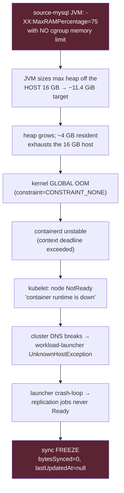

# Airbyte Installation Config & Replication-Memory OOM Fix

Reproducible install configuration for the Airbyte instance, and the controlled
procedure for applying + **verifying** the replication-container memory-limit fix.

| | |
|---|---|
| **Instance** | `i-075043415ebad732f` (c6a.2xlarge, 8 vCPU / 16 GB, AL2023, us-east-1) |
| **Access** | AWS Session Manager only (no SSH). EIP `18.204.90.52`. |
| **Runtime** | abctl `v0.30.4` → kind (k8s-in-Docker), single node |
| **Chart / app** | airbyte `2.0.19` / appVersion `2.0.1` |
| **Release** | `airbyte-abctl` (namespace `airbyte-abctl`) |
| **Values** | [`airbyte-values.yaml`](./airbyte-values.yaml) — the single source of truth |

> **Why this exists:** until 2026-07-03 the install config lived only in the
> running cluster. The 2026-04-07 2.0/new-EC2 migration silently reset
> replication memory limits to unbounded and nobody could see it because
> nothing was version-controlled. This directory now versions the whole config
> so a reinstall/instance-swap is reproducible and reviewable.

---

## The problem this fixes



**Fix:** set a cgroup memory **limit** on the sync source/dest containers so
`MaxRAMPercentage=75` resolves against the limit (→ ~1.5 GiB heap at 2Gi), not
the host. The kernel then caps **total** RSS at the limit, converting any future
overrun into a contained per-container `OOMKilled` (one failed sync, retried by
auto-remediation) instead of a global host OOM that freezes the whole node.

See the memory-fix block in [`airbyte-values.yaml`](./airbyte-values.yaml) for
the full root-cause note, the ineffective pre-fix `global.jobs.resources` (V1
key) it replaces, and the sizing/blast-radius math.

---

## Install / re-apply procedure

> ⚠️ **`abctl local install` recreates pods** — it is a state-changing operation.
> Two hard preconditions before running it (see below), then the propagation
> verification is the FIRST success criterion, not stability.

### Preconditions

1. **Investigation-A gate.** If the freeze root-cause capture (Investigation A)
   is still frozen/awaiting an uncontaminated capture, do **not** reinstall —
   pod recreation destroys the state A observes. Release A's freeze first, or
   explicitly decide B's fix takes priority.
2. **Baseline captured.** Record the pre-change state (see §Verify step 0) so
   before/after is measurable.

### Steps

```bash
# 1. Copy values to the instance (SSM; no SSH). Example via RunShellScript:
aws ssm send-command --profile ammodepot --region us-east-1 \
  --instance-ids i-075043415ebad732f \
  --document-name AWS-RunShellScript \
  --parameters commands='cat > /tmp/airbyte-values.yaml << "EOF"
<contents of airbyte-values.yaml>
EOF'

# 2. Apply (state-changing — gated on the preconditions above):
sudo abctl local install --values /tmp/airbyte-values.yaml

# 3. Re-attach the EIP/ingress if abctl reset it (as needed for the deployment).
```

---

## Verify — **"did Airbyte actually apply it?" BEFORE "did it help?"**

This ordering is deliberate. In April, config *appeared* correct but the runtime
silently ignored it. Do not evaluate stability until propagation is proven.

All checks are **read-only** (`crictl`/`kubectl` via `docker exec`, `journalctl`).

### Step 0 — Baseline (run BEFORE applying)

```bash
CP=airbyte-abctl-control-plane; NS=airbyte-abctl
# current (pre-fix) sync pod limits — expect memory:0 (unbounded)
sudo docker exec $CP kubectl get pods -n $NS -o custom-columns=\
'POD:.metadata.name,CONTAINERS:.spec.containers[*].name,MEM_LIM:.spec.containers[*].resources.limits.memory' \
 | grep replication-job
# baseline global-OOM count (should be non-zero pre-fix)
sudo journalctl -k --no-pager -S today | grep -c 'constraint=CONSTRAINT_NONE.*global_oom'
```

### Step 1 — Config propagation (the gating question)

**1a. Rendered pod spec** — the authoritative check. A *new* replication job's
`source` and `dest` containers must show `limits.memory=2Gi`, `requests.memory=1Gi`:

```bash
sudo docker exec $CP kubectl get pods -n $NS -o custom-columns=\
'POD:.metadata.name,CONTAINERS:.spec.containers[*].name,MEM_LIM:.spec.containers[*].resources.limits.memory,MEM_REQ:.spec.containers[*].resources.requests.memory' \
 | grep replication-job
# PASS: orchestrator,source,destination = 1Gi,2Gi,2Gi   (was 1Gi,0,0)
```

**1b. cgroup limit actually enforced** on the running source container:

```bash
SRCID=$(sudo docker exec $CP crictl ps --name source --state Running -q | head -1)
sudo docker exec $CP crictl inspect $SRCID | grep -iE 'memory_limit_in_bytes|"limit"'
# PASS: shows 2147483648 (2Gi), NOT 0 / empty
```

> ❗ If 1a/1b still show `0`/unbounded, the override was **ignored** (airbyte#68162)
> — do **not** proceed to stability. Investigate: confirm
> `useConnectorResourceDefaults:false` took, then the `JOB_RESOURCE_VARIANT_OVERRIDE:
> lowresource` variant, then the DB-level per-connector resource default. Roll back
> if needed (§Rollback). This is a different (DB-level) fix — stop and reassess.

### Step 2 — JVM heap now sized off the limit, not the host

The `MaxRAMPercentage=75` flag is unchanged (expected). Proof it now binds to the
2Gi limit rather than the 16 GB host = **RSS stays under 2Gi through a full sync**:

```bash
# watch a full sync cycle; RSS must plateau < 2Gi (was climbing to ~4 GB)
SRCID=$(sudo docker exec $CP crictl ps --name source --state Running -q | head -1)
sudo docker exec $CP crictl stats $SRCID
# expected effective max heap = 0.75 x 2Gi = ~1.5 GiB; container RSS capped at 2Gi
```

### Step 3 — ONLY NOW: did operational behavior improve?

```bash
# zero NEW global OOMs after the change (contained OOMKilled is acceptable/expected)
sudo journalctl -k --no-pager -S "$(date +%Y-%m-%d) 00:00:00" \
  | grep -E 'constraint=CONSTRAINT_NONE.*global_oom'
# node stays Ready across sync cycles
sudo docker exec $CP kubectl get nodes
# launcher restart count stops climbing
sudo docker exec $CP kubectl get pods -n $NS | grep workload-launcher
```

### Step 4 — Freeze frequency: before vs after

Compare the freeze-evidence / remediation audit over equal windows pre/post:

```sql
-- Snowflake, USE ROLE TRANSFORMER_ROLE; freeze/remediation events per day
SELECT DATE_TRUNC('day', capture_time) d, COUNT(*) freezes
FROM ad_analytics.ops.airbyte_freeze_evidence
GROUP BY 1 ORDER BY 1;
-- and AIRBYTE_REMEDIATION_LOG AUTO_FIX / ESCALATE counts over the same span
```

**Success = Step 1 PASS (applied) → Step 2 PASS (heap bound) → Step 3/4 improved.**
If Step 1 fails, the experiment answers "config still not propagating" and we stop
before touching stability — exactly the April failure mode we're guarding against.

---

## Rollback

```bash
# revert to prior values (git) and reinstall
sudo abctl local install --values /tmp/airbyte-values-prev.yaml
```
Because the change is a Helm value + reinstall, rollback is symmetric. The cgroup
limit is the only functional change; removing it restores the prior (unbounded)
behavior.

---

## References

- Root-cause + sizing: [`airbyte-values.yaml`](./airbyte-values.yaml) memory-fix block
- Incident/runbooks: [`../docs/AIRBYTE_INCIDENT_RUNBOOK.md`](../docs/AIRBYTE_INCIDENT_RUNBOOK.md),
  [`../docs/AIRBYTE_AUTO_REMEDIATION_RUNBOOK.md`](../docs/AIRBYTE_AUTO_REMEDIATION_RUNBOOK.md)
- Upstream: airbyte#68162 (workload resource overrides ignored for replication
  jobs), discussion#72436 (source-mysql 3.51.5 + abctl chart-V2 OOM), PR#6001
  (`MaxRAMPercentage=75` default)
