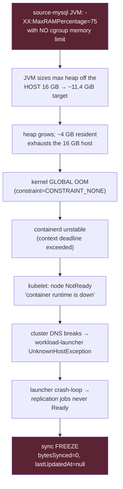

# Airbyte Installation Config & Replication-Memory OOM Fix

Reproducible install configuration for the Airbyte instance, and the controlled
procedure for applying + **verifying** the replication-container memory-limit fix.

| | |
|---|---|
| **Instance** | `i-075043415ebad732f` (c6a.2xlarge, 8 vCPU / 16 GB, AL2023, us-east-1) |
| **Access** | AWS Session Manager only (no SSH). EIP `18.204.90.52`. |
| **Runtime** | abctl `v0.30.4` → kind (k8s-in-Docker), single node |
| **Chart / app** | airbyte `2.1.0` / appVersion `2.1.0` (was 2.0.19/2.0.1 pre-2026-07-03; see Incident log) |
| **Release** | `airbyte-abctl` (namespace `airbyte-abctl`) |
| **Values** | [`airbyte-values.yaml`](./airbyte-values.yaml) — the single source of truth |

> **Why this exists:** until 2026-07-03 the install config lived only in the
> running cluster. The 2026-04-07 2.0/new-EC2 migration silently reset
> replication memory limits to unbounded and nobody could see it because
> nothing was version-controlled. This directory now versions the whole config
> so a reinstall/instance-swap is reproducible and reviewable.

---

## ⚠️ 2026-07-04 — the ACTUAL propagation point (config layers falsified)

The 2026-07-03 design assumed a cgroup memory **limit** set via Helm
`global.workloads.resources.mainContainer.memory.limit` (→ ConfigMap key
`JOB_MAIN_CONTAINER_MEMORY_LIMIT`) would bind the replication source/dest
containers. **Live testing on 2026-07-04 falsified that — and two fallbacks:**

| Layer set to `2Gi` | Result on a **fresh** replication pod |
|---|---|
| Helm `global.workloads…memory.limit` (→ ConfigMap `JOB_MAIN_CONTAINER_MEMORY_LIMIT=2Gi`) | source/dest still `limits.memory=0` |
| DB `actor.resource_requirements` (both sources + shared S3 dest) | still `0` (proven on a job created *after* a worker+server restart) |
| DB `connection.resource_requirements` (both connections) | still `0` |

**Root cause of the non-propagation:** the **workload-launcher builds every
replication pod from its OWN inline env**, and its `envFrom` pulls only
`airbyte-abctl-airbyte-telemetry-env` — **NOT** the `airbyte-abctl-airbyte-env`
ConfigMap that holds the `2Gi`. The chart leaves the launcher's inline
`JOB_MAIN_CONTAINER_MEMORY_LIMIT` **blank**, so it interpolates the `${…:0}`
fallback → source/dest render `limits.memory=0` (unbounded). Every config layer
we set populated things the launcher never reads. (This is *not* the
discussion#72436 "Workload-API drops overrides" story — it is a plain
env-wiring gap in the chart.)

**The fix that works:** set `JOB_MAIN_CONTAINER_MEMORY_LIMIT` (+ `_REQUEST`) on
the **launcher's own env** — i.e. under `workloadLauncher.env_vars` in
[`airbyte-values.yaml`](./airbyte-values.yaml). Verified live: fresh replication
jobs render `orch/source/dest = 1Gi,2Gi,2Gi`, cgroup `memory.max=2147483648`,
consecutive syncs stayed bounded, host memory flat, **zero global OOM**.

> **Live-state note:** the 2026-07-04 fix was applied ephemerally via
> `kubectl set env deploy/airbyte-abctl-workload-launcher JOB_MAIN_CONTAINER_MEMORY_LIMIT=2Gi JOB_MAIN_CONTAINER_MEMORY_REQUEST=0`.
> It survives pod restart / kind-bounce / EC2 reboot (the Deployment spec is in
> etcd on the PV) and reverts **only** on a manual `abctl local install`. It is
> now committed to `workloadLauncher.env_vars` so the next reinstall bakes it in.
> The `global.workloads…mainContainer` block below is kept (harmless — it only
> feeds the ConfigMap) but is **INERT for replication**; do not treat it as the
> fix. The DB `actor`/`connection` `resource_requirements=2Gi` were left in place
> (inert + harmless; remove in a future maintenance window if desired).

---

## ✅ 2026-07-05 — connection-level `resourceRequirements` is the GOVERNING knob (correction)

During the Magento backlog recovery, raising the launcher inline `JOB_MAIN_CONTAINER_MEMORY_LIMIT`
2Gi→3Gi did **NOT** change the rendered replication pods (still `source/dest=2Gi`) — the **Magento
connection carried `resourceRequirements.memory_limit=2Gi`** (the "inert leftover" from 07-04 — it is
in fact the governing layer). **Precedence: connection RR > actor RR > launcher inline env > `:0`.**
The launcher inline env is only the fallback when connection/actor RR is null.

Fix that binds per-connector memory — `POST /api/v1/connections/update` with
`{"connectionId":…,"resourceRequirements":{"memory_limit":"3Gi","memory_request":"0"}}` (partial-merge:
preserves catalog/schedule/status). Fresh pods then render `orch/source/dest = 1Gi/3Gi/3Gi`, cgroup
`memory.max=3221225472`. ⇒ **per-connector sizing works** (Magento 3Gi LARGE, Fishbowl 2Gi SMALL — no
global raise). **Verify propagation on a pod created AFTER the change** — jobs already running keep
their old limit. Durability: connection RR lives in the Postgres config DB (survives reinstall since
data is preserved); the launcher inline env reverts on `abctl local install` unless
`airbyte-values.yaml` is updated.

**Current live config (2026-07-05):** Magento connection RR **3Gi**, Fishbowl connection RR **2Gi**,
launcher fallback 3Gi. `airbyte-values.yaml` is still 2Gi (intentional divergence pending the
capacity-planning steady-state decision — see [`CAPACITY_PLANNING.md`](./CAPACITY_PLANNING.md) §0).

---

## The problem this fixes



**Fix:** set a cgroup memory **limit** on the sync source/dest containers so
`MaxRAMPercentage=75` resolves against the limit (→ ~1.5 GiB heap at 2Gi), not
the host. The kernel then caps **total** RSS at the limit, converting any future
overrun into a contained per-container `OOMKilled` (one failed sync, retried by
auto-remediation) instead of a global host OOM that freezes the whole node.

**The limit must be set on `workloadLauncher.env_vars.JOB_MAIN_CONTAINER_MEMORY_LIMIT`**
— see the §2026-07-04 section above for why the ConfigMap / actor / connection
layers do **not** reach the replication pod. See the `workloadLauncher.env_vars`
and memory-fix blocks in [`airbyte-values.yaml`](./airbyte-values.yaml) for the
full root-cause note, the ineffective pre-fix `global.jobs.resources` (V1 key),
and the sizing/blast-radius math.

---

## Install / re-apply procedure

> ⚠️ **`abctl local install` recreates pods** — it is a state-changing operation.
> All preconditions below are required before running it, then the propagation
> verification is the FIRST success criterion, not stability.

### Preconditions (ALL required)

1. **Investigation-A gate.** If the freeze root-cause capture (Investigation A)
   is still frozen/awaiting an uncontaminated capture, do **not** reinstall —
   pod recreation destroys the state A observes. Release A's freeze first, or
   explicitly decide B's fix takes priority.
2. **Rollback artifact present.** [`airbyte-values-prev.yaml`](./airbyte-values-prev.yaml)
   is committed (the exact pre-fix live config). No rollback exists without it.
3. **Auto-remediation PAUSED for the whole window.** Set SSM
   `/airbyte-auto-remediate/observe-only=true` (or disable the EventBridge rule)
   from the forward install through Step-4 sign-off. **Why:** a contained
   `OOMKilled` is the *intended* outcome, but it presents as stale freshness →
   the Lambda would cancel+restart (re-OOM) then **kind-bounce the control plane**
   (`docker restart airbyte-abctl-control-plane`, live since 2026-05-20) — which
   destroys the exact pod state the verify steps read and corrupts the signal.
   Re-enable only after sizing is confirmed stable.
4. **Low-traffic window.** Pause the dbt/PBI-facing cron; the reinstall recreates
   pods and can collide with the 10-min sync cron / EIP. Budget for EIP re-attach.
5. **Baseline captured** (see §Verify Step 0) so before/after is measurable.

> 🔴 **MANDATORY: always pin `--chart-version 2.1.0`** (the current live chart —
> was `2.0.19` before the 2026-07-03 incident). `abctl local install` **without** a
> version pin fetches the **latest** chart and silently turns a values change into a
> **platform upgrade** — which on 2026-07-03 partially applied, failed on a Helm
> strategic-merge env-list bug, and could not be rolled back the same way (see
> §Incident log). Both the apply and rollback commands below pin the version.
> 🔴 **Do NOT stage large files in `/tmp`** — it is a **7.7 GB tmpfs**; a full `/tmp`
> makes `runc` fail with `no space left on device` and abctl's cluster creation dies
> *silently* (exit 1, zero output). Put backups on `/var` (root fs).

```bash
CV=2.1.0   # <-- pin the chart version to match the running platform (was 2.0.19 pre-2026-07-03)

# 1. Stage values on the instance (SSM; no SSH), sha256-verified against the repo:
aws ssm send-command --profile ammodepot --region us-east-1 \
  --instance-ids i-075043415ebad732f --document-name AWS-RunShellScript \
  --parameters commands='cat > /tmp/airbyte-values.yaml << "EOF"
<contents of airbyte-values.yaml>
EOF'

# 2. Apply — PINNED to the current chart version (state-changing; gated on preconditions).
#    HOME=/usr/bin targets the existing abctl state dir (/usr/bin/.airbyte).
sudo env HOME=/usr/bin abctl local install --chart-version "$CV" --values /tmp/airbyte-values.yaml

# 3. Re-attach the EIP/ingress if abctl reset it (as needed for the deployment).
```

---

## Verify — **"did Airbyte actually apply it?" BEFORE "did it help?"**

This ordering is deliberate. In April, config *appeared* correct but the runtime
silently ignored it. Do not evaluate stability until propagation is proven.

All checks are **read-only** (`crictl`/`kubectl` via `docker exec`, `journalctl`).

### Step 0 — Baseline (run BEFORE applying)

```bash
CP=airbyte-abctl-control-plane; NS=airbyte-abctl
# current (pre-fix) sync pod limits — expect memory:0 (unbounded)
sudo docker exec $CP kubectl get pods -n $NS -o custom-columns=\
'POD:.metadata.name,CONTAINERS:.spec.containers[*].name,MEM_LIM:.spec.containers[*].resources.limits.memory' \
 | grep replication-job
# baseline global-OOM count (should be non-zero pre-fix)
sudo journalctl -k --no-pager -S today | grep -c 'constraint=CONSTRAINT_NONE.*global_oom'
```

### Step 1 — Config propagation (the gating question)

> Verify **both** connections, not "whichever pod is running." All replication
> pods share the k8s namespace `airbyte-abctl`; identify fishbowl vs magento by
> the `connectionId` in the orchestrator log (`4bfd4a15…` = fishbowl,
> `ad733fe4…` = magento). A PASS on fishbowl says **nothing** about magento (the
> larger, historically-frozen dataset). Observe a sync of each and re-run 1–2.

**1a. Rendered pod spec** — the authoritative check. A *new* replication job's
`source` and `dest` containers must show `limits.memory=2Gi`, and requests must
stay `0` (we set `request:"0"`; orchestrator must still read `1Gi`, not `2Gi`):

```bash
sudo docker exec $CP kubectl get pods -n $NS -o custom-columns=\
'POD:.metadata.name,CONTAINERS:.spec.containers[*].name,MEM_LIM:.spec.containers[*].resources.limits.memory,MEM_REQ:.spec.containers[*].resources.requests.memory' \
 | grep replication-job
# PASS: limits orchestrator,source,destination = 1Gi,2Gi,2Gi   (was 1Gi,0,0)
#       requests all 0   |   orchestrator MUST stay 1Gi (airbyte#72833), not 2Gi
```

**1b. cgroup limit actually enforced** — cgroup **v2** (AL2023 + kind), so read
`memory.max` (NOT the cgroup-v1 `memory_limit_in_bytes`, which returns nothing):

```bash
SRCID=$(sudo docker exec $CP crictl ps --name source --state Running -q | head -1)
sudo docker exec $CP crictl exec $SRCID cat /sys/fs/cgroup/memory.max
# PASS: 2147483648 (2Gi).  "max" / host-size (~16e9) = NOT applied -> FAILED.
```

**1c. Helper jobs did NOT inherit the cap** (confirm the global `mainContainer`
did not leak a limit/request onto check/discover/spec pods):

```bash
sudo docker exec $CP kubectl get pods -n $NS -o custom-columns=\
'POD:.metadata.name,MEM_LIM:.spec.containers[*].resources.limits.memory,MEM_REQ:.spec.containers[*].resources.requests.memory' \
 | grep -E 'check|discover|spec'
# PASS: requests still 0 (workloadLauncher pins). A 2Gi limit here is harmless
# (helpers are tiny) but confirm requests did NOT jump off 0.
```

> ❗ If 1a/1b still show `0`/unbounded, the limit is not reaching the launcher's
> pod-build path. **RESOLVED 2026-07-04 (see §2026-07-04 above):** this is NOT a
> DB-level fix — the DB `actor`/`connection` `resource_requirements` layers were
> *also* falsified. The limit must be set on the **launcher's own inline env**
> (`workloadLauncher.env_vars.JOB_MAIN_CONTAINER_MEMORY_LIMIT`), because the
> launcher does not read the `airbyte-abctl-airbyte-env` ConfigMap. Confirm the
> launcher env with:
> `kubectl get deploy airbyte-abctl-workload-launcher -n $NS -o jsonpath='{range .spec.template.spec.containers[0].env[*]}{.name}={.value}{"\n"}{end}' | grep JOB_MAIN_CONTAINER_MEMORY_LIMIT`
> (must be `=2Gi`, not empty).

### Step 2 — JVM heap now sized off the limit, not the host

The `MaxRAMPercentage=75` flag is unchanged (expected). Proof it now binds to the
2Gi limit rather than the 16 GB host = **RSS stays under 2Gi through a full sync,
for BOTH connections** (watch magento specifically — it is unmeasured and larger):

```bash
# watch a full sync cycle; RSS must plateau < 2Gi (was climbing to ~4 GB)
SRCID=$(sudo docker exec $CP crictl ps --name source --state Running -q | head -1)
sudo docker exec $CP crictl stats $SRCID
# expected effective max heap = 0.75 x 2Gi = ~1.5 GiB; container RSS capped at 2Gi
```

### Step 3 — ONLY NOW: did operational behavior improve?

```bash
# zero NEW global OOMs after the change (contained OOMKilled is acceptable/expected)
sudo journalctl -k --no-pager -S "$(date +%Y-%m-%d) 00:00:00" \
  | grep -E 'constraint=CONSTRAINT_NONE.*global_oom'
# node stays Ready across sync cycles
sudo docker exec $CP kubectl get nodes
# launcher restart count stops climbing
sudo docker exec $CP kubectl get pods -n $NS | grep workload-launcher
```

### Step 4 — Freeze frequency: before vs after

Compare the freeze-evidence / remediation audit over equal windows pre/post:

```sql
-- Snowflake, USE ROLE TRANSFORMER_ROLE; freeze/remediation events per day
SELECT DATE_TRUNC('day', capture_time) d, COUNT(*) freezes
FROM ad_analytics.ops.airbyte_freeze_evidence
GROUP BY 1 ORDER BY 1;
-- and AIRBYTE_REMEDIATION_LOG AUTO_FIX / ESCALATE counts over the same span
```

**Success = Step 1 PASS (applied) → Step 2 PASS (heap bound) → Step 3/4 improved.**
If Step 1 fails, the experiment answers "config still not propagating" and we stop
before touching stability — exactly the April failure mode we're guarding against.

---

## Rollback criteria (pre-armed — any ONE trigger ⇒ act)

Codified alongside the success criteria. If a trigger fires at its threshold, take
the action; "**roll back**" means run the Rollback command below. All detection is
read-only.

| # | Trigger | Threshold that fires | Detect (read-only) | Action |
|---|---|---|---|---|
| 1 | **Propagation failure** | New replication `source` **or** `dest` limit still `0`/unbounded after install | Step 1a pod spec + **1b `memory.max`** per connection | **STOP** — do not evaluate stability. Real fix is DB-level (actor `scoped_resource_requirements`). **Roll back**, reassess. |
| 2 | **Destination OOMKilled** (S3FileIO buffering, #70247; dest was never capped before) | ≥1 `OOMKilled`(137) on a `destination-s3-data-lake` container | `kubectl get pods -n $NS`; `describe … lastState.terminated.exitCode==137` | Raise flat cap→`3Gi` + serialize, **or** leave dest unbounded + cap source only, **or** lower dest `MaxRAMPercentage`. **Recurs every run → roll back.** |
| 3 | **Magento OOMKilled while Fishbowl fine** (magento unmeasured, larger EAV) | ≥1 `OOMKilled` on a magento source (`connectionId ad733fe4…`) on a **normal incremental** | `kubectl get pods` OOMKilled + orchestrator log connectionId | Raise cap + serialize, or lower magento `MaxRAMPercentage`. **Every magento run fails → roll back** (a magento hard-fail is worse than the freeze it replaced). |
| 4 | **Repeated contained source OOMKills** (off-heap squeeze: ~0.5 GiB non-heap for SOCKET direct buffers) | Source `OOMKilled`(137) in ≥2 consecutive cycles | OOMKilled count/cycle; `crictl stats` RSS pinned at 2Gi | Tune: lower `MaxRAMPercentage`→~50-60, **or** cap→`3Gi`+serialize. Not auto-rollback if tunable; **can't stabilize in window → roll back.** |
| 5 | **Helper/connector failures increase** | Any check/discover/spec/sidecar job or connection CHECK that passed pre-install now fails | Step 1c helper grep; Airbyte job status | Investigate helper inheritance of `mainContainer`. **Caused by the fix → roll back.** |
| 6 | **Throughput drops** (heap-starved GC thrash) | Sync runtime materially longer / bytes-sec down vs baseline with **no** OOMKilled (operator %, e.g. >30%) | `V_AIRBYTE_FRESHNESS` extract-age; job logs; `crictl stats` GC-bound CPU | Raise cap→`3Gi` (more heap) + serialize. **Unrecoverable → roll back.** |
| 7 | **Freeze frequency WORSE** | Any NEW `constraint=CONSTRAINT_NONE…global_oom` (must be **zero**), or freezes/day > baseline | Step 3 `journalctl -k`; Step 4 SQL (`airbyte_freeze_evidence` + `AIRBYTE_REMEDIATION_LOG`) | The fix regressed / reinstall destabilized → **roll back immediately.** |

**Pre-decided sizing fallback** (so FM1/3 aren't improvised mid-incident): the flat
`mainContainer` gives source and dest the *same* 2Gi (true asymmetry isn't cleanly
expressible in Helm — both interpolate one env var). If tight: (a) lower connector
`MaxRAMPercentage`→~50-60, else (b) cap→`3Gi` + **serialize** the two schedules,
else (c) leave dest unbounded and cap source only via a connection-level API override.

### Rollback command

```bash
# copy the COMMITTED prev artifact to the instance via SSM, then reinstall — PINNED:
sudo env HOME=/usr/bin abctl local install --chart-version 2.1.0 --values /tmp/airbyte-values-prev.yaml
# re-attach EIP/ingress if abctl reset it
```

**Rollback is safe because** it is a Helm-value + reinstall — the only functional
change is the cgroup memory limit; removing it restores the prior unbounded behavior
exactly. **But it is not a hot revert:** it is a *second* multi-minute pod-recreation
that itself sits in the freeze blast zone and can interrupt up to 2 in-flight jobs —
run it in the **same** paused-cron / `observe-only=true` window as the forward install
(preconditions 3–4). Without the committed `airbyte-values-prev.yaml` there is nothing
to roll back to.

> ⚠️ **A same-version `abctl local install` rollback may NOT cleanly revert a drifted
> release** (Helm 3-way env-list merge keeps upgraded env keys → pods `CreateContainerConfigError`).
> If the release is already drifted (a failed upgrade), the reliable recovery is a
> **data-preserving clean reinstall** (below), not another in-place install.

### Clean uninstall/reinstall recovery (for a drifted/tangled release)

Verified data-preserving (2026-07-03). `abctl local uninstall` **without** `--persisted`
keeps the DB + storage host-side at `/usr/bin/.airbyte/abctl/data/` (PVs are `Retain`;
`--persisted` is the DESTRUCTIVE flag that deletes them):

```bash
# 0. Safety backup to /var (NOT /tmp — tmpfs):
sudo docker exec airbyte-abctl-control-plane tar czf - -C /var/local-path-provisioner \
     airbyte-volume-db airbyte-local-pv > /var/airbyte-data-backup.tgz
# 1. Kill any stuck install; 2. data-preserving uninstall (removes the kind cluster, KEEPS data):
sudo env HOME=/usr/bin abctl local uninstall            # NO --persisted
# 3. Fresh install, version-pinned (re-attaches persisted DB/storage):
sudo env HOME=/usr/bin abctl local install --chart-version 2.1.0 --values /tmp/airbyte-values-prev.yaml
# 4. Verify: single deployed helm rev, 0 pods on the wrong version, connections intact.
```

---

## Incident log — 2026-07-03 execution attempt 1 (deployment-tooling failure)

**Not an experimental result — the experiment never reached the propagation gate.** A
deployment-tooling defect aborted it before any behavioral observation.

**What happened:**
1. `abctl local install --values` (no `--chart-version`) fetched the **latest** chart
   (2.1.0) and attempted a 2.0.19→2.1.0 **platform upgrade**, not a values change.
2. The upgrade **partially applied** (server/worker/api-server → 2.1.0) then **failed**
   on a Helm strategic-merge env-list bug on the workload-launcher
   (`failed to create patch: … doesn't match $setElementOrder`).
3. **Rollback also failed**: a same-version `abctl local install --chart-version 2.0.19`
   left the release drifted (Helm kept 2.1.0-only env `CONFIG_DATABASE_REPLICA_*` in
   the deployments while the configmap reverted → pods `CreateContainerConfigError`).
4. **Recovery** = data-preserving clean **uninstall/reinstall** pinned to 2.0.19
   (§Clean uninstall/reinstall recovery). Data (4 connections, sources/dests, jobs) all
   survived on the retained host-side PVs; a `/var` backup was taken as insurance.
5. **Secondary self-inflicted block:** the 8 GB safety backup was first written to
   `/tmp` (a 7.7 GB tmpfs), filling it → `runc: no space left on device` → kind cluster
   creation failed **silently** (exit 1, no output). Moving the backup to `/var` fixed it.

**Operational lessons (now baked into the procedure above):**
- **Always pin `--chart-version`** — `abctl local install` is not reproducible over
  time; without a pin a values-only op silently becomes a platform upgrade.
- **A failed cross-version upgrade cannot be rolled back in-place** (Helm 3-way env
  merge) — recover via data-preserving uninstall/reinstall.
- **`abctl local uninstall` (no `--persisted`) preserves data**; `--persisted` deletes
  it. PVs are `Retain`; data lives at `/usr/bin/.airbyte/abctl/data/`.
- **`/tmp` is a small tmpfs** — never stage large files there; a full `/tmp` makes abctl
  fail silently at cluster creation.

**Verified after recovery:** a **version-pinned** `abctl local install` stays on the
pinned chart (no upgrade attempt) — the corrected procedure works.

**Subsequent history (2026-07-03/04):** the 2.0.19 recovery hit an HTTP 409 (the failed
upgrade's bootloader had already migrated the config DB to `2.1.0.017`, so 2.0.1 code on
a 2.1.0 schema broke `getInstanceConfiguration`). Resolved by a data-preserving
uninstall + fresh **pinned `--chart-version 2.1.0`** install → the platform is now
**Airbyte 2.1.0 / chart 2.1.0** (the mem-limit fix mechanism is version-independent). The
memory-limit experiment was then executed on 2.1.0 on **2026-07-04** — see the
**§2026-07-04** section at the top for the result (config layers falsified; the launcher's
inline `JOB_MAIN_CONTAINER_MEMORY_LIMIT` is the actual propagation point) and the current
observation period.

---

## References

- Root-cause + sizing: [`airbyte-values.yaml`](./airbyte-values.yaml) memory-fix block
- Incident/runbooks: [`../docs/AIRBYTE_INCIDENT_RUNBOOK.md`](../docs/AIRBYTE_INCIDENT_RUNBOOK.md),
  [`../docs/AIRBYTE_AUTO_REMEDIATION_RUNBOOK.md`](../docs/AIRBYTE_AUTO_REMEDIATION_RUNBOOK.md)
- Mechanism (chart-V2 variant map): `airbyte-server/.../application.yml`
  (`lowresource--*` blocks interpolate `${JOB_MAIN_CONTAINER_MEMORY_LIMIT}`),
  `ResourceRequirementsProvider.kt`, `DefaultSyncJobFactory.kt` (`useConnectorResourceDefaults`)
- Upstream risk: discussion#72436 (Workload-API ignores Helm overrides in the pod
  manifest — source-mysql 3.51.5 + abctl chart-V2, the propagation risk Step 1 gates),
  #70247 (dest s3-data-lake OOMKilled), #72833 (orchestrator hardcoded 1Gi),
  #68162 (actor-level DB requirements win — NOT the mechanism here), PR#6001
  (`MaxRAMPercentage=75` default)
