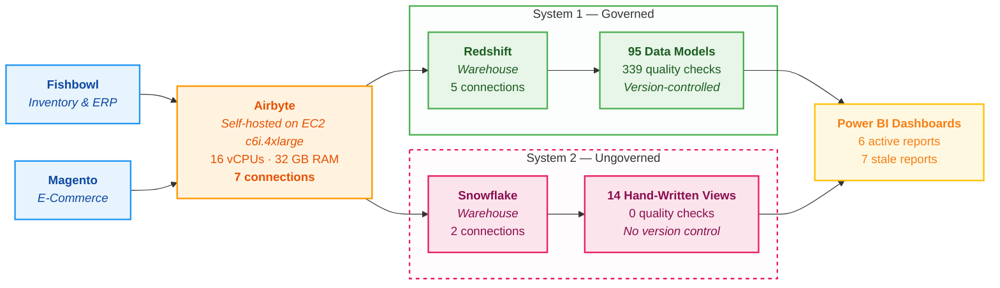

# Data Platform Consolidation -- Executive Summary

**Prepared for:** Ammunition Depot Leadership
**Date:** February 27, 2026
**Prepared by:** Trinity BI

---

## The Situation

Ammunition Depot currently runs **two separate data systems** that feed its business dashboards. This was not planned -- it evolved over time as the business grew and urgency demanded quick fixes. The result is a platform that works but carries significant risk, unnecessary cost, and growing complexity.

**System 1 -- The Governed Pipeline (Redshift)**

This system was built with engineering best practices. Every data transformation is version-controlled, automatically tested, and peer-reviewed before reaching production. It scores 8.0 out of 10 on an industry-standard audit, with 95 data models and 339 automated quality checks running continuously. It handles the majority of historical reporting for sales, products, customers, inventory, and shipping.

**System 2 -- The Ungoverned Pipeline (Snowflake)**

This system was built quickly to solve immediate needs -- particularly near-real-time sales reporting. It consists of roughly 14 hand-written data transformations with no version control, no automated testing, no documentation, and no change review process. Anyone with access can modify production data at any time. This system handles real-time sales, customer cohort analysis, and several product and vendor views.

**The Problem: Both Systems Feed the Same Dashboards**

Power BI pulls data from both systems simultaneously, meaning the same business concepts (sales figures, product information, customer segments) are calculated differently depending on which path the data takes. This creates a real risk of inconsistent numbers reaching decision-makers.

Additionally, there are **7 reports that have not been refreshed in 7 to 9 months** still sitting alongside the 6 active reports, creating confusion about which numbers to trust.

### How Data Flows Today

---

## Why This Matters

| Risk | Business Impact |
|------|-----------------|
| **Two versions of the truth** | Sales, margins, and costs may show different numbers depending on which report you look at -- eroding trust in data-driven decisions |
| **No safety net on critical views** | The most important real-time sales view (854 lines of complex logic) has zero quality checks -- a single mistake goes straight to dashboards |
| **No audit trail** | Changes to the ungoverned system leave no record of who changed what, when, or why -- making troubleshooting slow and accountability unclear |
| **Hidden external dependency** | A legacy third-party connection (Fivetran) still feeds one table, adding an unmonitored point of failure |
| **Wasted resources** | Maintaining two warehouses, duplicate data pipelines, and stale reports costs money and attention that could go elsewhere |

---

## The Plan: One Platform, One Source of Truth

We will consolidate everything onto a single, modern platform using the framework that already scores 8.0/10 in quality. The proven approach (version control, automated testing, layered architecture) will be extended to cover the views that currently have no governance.

### How Data Will Flow After Consolidation

```mermaid
graph LR
    %% Sources
    FB["<b>Fishbowl</b><br/><i>Inventory & ERP</i>"]:::source
    MG["<b>Magento</b><br/><i>E-Commerce</i>"]:::source

    %% Ingestion
    AIR["<b>Airbyte</b><br/><i>EC2 — downsizable after consolidation</i><br/><b>2-3 connections</b>"]:::ingestion

    FB --> AIR
    MG --> AIR

    %% Single Platform
    subgraph PLATFORM ["Single Governed Platform — Snowflake"]
        direction LR
        RAW["<b>Raw Data</b><br/><i>Ingested from sources</i>"]:::bronze
        CLEAN["<b>Cleaned Data</b><br/>~80 models<br/><i>Filtered & standardized</i>"]:::silver
        READY["<b>Business-Ready Data</b><br/>~110 models<br/>400+ quality checks<br/><i>Version-controlled & tested</i>"]:::gold
        RAW --> CLEAN --> READY
    end

    AIR --> RAW

    %% Power BI
    PBI["<b>Power BI Dashboards</b><br/>6 active reports<br/><i>Single source of truth</i>"]:::powerbi

    READY --> PBI

    %% Styles
    classDef source fill:#e8f4fd,stroke:#2196F3,stroke-width:2px,color:#0d47a1
    classDef ingestion fill:#fff3e0,stroke:#FF9800,stroke-width:2px,color:#e65100
    classDef bronze fill:#efebe9,stroke:#795548,stroke-width:1.5px,color:#3e2723
    classDef silver fill:#e3f2fd,stroke:#1565C0,stroke-width:1.5px,color:#0d47a1
    classDef gold fill:#e8f5e9,stroke:#2E7D32,stroke-width:2px,color:#1b5e20
    classDef powerbi fill:#fff8e1,stroke:#FFC107,stroke-width:2px,color:#f57f17

    style PLATFORM fill:#f8f9fa,stroke:#1565C0,stroke-width:3px,color:#0d47a1
```

### Current State vs. Future State

| | Today | After Consolidation |
|---|---|---|
| **Data Warehouses** | 2 (Redshift + Snowflake) | 1 (Snowflake) |
| **Airbyte Connections** | 7 connections writing to 2 warehouses | 2-3 connections writing to 1 warehouse |
| **Airbyte Infrastructure** | EC2 c6i.4xlarge (16 vCPUs, 32 GB RAM) -- oversized for dual-write load | Downsizable to a smaller instance (e.g., c6i.2xlarge or c6i.xlarge) once Redshift connections are removed |
| **Processing Approaches** | 2 (governed framework + hand-written views) | 1 (governed framework only) |
| **Dashboard Data Sources** | 5 separate feeds pulling from 4 locations | 2 feeds (Core + Realtime) from a single location |
| **Reports** | 13 total (6 active, 7 dead) | 6 active reports; dead reports archived |
| **Data Models** | 95 governed + 14 ungoverned | ~110 governed, tested models |
| **Automated Quality Checks** | 339 (governed system only) | 400+ covering all data |
| **Change Tracking** | Partial -- only on one system | Complete -- every change recorded and reviewed |
| **External Dependencies** | Fivetran (legacy, single table) | None -- fully self-contained |

---

## Business Benefits

**1. Trustworthy Numbers**
One calculation for sales, one for margins, one for costs. Every report draws from the same source, eliminating the "which number is right?" problem.

**2. Lower Operational Risk**
Every change -- no matter how small -- goes through automated testing before reaching dashboards. Issues are caught before they affect business decisions, not after.

**3. Reduced Cost and Complexity**
One warehouse instead of two. One set of data pipelines instead of overlapping ones. The initial Phase 0 cleanup has already reduced data ingestion workload by approximately 50%. Additionally, Airbyte currently runs on an EC2 c6i.4xlarge instance (16 vCPUs, 32 GB RAM) to handle 7 connections writing to two warehouses. After consolidation, with only 2-3 connections targeting a single warehouse, this instance can be downsized -- potentially halving Airbyte hosting costs.

**4. Faster, Safer Changes**
New reports, new metrics, and business logic changes can be implemented faster because there is a clear, structured process with built-in quality checks -- rather than ad-hoc modifications to production.

**5. Scalability**
Snowflake's architecture scales computing power up and down based on demand, meaning the platform grows with the business without large infrastructure investments.

---

## Work Already Completed

The foundation is in place. Significant progress has already been made:

- The governed framework (95 models, 339 tests) is built and running in production
- Snowflake infrastructure is provisioned (database, roles, service accounts, security)
- Data ingestion from both source systems (Fishbowl and Magento) into Snowflake is active
- Duplicate and wasteful data pipelines have been removed (Phase 0 complete -- ~50% ingestion cost reduction)
- A complete inventory of all ungoverned views and their governed equivalents has been documented
- All 14 ungoverned Snowflake views have been analyzed and mapped to migration targets

---

*"We are evolving from parallel, partially governed data flows to a unified, controlled, and scalable Snowflake-based data platform -- ensuring that every number reaching a business decision-maker has been tested, documented, and verified."*
