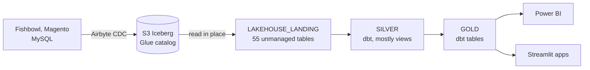

# The warehouse and the lakehouse

## Lakehouse

Since the cutover of 2026-04-07, Airbyte writes Iceberg to `s3://ammodepot-lakehouse/iceberg/` and
Snowflake reads it in place — nothing is copied into Snowflake storage. Layout:
`iceberg/<glue_db>.db/<table>/{data,metadata}/`, with Glue databases `production2018` (Fishbowl, 34
tables) and `ammuni_prod` (Magento, 21). Snowflake reaches it through the external volume
`LAKEHOUSE_S3_VOLUME` and the catalog integration `LAKEHOUSE_GLUE_CATALOG`. Airbyte writes as the IAM
user `svc_airbyte-s3` (S3 and Glue); Snowflake reads through the role `snowflake-lakehouse-role`.

The 55 tables in `AD_ANALYTICS.LAKEHOUSE_LANDING` are **unmanaged**: Snowflake sees new Iceberg
commits only after `ALTER ICEBERG TABLE … REFRESH`, which `ecs/refresh_iceberg.py` runs before every
scheduled build. Iceberg is append-only — rows with a NULL primary key that Snowflake's MERGE used to
drop now arrive, hence the NULL-PK guard in `magento_catalog_product_entity`. Why this design over a
full DuckDB lakehouse: `../decisions/0004-iceberg-lakehouse-option-b.md`.

## Databases

| Database | What | Owned by |
|---|---|---|
| `AD_ANALYTICS` | `LAKEHOUSE_LANDING` (Iceberg), `SILVER`, `GOLD` (dbt), `OPS` (Streamlit apps, alerts, audit logs) | `TRANSFORMER_ROLE`; `OPS` is `STREAMLIT_ROLE`'s |
| `AD_AIRBYTE` | legacy ingestion (`AD_FISHBOWL`, `AD_MAGENTO`) — no longer written — **plus a hand-built parallel layer** | `AIRBYTE_ROLE` / ACCOUNTADMIN |
| `PC_FIVETRAN_DB` | `UPS_INVOICE_HISTORY`, the manual weekly UPS upload | — |

**`AD_AIRBYTE` is not only legacy.** Its `AD_REALTIME`, `SILVER` and `GOLD` schemas are hand-written —
no tests, no source control, no CI — and Power BI's realtime reports read `AD_REALTIME`. At the
cutover those views went stale because they read the disabled ingestion tables; `F_SALES_REALTIME`
and `F_SALES_REALTIME_LASTDAYS` were rewritten as thin passthroughs to `AD_ANALYTICS.GOLD`
(2026-04-07; the original DDL is in `archive/sql/2026-04-07-iceberg-cutover/`). Other schemas there
(`AVANTLINK`, `LISTRAK`, `AIRBYTE_SCHEMA*`, `TEST_DTO*`) are unaudited. **Before answering "why is a
report stale", find the Power BI source**, and drop nothing in `AD_AIRBYTE` without an audit.

## Roles, users, warehouses

- Roles: `AIRBYTE_ROLE` (ingestion), `TRANSFORMER_ROLE` (dbt), `POWERBI_ROLE`, `POWERBI_READONLY_ROLE`
  (Gold + Streamlit viewing), `STREAMLIT_ROLE` (app owner), `DASHBOARD_VIEWER_ROLE` (SSO viewers).
- Service users: `SVC_AIRBYTE` and `SVC_DBT` (key-pair); `POWERBI_READER` and `POWERBI_AD` (Power
  BI); `PC_FIVETRAN_USER` (legacy). Setup: `../snowflake_access_setup.md`.
- **`SVC_POWERBI` refreshes the Power BI dataflow** since 2026-09-22 — `TYPE = SERVICE`,
  `DASHBOARD_VIEWER_ROLE`, `COMPUTE_WH`, a programmatic access token sent as the password. It
  replaced a person account that MFA enforcement blocked. The setup and what failed are in
  `../sql/create_svc_powerbi.sql`, not in §11 of the access doc, which describes an earlier design.
- **`ETL_WH`** (XS, 60 s auto-suspend): Airbyte, dbt, the freshness alerts. **`COMPUTE_WH`** is Power
  BI's — its connection settings are not ours to change, so it is never renamed, dropped or
  suspended. `PC_FIVETRAN_WH` is legacy but not idle: `POWERBI_AD` ran ~286 queries a week there (2026-04-28).
- Every user carries a `QUERY_TAG`, and dbt tags per layer (`dbt:gold` …), for cost attribution.

## Cost shape (measured, dated)

- Before the cutover, `SVC_AIRBYTE` was 74% of compute (678 credits/month); the cutover saved about
  $2,034/month (verified 2026-04-07 from its credits dropping to ~0).
- `ETL_WH` spend is **flat by hour of day** (17% variance, 30-day audit 2026-04-28): it is warehouse
  spin-up per build, about $0.43 each, not work done. The lever is build count, which is why the
  schedule follows Power BI (`../decisions/0006-dbt-cadence-follows-power-bi.md`).
- The Airbyte host needs ≥ 8 vCPU — a 4-vCPU `m7i.xlarge` failed on Airbyte's orchestrator minimums.
