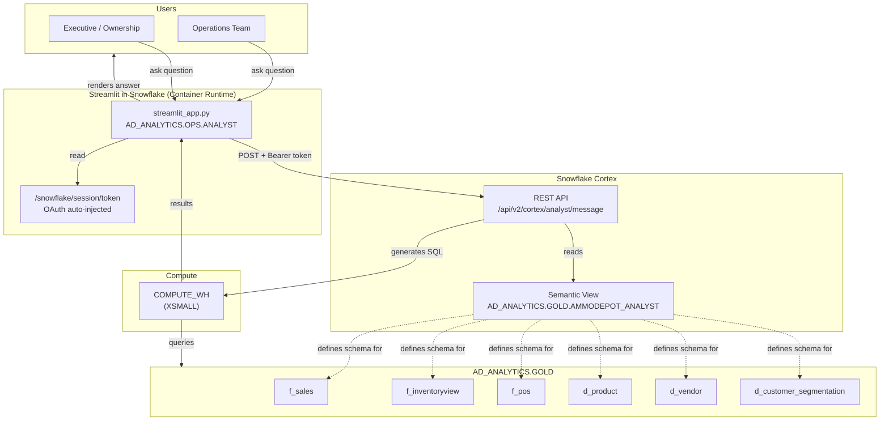
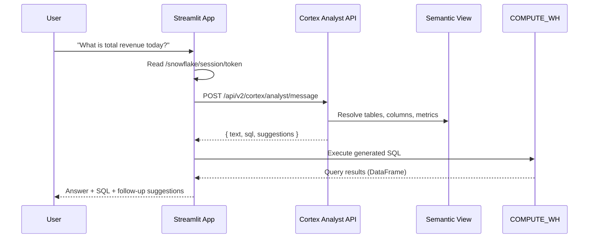
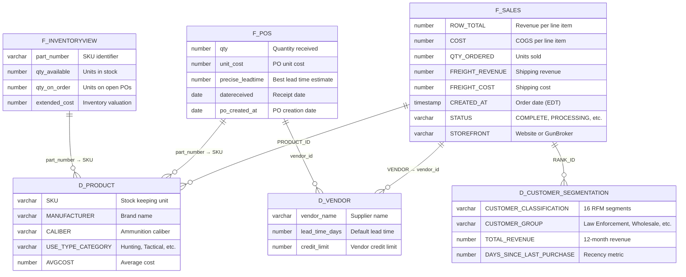

# Cortex Analyst Chatbot

Natural language query interface for Ammunition Depot's Gold layer, powered by Snowflake Cortex Analyst. Deployed as a Streamlit in Snowflake (SiS) app on container runtime.

## Architecture



## Data Flow (Sequence)



## Semantic View Coverage



## Deployment

| Attribute | Value |
|-----------|-------|
| **Snowflake Object** | `AD_ANALYTICS.OPS.ANALYST` |
| **Runtime** | Container (`SYSTEM$ST_CONTAINER_RUNTIME_PY3_11`) |
| **Compute Pool** | `sales_dashboard_pool` (shared, CPU_X64_XS) |
| **Query Warehouse** | `COMPUTE_WH` (XSMALL) |
| **Semantic View** | `AD_ANALYTICS.GOLD.AMMODEPOT_ANALYST` |
| **CI/CD** | GitHub Actions (`deploy-streamlit-analyst.yml`) |
| **Auth** | `/snowflake/session/token` (container runtime OAuth) |

### RBAC

| Role | Access |
|------|--------|
| `TRANSFORMER_ROLE` | Owns semantic view |
| `STREAMLIT_ROLE` | Owns Streamlit app object |
| `DASHBOARD_VIEWER_ROLE` | USAGE on app + semantic view |
| `POWERBI_READONLY_ROLE` | USAGE on app + semantic view |

### Cost Estimate

| Component | Monthly Cost |
|-----------|-------------|
| Cortex Analyst messages | ~$15-50 (6.7 credits / 100 messages) |
| COMPUTE_WH SQL execution | Negligible (shared XSMALL) |
| Compute pool | $0 incremental (shared) |
| **Total** | **~$15-50/mo** |

## Project Structure

```
streamlit_analyst/
├── README.md                  # This file
├── streamlit_app.py           # Entry point (SiS)
├── app.py                     # Entry point (local dev)
├── snowflake.yml              # SiS definition v2
├── requirements.txt           # streamlit, requests, pandas, snowflake-snowpark-python
├── setup/
│   ├── 01_bootstrap.sql       # Semantic view DDL + RBAC grants
│   └── 02_verified_queries.sql # Golden question SQL for accuracy
└── utils/
    ├── __init__.py
    ├── analyst.py             # Cortex Analyst REST API wrapper
    ├── db.py                  # Snowpark session + query runner
    └── chart_theme.py         # Dark theme constants (subset)
```

## Semantic View Tables (Phase 1)

| Gold Model | Type | Semantic Role | Key Questions |
|---|---|---|---|
| `f_sales` | Fact (incremental) | Revenue, orders, margins | "Total revenue today", "Top products this week" |
| `f_inventoryview` | Fact (table) | Stock levels, valuation | "How many units of 9mm in stock?" |
| `f_pos` | Fact (table) | Purchase orders, lead times | "Which vendors are late?", "Open POs" |
| `d_product` | Dimension | Product catalog, taxonomy | "List Hornady products", "Revenue by use-type" |
| `d_vendor` | Dimension | Supplier master | "Vendor lead times", "Credit limits" |
| `d_customer_segmentation` | Dimension | RFM segments | "At-Risk customers", "Segment counts" |

## Verified Queries (Golden Question Set)

| # | Question | Pass Criteria |
|---|----------|--------------|
| 1 | "What is total revenue today?" | Matches Streamlit Page 1 Net Sales KPI |
| 2 | "What is our gross margin this month?" | Matches Page 1 Margin % |
| 3 | "Top 10 products by revenue this week" | Correct SKUs and ordering |
| 4 | "How many units of 9mm are in stock?" | Matches Page 3 inventory filter |
| 5 | "Which vendors have the longest lead times?" | Matches Page 3 Vendor Analysis |
| 6 | "Total orders yesterday vs day before" | Matches Page 1 delta |
| 7 | "Revenue by category this month" | Matches Page 2 category breakdown |
| 8 | "How many customers are At-Risk Regular?" | Correct count from d_customer_segmentation |
| 9 | "Show me open POs not yet received" | Matches Page 3 Open POs tab |
| 10 | "Top 5 manufacturers by units sold MTD" | Matches Page 2 manufacturer chart |

## Local Development

```bash
# From repo root
cd streamlit_analyst

# Set environment variables (same as ammodepot/.env)
export SNOWFLAKE_ACCOUNT="your_account"
export SNOWFLAKE_USER="your_user"
export SNOWFLAKE_PRIVATE_KEY_PATH="../ammodepot/.ssh/snowflake_key.p8"
export SNOWFLAKE_PRIVATE_KEY_PASSPHRASE="your_passphrase"

# Run locally
streamlit run app.py
```

## AI Roadmap Status

```mermaid
flowchart LR
    P1["Phase 1 ✅<br/>Text-to-SQL Chatbot<br/>Cortex Analyst<br/>2026-04-14"]
    P2["Phase 2 ✅<br/>Demand Forecasting<br/>ML.FORECAST<br/>2026-04-14"]
    P3["Phase 3 ✅<br/>Anomaly Alerts<br/>ML.ANOMALY_DETECTION<br/>2026-04-14"]
    P4["Phase 4 ✅<br/>Churn Narratives<br/>CORTEX.COMPLETE<br/>2026-04-16"]
    P5["Phase 5 ✅<br/>Reorder Intelligence<br/>F_REORDER_RECOMMENDATIONS<br/>2026-04-16"]

    P1 -->|foundation proven| P2
    P2 -->|forecasts reliable| P3
    P3 -->|monitoring active| P4
    P4 -->|narratives trusted| P5

    style P1 fill:#2d6a4f,stroke:#40916c,color:#fff
    style P2 fill:#2d6a4f,stroke:#40916c,color:#fff
    style P3 fill:#2d6a4f,stroke:#40916c,color:#fff
    style P4 fill:#2d6a4f,stroke:#40916c,color:#fff
    style P5 fill:#2d6a4f,stroke:#40916c,color:#fff
```



All phases are Snowflake-native — no external LLM APIs.

## References

- [Cortex Analyst REST API](https://docs.snowflake.com/en/user-guide/snowflake-cortex/cortex-analyst/rest-api)
- [Semantic Views](https://docs.snowflake.com/en/user-guide/views-semantic/overview)
- [Semantic View YAML Spec](https://docs.snowflake.com/en/user-guide/views-semantic/semantic-view-yaml-spec)
- [Best Practices for Semantic Views](https://www.snowflake.com/en/developers/guides/best-practices-semantic-views-cortex-analyst/)
- Brainstorm: `.claude/sdd/features/BRAINSTORM_CORTEX_ANALYST_CHATBOT.md`
